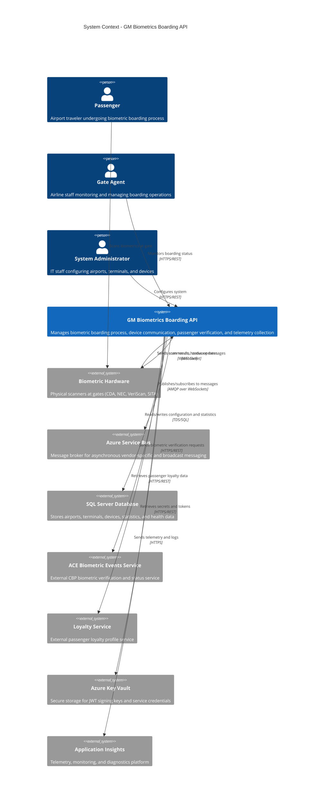

# Level 1: System Context Diagram

## Overview

This diagram shows the GM Biometrics Boarding API system in its environment, including all users and external systems it interacts with.

## Diagram

## System Elements

### Users

| User | Description | Primary Use Cases |
|------|-------------|-------------------|
| **Passenger** | Airport traveler going through the biometric boarding process | Scans biometrics at gate devices |
| **Gate Agent** | Airline staff managing the boarding process | Monitors boarding operations, views device status, manages exceptions |
| **System Administrator** | IT staff responsible for system configuration | Configures airports, terminals, devices; views statistics and health metrics |

### External Systems

| System | Type | Purpose | Protocol |
|--------|------|---------|----------|
| **Biometric Hardware** | Physical Devices | Capture biometric data (facial recognition, fingerprints) | WebSocket (WSS) |
| **Azure Service Bus** | Message Broker | Asynchronous messaging between components and vendors | AMQP over WebSockets |
| **SQL Server Database** | Relational Database | Persistent storage for configuration, statistics, and operational data | TDS/SQL |
| **ACE Biometric Events Service** | External API | CBP (Customs and Border Protection) biometric verification service | HTTPS/REST |
| **Loyalty Service** | External API | Retrieves passenger loyalty profiles and information | HTTPS/REST |
| **Azure Key Vault** | Secret Management | Secure storage for JWT signing keys, connection strings, API credentials | HTTPS/REST |
| **Application Insights** | Monitoring Platform | Telemetry collection, logging, performance monitoring, diagnostics | HTTPS |

## Key Interactions

### Boarding Process Flow
1. **Passenger** scans biometrics at **Biometric Hardware** device
2. **Biometric Hardware** sends scan data to **GM Biometrics Boarding API** via WebSocket
3. **GM Biometrics Boarding API** processes the scan:
   - Publishes scan message to **Azure Service Bus**
   - Sends verification request to **ACE Biometric Events Service**
   - May retrieve loyalty information from **Loyalty Service**
4. API receives response and sends result back to **Biometric Hardware**
5. **Gate Agent** monitors the process via REST API

### Configuration Management
1. **System Administrator** accesses admin endpoints via REST API
2. API reads/writes configuration data to **SQL Server Database**
3. Changes are logged to **Application Insights**

### Security & Secrets Management
1. API retrieves JWT signing keys from **Azure Key Vault**
2. Service credentials and connection strings stored securely in Key Vault
3. WebSocket connections validated using JWT tokens

## Technology Context

- **Communication Protocols**: HTTPS/REST, WebSocket (WSS), AMQP, TDS/SQL
- **Authentication**: JWT tokens, OAuth 2.0 bearer tokens
- **Data Formats**: JSON (primary), SQL (database)
- **Cloud Platform**: Microsoft Azure
- **.NET Platform**: .NET 8

## Next Steps

- See [Level 2: Container Diagram](02-Container-Diagram.md) for details on internal system structure
- See [Level 3: Component Diagrams](03-Component-API-Controllers.md) for component-level architecture
