# Level 2: Container Diagram

## Overview

This diagram shows the high-level technical building blocks (containers) that make up the GM Biometrics Boarding API system. Each container represents a deployable/runnable unit.

## Diagram

```mermaid
C4Container
    title Container Diagram - GM Biometrics Boarding API

    Person(user, "User", "Gate agent, admin, or system client")
    System_Ext(devices, "Biometric Devices", "Hardware scanners at gates")

    Container_Boundary(api, "GM Biometrics Boarding API System") {
        Container(webAPI, "Web API", ".NET 8 Web API", "Exposes REST endpoints for boarding configuration, admin operations, telemetry, and WebSocket device management")
        
        Container(controllers, "API Controllers", ".NET 8 MVC Controllers", "AdminController, BoardingController, TelemetryController, RemoteManagerController")
        
        Container(socketMgr, "Socket Manager", ".NET 8 Singleton Service", "Manages WebSocket connections, validates JWT tokens, routes messages to/from devices")
        
        Container(adminBL, "Admin Business Logic", ".NET 8 Library", "Handles CRUD operations for airports, terminals, devices, and biometric statistics")
        
        Container(biometricsBL, "Biometrics Business Logic", ".NET 8 Library", "Core boarding logic, scan processing, Service Bus topic/subscription management, message routing")
        
        Container(telemetryBL, "Telemetry Business Logic", ".NET 8 Library", "Device health monitoring, system status tracking, statistics aggregation")
        
        Container(remoteManagerBL, "Remote Manager Business Logic", ".NET 8 Library", "Device region lookup and WebSocket device management")
        
        Container(dataAccess, "Data Access Layer", "Entity Framework Core 8", "BiometricDBContext with Airports, Terminals, Devices, BiometricStats, SystemHealth, WebSocketDevices")
        
        Container(messagingLayer, "Service Bus Messaging", ".NET 8 Library", "Vendor-specific queue send/receive, topic publish, correlation-based message filtering")
        
        Container(biometricEventsSvc, "Biometric Events Service Client", ".NET 8 HttpClient", "Sends scan and status requests to ACE Biometric Events API")
        
        Container(loyaltySvc, "Loyalty Service Client", ".NET 8 HttpClient", "Retrieves passenger loyalty profiles")
        
        Container(bearerTokenSvc, "Bearer Token Service", ".NET 8 Library", "OAuth token generation and caching for external service authentication")
        
        Container(middleware, "Logging Middleware", ".NET 8 Middleware", "Request/response body logging for diagnostics")
        
        Container(models, "Domain Models", ".NET 8 Library", "Shared data models: Airport, Device, Scan, Status, Hardware, BoardingConfiguration, etc.")
    }

    ContainerDb(database, "Biometrics Database", "SQL Server", "Tables: Airports, Terminals, Devices, BiometricStats, SystemHealth, Verbiages, WebSocketDevices")
    
    Container_Ext(serviceBus, "Azure Service Bus", "Message Broker", "Topics: biometrics-topic with correlation-filtered subscriptions; Queues: veriscan-queue, cda-queue, nec-queue, sita-queue, response queues")
    
    Container_Ext(aceAPI, "ACE Biometric Events API", "External REST API", "Endpoints: /biometric-verification, /device-status")
    
    Container_Ext(loyaltyAPI, "Loyalty Service API", "External REST API", "Passenger loyalty profile endpoint")
    
    Container_Ext(keyVault, "Azure Key Vault", "Secret Store", "JWT signing keys, service credentials, connection strings")

    Rel(user, webAPI, "Uses", "HTTPS/REST")
    Rel(devices, socketMgr, "Connects via WebSocket", "WSS")
    
    Rel(webAPI, controllers, "Routes requests")
    Rel(controllers, adminBL, "Uses")
    Rel(controllers, biometricsBL, "Uses")
    Rel(controllers, telemetryBL, "Uses")
    Rel(controllers, remoteManagerBL, "Uses")
    Rel(controllers, socketMgr, "Uses")
    
    Rel(socketMgr, biometricsBL, "Processes scan/status messages")
    Rel(socketMgr, dataAccess, "Registers/unregisters devices")
    Rel(socketMgr, keyVault, "Retrieves JWT signing keys")
    
    Rel(adminBL, dataAccess, "CRUD operations")
    Rel(biometricsBL, dataAccess, "Reads device configurations")
    Rel(biometricsBL, messagingLayer, "Publishes/subscribes")
    Rel(biometricsBL, biometricEventsSvc, "Sends ACE requests")
    Rel(telemetryBL, dataAccess, "Writes health data")
    Rel(remoteManagerBL, dataAccess, "Queries device regions")
    
    Rel(dataAccess, database, "Reads/writes", "EF Core/SQL")
    Rel(messagingLayer, serviceBus, "Sends/receives messages", "AMQP")
    Rel(biometricEventsSvc, aceAPI, "HTTP POST", "HTTPS/JSON")
    Rel(loyaltySvc, loyaltyAPI, "HTTP POST", "HTTPS/JSON")
    Rel(biometricEventsSvc, bearerTokenSvc, "Gets OAuth token")
    Rel(middleware, webAPI, "Logs requests/responses")

    UpdateLayoutConfig($c4ShapeInRow="4", $c4BoundaryInRow="1")
```

## Container Details

### API Layer

| Container | Project | Technology | Responsibility |
|-----------|---------|------------|----------------|
| **Web API** | gm-web-biometrics.boarding.api | ASP.NET Core 8 Web API | Main entry point, hosts REST endpoints and WebSocket endpoints |
| **API Controllers** | gm-web-biometrics.boarding.api | ASP.NET Core MVC | Route HTTP requests to appropriate business logic |
| **Logging Middleware** | gm-web-biometrics.boarding.api | ASP.NET Core Middleware | Logs request/response bodies for diagnostics |

### Business Logic Layer

| Container | Project | Technology | Responsibility |
|-----------|---------|------------|----------------|
| **Admin Business Logic** | gm-web-biometrics.bl | .NET 8 Class Library | Airport, terminal, device, and statistics management |
| **Biometrics Business Logic** | gm-web-biometrics.bl | .NET 8 Class Library | Core boarding operations, scan processing, Service Bus orchestration |
| **Telemetry Business Logic** | gm-web-biometrics.bl | .NET 8 Class Library | Device health tracking, system status monitoring |
| **Remote Manager Business Logic** | gm-web-biometrics.bl | .NET 8 Class Library | WebSocket device region management |

### Infrastructure Layer

| Container | Project | Technology | Responsibility |
|-----------|---------|------------|----------------|
| **Socket Manager** | gm-web-biometrics.socketmanager | .NET 8 Singleton Service | WebSocket connection lifecycle, JWT validation, message routing |
| **Data Access Layer** | gm-web-biometrics.data | Entity Framework Core 8 | Database context, entity management, migrations |
| **Service Bus Messaging** | gm-web-biometrics.servicebusmessaging | .NET 8 Class Library | Azure Service Bus send/receive operations |
| **Domain Models** | gm-web-biometrics.models | .NET 8 Class Library | Shared data transfer objects and domain entities |

### External Service Clients

| Container | Project | Technology | Responsibility |
|-----------|---------|------------|----------------|
| **Biometric Events Service Client** | gm-web-biometrics.webservices | .NET 8 HttpClient | ACE Biometric Events API integration |
| **Loyalty Service Client** | gm-web-biometrics.webservices | .NET 8 HttpClient | Loyalty Service API integration |
| **Bearer Token Service** | gm-web-biometrics.BearerTokenService | .NET 8 Class Library | OAuth token generation and caching |

### External Containers

| Container | Technology | Purpose |
|-----------|------------|---------|
| **Biometrics Database** | SQL Server | Persistent storage for all application data |
| **Azure Service Bus** | Azure PaaS | Message broker for async communication with vendor systems |
| **ACE Biometric Events API** | External REST API | CBP biometric verification service |
| **Loyalty Service API** | External REST API | Passenger loyalty information service |
| **Azure Key Vault** | Azure PaaS | Secure credential and secret storage |

## Communication Patterns

### Synchronous Communication
- **REST API Calls**: User ? Web API ? Business Logic ? Data Access ? Database
- **HTTP Requests**: Business Logic ? External Service Clients ? External APIs

### Asynchronous Communication
- **Service Bus Messaging**: Business Logic ? Messaging Layer ? Azure Service Bus ? Vendor Systems
- **WebSocket**: Devices ? Socket Manager ? Business Logic

### Data Flow Patterns
1. **Request/Response**: REST endpoints for immediate operations
2. **Pub/Sub**: Service Bus topics for broadcast messaging
3. **Queue-based**: Service Bus queues for vendor-specific messaging
4. **WebSocket Streaming**: Real-time bidirectional communication with devices

## Deployment Considerations

### Application Deployment
- **Hosting**: Azure App Service or Azure Container Apps
- **Scaling**: Horizontal scaling with load balancer
- **Regions**: Multi-region deployment for high availability

### Database Deployment
- **SQL Server**: Azure SQL Database with geo-replication
- **Backup**: Automated backups with point-in-time restore

### Service Bus Deployment
- **Namespace**: Azure Service Bus Premium for high throughput
- **Topics/Queues**: Auto-created via ServiceBusAdministrationClient

## Security Architecture

### Authentication & Authorization
- **JWT Tokens**: WebSocket device authentication
- **OAuth 2.0**: External service authentication
- **Azure Key Vault**: Secure credential storage

### Network Security
- **HTTPS/TLS**: All HTTP communication encrypted
- **WSS**: Secure WebSocket connections
- **AMQP over TLS**: Service Bus communication encrypted

## Next Steps

- See [Level 3: Component Diagrams](03-Component-API-Controllers.md) for detailed component architecture
- See [Level 4: Code Diagrams](04-Code-BiometricsBL.md) for class-level details
