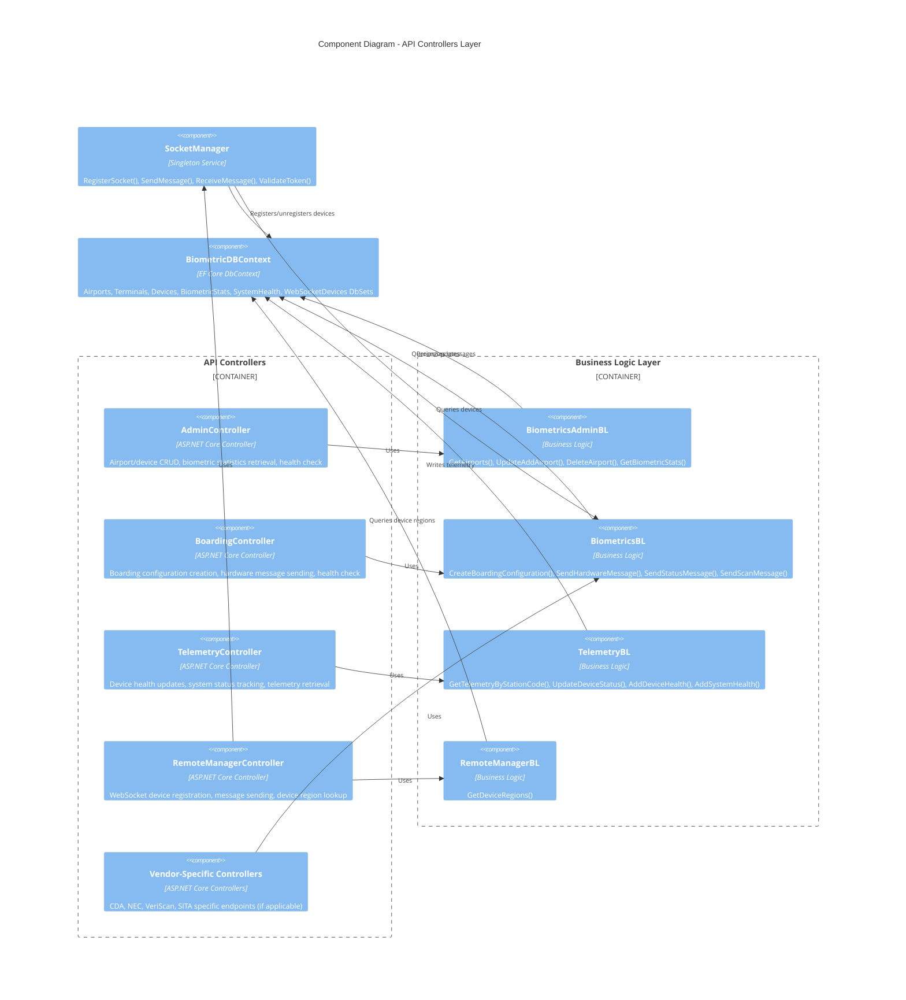

# Level 3: Component Diagram - API Controllers Layer

## Overview

This diagram shows the API Controllers and their relationships with business logic components.

## Diagram



## Component Details

### AdminController

**Project**: `gm-web-biometrics.boarding.api`

**Endpoints**:
- `GET /Biometrics/Admin/GetAirports` - Retrieves all airports with terminals and devices
- `POST /Biometrics/Admin/UpdateAirport` - Creates or updates airport configuration
- `POST /Biometrics/Admin/DeleteAirport` - Deletes airport and related entities
- `GET /Biometrics/Admin/GetBiometricStats` - Retrieves statistics without filter
- `POST /Biometrics/Admin/GetBiometricStats` - Retrieves statistics with filter criteria
- `GET /Biometrics/Admin/Health` - Health check endpoint

**Dependencies**:
- `BiometricsAdminBL` - Business logic for admin operations
- `BiometricDBContext` - Database health check
- `ServiceBusAdministrationClient` - Service Bus health check

### BoardingController

**Project**: `gm-web-biometrics.boarding.api`

**Endpoints**:
- `POST /Biometrics/Boarding/BoardingConfiguration` - Creates boarding configuration with correlation ID
- `POST /Biometrics/Boarding/Hardware` - Sends hardware control messages to devices
- `GET /Biometrics/Boarding/Health` - Health check endpoint

**Dependencies**:
- `BiometricsBL` - Core boarding business logic
- `BiometricDBContext` - Database health check
- `ServiceBusAdministrationClient` - Service Bus health check

### TelemetryController

**Project**: `gm-web-biometrics.boarding.api`

**Endpoints**:
- `GET /Biometrics/Telemetry/GetTelemetryByStationCode` - Retrieves telemetry for an airport
- `POST /Biometrics/Telemetry/UpdateDeviceStatus` - Updates device status
- `POST /Biometrics/Telemetry/DeviceHealth` - Records device health metrics
- `POST /Biometrics/Telemetry/SystemStatus` - Records system status metrics
- `GET /Biometrics/Telemetry/Health` - Health check endpoint

**Dependencies**:
- `TelemetryBL` - Telemetry business logic
- `IBiometricDBContext` - Database operations (uses interface for testing)
- `ServiceBusAdministrationClient` - Service Bus health check

### RemoteManagerController

**Project**: `gm-web-biometrics.boarding.api`

**Endpoints**:
- `GET /Biometrics/RemoteManager/RegisterDevice` - WebSocket endpoint for device registration
- `POST /Biometrics/RemoteManager/SendMessage/East` - Sends message to device (East region)
- `POST /Biometrics/RemoteManager/SendMessage/West` - Sends message to device (West region)
- `POST /Biometrics/RemoteManager/GetDeviceRegions` - Retrieves region mapping for devices
- `GET /Biometrics/RemoteManager/Health` - Health check endpoint

**Dependencies**:
- `SocketManager` - WebSocket connection management
- `RemoteManagerBL` - Device region business logic
- `BiometricDBContext` - Database health check
- `ServiceBusAdministrationClient` - Service Bus health check

## Business Logic Components

### BiometricsAdminBL

**Project**: `gm-web-biometrics.bl`

**Key Methods**:
```csharp
Task<List<Airport>> GetAirports()
Task<Airport> UpdateAddAirport(Airport airport)
Task<Airport> DeleteAirport(Airport airport)
Task<List<BiometricStat>> GetBiometricStats(BiometricsStatsFilter filter)
```

**Responsibilities**:
- Airport, terminal, and device CRUD operations
- Biometric statistics retrieval with filtering
- Cascading deletes for related entities

### BiometricsBL (IBiometricsBL)

**Project**: `gm-web-biometrics.bl`

**Key Methods**:
```csharp
Task<BoardingConfiguration> CreateBoardingConfiguration(FlightDescriptor request)
Task<bool> SendHardwareMessage(BoardingHardware boardingHardware)
Task<bool> SendStatusMessage(string vendor, string correlationId, Status status)
Task<ScanResponse> SendScanMessage(string vendor, string correlationId, Scan scan, CancellationToken cancellationToken)
string NormalizePassengerUID(string passUID)
```

**Responsibilities**:
- Boarding configuration creation with correlation ID generation
- Hardware message routing to Service Bus queues
- Scan and status message processing
- Service Bus topic/subscription management
- Integration with ACE Biometric Events Service

### TelemetryBL (ITelemetryBL)

**Project**: `gm-web-biometrics.bl`

**Key Methods**:
```csharp
Task<TelemetryData> GetTelemetryByStationCode(string stationCode)
Task<DeviceStatus> UpdateDeviceStatus(DeviceStatus deviceStatus)
Task AddDeviceHealth(DeviceHealthRequest deviceHealthRequest)
Task AddSystemHealth(SystemStatusRequest systemStatusRequest, string vendor = "Club")
```

**Responsibilities**:
- Device health monitoring and recording
- System status tracking
- Telemetry data aggregation by station code

### RemoteManagerBL

**Project**: `gm-web-biometrics.bl`

**Key Methods**:
```csharp
Task<Dictionary<string, string>> GetDeviceRegions(string[] devices)
```

**Responsibilities**:
- Device region mapping lookup
- WebSocket device region coordination

## Error Handling Pattern

All controllers follow a consistent error handling pattern:

```csharp
try
{
    logger.LogInformation(new LogInfo(message: Consts.HANDLING_REQUEST, eventData: requestData));
    
    // Business logic execution
    var result = await businessLogic.Method(request);
    
    logger.LogInformation(new LogInfo(message: Consts.HANDLING_RESPONSE, eventData: result));
    return Ok(result);
}
catch (Exception ex)
{
    logger.LogError(new LogInfo(message: Consts.EXCEPTION, exception: ex));
    return Conflict();
}
```

## API Versioning

All controllers support API versioning:
- Default version: 1.0
- Route templates: 
  - `Biometrics/[controller]`
  - `Biometrics/[controller]/v{version:apiVersion}`

## Health Check Pattern

All controllers implement a consistent health check:
- Database connectivity check
- Service Bus availability check
- Returns HTTP 200 if healthy, 503 if unhealthy

## Next Steps

- See [Business Logic Component Diagram](03-Component-Business-Logic.md) for messaging details
- See [Socket Manager Component Diagram](03-Component-Socket-Manager.md) for WebSocket architecture
- See [Data Access Component Diagram](03-Component-Data-Access.md) for database structure
