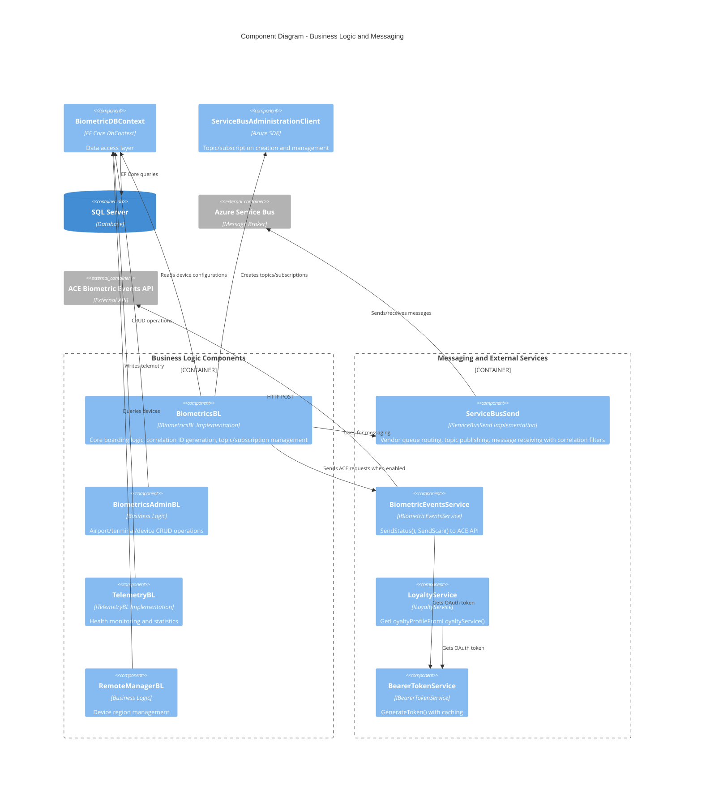

# Level 3: Component Diagram - Business Logic and Messaging

## Overview

This diagram shows the business logic components and their interactions with messaging and external services.

## Diagram



## Business Logic Components

### BiometricsBL (IBiometricsBL)

**Project**: `gm-web-biometrics.bl`

**Interface Definition**:
```csharp
public interface IBiometricsBL
{
    Task<BoardingConfiguration> CreateBoardingConfiguration(FlightDescriptor request);
    Task<bool> SendHardwareMessage(BoardingHardware boardingHardware);
    Task<bool> SendStatusMessage(string vendor, string correlationId, Status status);
    Task<ScanResponse> SendScanMessage(string vendor, string correlationId, Scan scan, CancellationToken cancellationToken);
    string NormalizePassengerUID(string passUID);
    Task<bool> SendMessageToQueue(string vendor, string correlationId, object payload);
    Task<bool> SendMessageToQueue(string vendor, string correlationId, object payload, string departureAirport);
    Task<bool> SendMessageToTopic(string correlationId, object payload);
    Task<T> ReceiveMessageFromQueue<T>(string vendor, CancellationToken cancellationToken, string correlationId, string passengerUID);
}
```

**Key Responsibilities**:
1. **Boarding Configuration**: Creates correlation ID, retrieves device list, creates Service Bus subscriptions
2. **Message Routing**: Routes hardware, status, and scan messages to appropriate queues/topics
3. **ACE Integration**: Conditionally routes to ACE Biometric Events Service when enabled
4. **Passenger UID Normalization**: Standardizes passenger identifiers using regex patterns
5. **Service Bus Management**: Creates topics and correlation-filtered subscriptions dynamically

**Configuration Dependencies**:
- `biometrics:ACEServiceEndpointEnabled` - Feature flag for ACE integration
- `biometrics:ServiceBusConnectionString` - Service Bus connection
- `biometrics:TopicName` - Main topic for broadcasting messages

### BiometricsAdminBL

**Project**: `gm-web-biometrics.bl`

**Key Methods**:
```csharp
Task<List<Airport>> GetAirports()
Task<Airport> UpdateAddAirport(Airport airport)
Task<Airport> DeleteAirport(Airport airport)
Task<List<BiometricStat>> GetBiometricStats(BiometricsStatsFilter filter)
```

**Key Responsibilities**:
1. **Airport Management**: CRUD operations with Include for Terminals and Devices
2. **Cascading Operations**: Properly handles terminal and device deletions
3. **Statistics Filtering**: Supports complex filtering by date range, origin, destination, and passenger count

### TelemetryBL (ITelemetryBL)

**Project**: `gm-web-biometrics.bl`

**Interface Definition**:
```csharp
public interface ITelemetryBL
{
    Task AddDeviceHealth(DeviceHealthRequest deviceHealthRequest);
    Task AddSystemHealth(SystemStatusRequest systemStatusRequest, string vendor = "Club");
    Task<TelemetryData> GetTelemetryByStationCode(string stationCode);
    Task<DeviceStatus> UpdateDeviceStatus(DeviceStatus deviceStatus);
}
```

**Key Responsibilities**:
1. **Health Recording**: Persists device and system health metrics
2. **Status Updates**: Updates device operational status
3. **Telemetry Aggregation**: Retrieves telemetry data by airport station code

### RemoteManagerBL

**Project**: `gm-web-biometrics.bl`

**Key Methods**:
```csharp
Task<Dictionary<string, string>> GetDeviceRegions(string[] devices)
```

**Key Responsibilities**:
- Maps device names to their WebSocket regions (East/West)
- Queries WebSocketDevices table for active connections

## Messaging Components

### ServiceBusSend (IServiceBusSend)

**Project**: `gm-web-biometrics.servicebusmessaging`

**Interface Definition**:
```csharp
public interface IServiceBusSend
{
    Task<bool> SendMessageToQueue(string vendor, string correlationId, object payload, string departureAirport);
    Task<bool> SendMessageToTopic(string correlationId, object payload);
    Task<T> ReceiveMessageFromQueue<T>(string vendor, CancellationToken cancellationToken, string correlationId, string passengerUID);
}
```

**Key Features**:
1. **Vendor Queue Routing**: Routes messages to vendor-specific queues (VeriScan, CDA, NEC, SITA)
2. **Topic Publishing**: Broadcasts messages to topic with correlation ID filter
3. **Message Reception**: Receives messages with 8-second timeout, 100 message batch size
4. **Correlation Filtering**: Filters messages by correlation ID and passenger UID
5. **Message Acknowledgment**: Completes matching messages, abandons non-matching

**Vendor Queue Mapping**:
```csharp
{
    ["VERISCAN"] = veriScan-queue (request) / veriScan-response-queue (response)
    ["CDA"] = cda-queue (request) / cda-response-queue (response)
    ["NEC"] = nec-queue (request) / nec-response-queue (response)
    ["SITA"] = sita-queue (request) / sita-response-queue (response)
}
```

**Configuration Dependencies**:
- `biometrics:ServiceBusConnectionString`
- `veriScan:QueueName`, `veriScan:ResponseQueueName`
- `cda:QueueName`, `cda:ResponseQueueName`
- `nec:QueueName`, `nec:ResponseQueueName`
- `sita:QueueName`, `sita:ResponseQueueName`
- `biometrics:TopicName`

### BiometricEventsService (IBiometricEventsService)

**Project**: `gm-web-biometrics.webservices`

**Interface Definition**:
```csharp
public interface IBiometricEventsService
{
    Task<bool> SendStatus(Status request);
    Task<ExtendedScanResponse> SendScan(Scan request);
}
```

**Key Features**:
1. **ACE Status Updates**: Posts device status to ACE service
2. **ACE Scan Verification**: Posts scan data and receives verification response
3. **OAuth Authentication**: Uses BearerTokenService for authentication
4. **Retry Logic**: Handles unauthorized responses
5. **Performance Logging**: Tracks request duration with Stopwatch

**Configuration Dependencies**:
- `AceBiometricEventsService:ServiceURL`
- `AceBiometricEventsService:Status` (endpoint: "device-status")
- `AceBiometricEventsService:Scan` (endpoint: "biometric-verification")
- `AceBiometricEventsService:ClientID`
- `AceBiometricEventsService:ClientPassword`
- `AceBiometricEventsService:AuthURL`

### LoyaltyService (ILoyaltyService)

**Project**: `gm-web-biometrics.webservices`

**Interface Definition**:
```csharp
public interface ILoyaltyService
{
    Task<LoyaltyResponse> GetLoyaltyProfileFromLoyaltyService(ILogger logger, string bearerToken, LoyaltyRequest request);
}
```

**Key Features**:
- Retrieves passenger loyalty profile information
- Bearer token authentication
- Error handling for unauthorized and failed requests

### BearerTokenService (IBearerTokenService)

**Project**: `gm-web-biometrics.BearerTokenService`

**Key Features**:
1. **Token Generation**: Generates OAuth 2.0 bearer tokens
2. **Token Caching**: Caches tokens to reduce authentication calls
3. **Application Insights Integration**: Logs token generation events

**Configuration Dependencies**:
- Client ID, Client Secret, and Auth URL for each service

## Message Flow Patterns

### Scan Processing Flow

1. **WebSocket Receives Scan** ? SocketManager
2. **Route to Business Logic** ? BiometricsBL.SendScanMessage()
3. **Check ACE Feature Flag** 
   - **If Enabled**: BiometricEventsService.SendScan() ? ACE API
   - **If Disabled**: 
     - ServiceBusSend.SendMessageToTopic() ? Publish to topic
     - ServiceBusSend.ReceiveMessageFromQueue() ? Wait for vendor response
4. **Return Response** ? SocketManager ? WebSocket ? Device

### Status Update Flow

1. **WebSocket Receives Status** ? SocketManager
2. **Route to Business Logic** ? BiometricsBL.SendStatusMessage()
3. **Check ACE Feature Flag**
   - **If Enabled**: BiometricEventsService.SendStatus() ? ACE API
   - **If Disabled**: ServiceBusSend.SendMessageToQueue() ? Vendor queue
4. **Return Success/Failure** ? SocketManager

### Hardware Command Flow

1. **REST API Receives Hardware Command** ? BoardingController
2. **Route to Business Logic** ? BiometricsBL.SendHardwareMessage()
3. **Send to Queue** ? ServiceBusSend.SendMessageToQueue() with departureAirport
4. **Vendor Processes** ? Vendor system via Service Bus queue
5. **Return Acknowledgment** ? Controller

## Service Bus Architecture

### Topics and Subscriptions

**Topic**: `biometrics-topic`
- **Auto-delete on idle**: 8 hours
- **Message TTL**: 4 hours
- **Partitioning**: Enabled
- **Ordering**: Not supported

**Subscriptions**: Created per correlation ID
- **Auto-delete on idle**: 10 minutes
- **Message TTL**: 1 minute
- **Filter**: CorrelationRuleFilter(correlationId)
- **Dead-lettering on filter evaluation exceptions**: Enabled

### Queue Architecture

Each vendor has a request and response queue:
- **Request Queues**: Receive hardware, status, scan messages
- **Response Queues**: Return scan responses from vendor systems
- **Message Properties**: `messagetype`, `departureairport` (optional)

## Next Steps

- See [Socket Manager Component Diagram](03-Component-Socket-Manager.md) for WebSocket architecture
- See [Data Access Component Diagram](03-Component-Data-Access.md) for database structure
- See [ServiceBusSend Code Diagram](04-Code-ServiceBusSend.md) for implementation details
