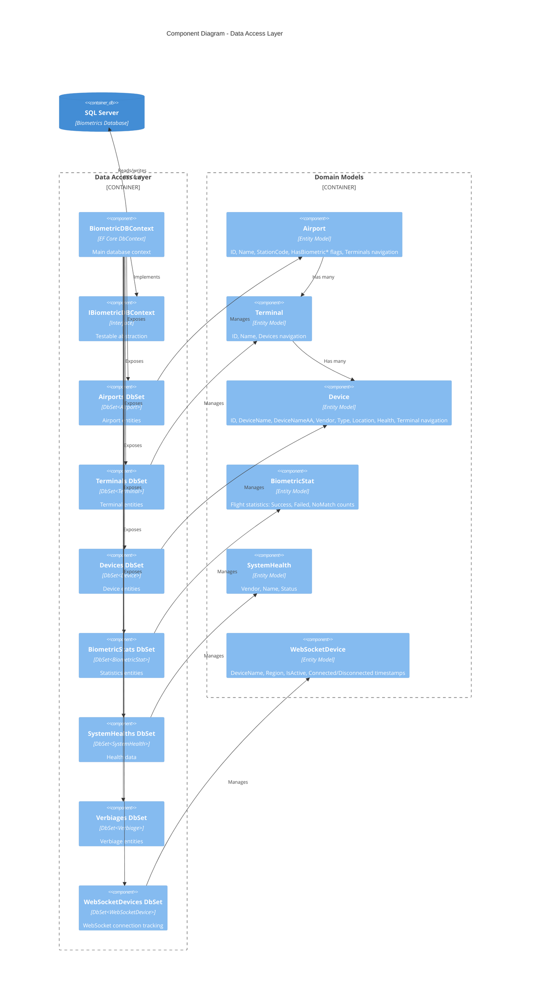

# Level 3: Component Diagram - Data Access Layer

## Overview

This diagram shows the data access layer components including Entity Framework DbContext, DbSets, and domain models.

## Diagram



## BiometricDBContext

**Project**: `gm-web-biometrics.data`

**Base Class**: `DbContext`

**Implements**: `IBiometricDBContext`

**DbSets**:
```csharp
public DbSet<Airport> Airports { get; set; }
public DbSet<Terminal> Terminals { get; set; }
public DbSet<Device> Devices { get; set; }
public DbSet<Verbiage> Verbiages { get; set; }
public DbSet<SystemHealth> SystemHealths { get; set; }
public DbSet<BiometricStat> BiometricStats { get; set; }
public DbSet<WebSocketDevice> WebSocketDevices { get; set; }
```

**Custom Methods**:
```csharp
public async Task<bool> CanConnectAsync() => await Database.CanConnectAsync();
```

**Constructor**:
```csharp
public BiometricDBContext(DbContextOptions<BiometricDBContext> options) : base(options)
```

**Registration** (Program.cs):
```csharp
builder.Services.AddDbContext<BiometricDBContext>(options =>
{
    options.UseSqlServer(builder.Configuration.GetConnectionString("BiometricsDatabase"));
});

builder.Services.AddScoped<IBiometricDBContext>(provider =>
    provider.GetRequiredService<BiometricDBContext>());
```

## IBiometricDBContext Interface

**Purpose**: Testable abstraction for dependency injection and unit testing

**Definition**:
```csharp
public interface IBiometricDBContext
{
    DbSet<Airport> Airports { get; set; }
    DbSet<Terminal> Terminals { get; set; }
    DbSet<Device> Devices { get; set; }
    DbSet<Verbiage> Verbiages { get; set; }
    DbSet<SystemHealth> SystemHealths { get; set; }
    DbSet<BiometricStat> BiometricStats { get; set; }
    DbSet<WebSocketDevice> WebSocketDevices { get; set; }
    Task<bool> CanConnectAsync();
}
```

**Benefits**:
- Enables mocking in unit tests
- Supports dependency inversion principle
- Allows swapping implementations (e.g., in-memory database for testing)

## Domain Models

### Airport Entity

**Purpose**: Represents airport configuration with biometric capabilities

**Schema**:
```csharp
public class Airport
{
    [Key]
    public int ID { get; set; }
    
    [MaxLength(3)]
    public string StationCode { get; set; }  // e.g., "DFW", "LAX", "PHX"
    
    public string Name { get; set; }         // e.g., "Dallas Fort Worth International"
    
    public bool HasBiometricTSA { get; set; }    // TSA PreCheck biometrics
    public bool HasBiometricClub { get; set; }   // Admirals Club biometrics
    public bool HasBiometricExit { get; set; }   // Exit/Departure biometrics
    
    public virtual ICollection<Terminal> Terminals { get; set; }  // Navigation property
}
```

**Relationships**:
- One-to-Many with Terminal

**Indexes**: None explicitly defined (consider adding on StationCode for performance)

### Terminal Entity

**Purpose**: Represents physical terminals within an airport

**Schema**:
```csharp
public class Terminal
{
    [Key]
    public int ID { get; set; }
    
    public string Name { get; set; }  // e.g., "Terminal A", "Terminal B"
    
    public virtual ICollection<Device> Devices { get; set; }  // Navigation property
}
```

**Relationships**:
- Many-to-One with Airport (implicit via EF conventions)
- One-to-Many with Device

**Note**: Originally had a Gate entity in the hierarchy (Airport ? Terminal ? Gate ? Device) which was removed in migration `20230518163849_RemoveGate`. Gates are now represented by Device.DeviceLocation.

### Device Entity

**Purpose**: Represents individual biometric scanning devices

**Schema**:
```csharp
public class Device
{
    [Key]
    public int ID { get; set; }
    
    public string DeviceName { get; set; }      // Internal device identifier
    public string DeviceNameAA { get; set; }    // American Airlines device identifier
    public string DeviceVendor { get; set; }    // "VeriScan", "CDA", "NEC", "SITA"
    public string DeviceType { get; set; }      // e.g., "SurfaceBook", "iPad"
    public string DeviceLocation { get; set; }  // Gate identifier, e.g., "A5", "B12"
    public string BiometricType { get; set; }   // "CLUB", "TSA", "EXIT"
    public DateTime LastStatusDateTime { get; set; }
    public string DeviceHealth { get; set; }    // "Online", "Offline", "Error"
    public DateTime AlertStartDate { get; set; }
    public DateTime AlertEndDate { get; set; }
    
    public int? TerminalID { get; set; }        // Foreign key
}
```

**Relationships**:
- Many-to-One with Terminal

**Business Rules**:
- Devices with "-DSH-" in DeviceName are excluded from boarding operations (dashboard devices)
- DeviceLocation is used for gate filtering in boarding configuration

### BiometricStat Entity

**Purpose**: Stores flight-level boarding statistics

**Schema**:
```csharp
public class BiometricStat
{
    [Key]
    public int ID { get; set; }
    
    public string FlightNumber { get; set; }
    public string Origin { get; set; }         // Departure airport code
    public string Destination { get; set; }    // Arrival airport code
    public string Gate { get; set; }
    public DateTime FlightDate { get; set; }
    
    // Statistics counters
    public int Success { get; set; }      // Successful biometric scans
    public int Failed { get; set; }       // Failed scans
    public int NoMatch { get; set; }      // No biometric match
    public int Online { get; set; }       // Online status count
    public int Offline { get; set; }      // Offline status count
    public int Exceptions { get; set; }   // Exception count
    public int Open { get; set; }         // Open hardware count
    public int Close { get; set; }        // Close hardware count
    
    public DateTime FirstScan { get; set; }
    public DateTime LastScan { get; set; }
    public string CorrelationIds { get; set; }  // Comma-separated correlation IDs
}
```

**Query Patterns**:
```csharp
// Filter by date range and minimum successful scans
biometricStats.Where(stat => 
    stat.FlightDate >= startDate && 
    stat.FlightDate <= endDate && 
    stat.Success > minCount)

// Filter by origin and destination
biometricStats.Where(stat => 
    stat.Origin == originCode && 
    stat.Destination == destinationCode)
```

### SystemHealth Entity

**Purpose**: Tracks system and vendor health status over time

**Schema**:
```csharp
public class SystemHealth
{
    [Key]
    public int ID { get; set; }
    
    public string Vendor { get; set; }    // "VeriScan", "CDA", "NEC", "SITA", "Club"
    public string Name { get; set; }      // System/service name
    public string Status { get; set; }    // "Online", "Offline", "Degraded"
    public DateTime Timestamp { get; set; }
}
```

**Use Cases**:
- Monitor external vendor system health
- Track biometric service availability
- Historical health analysis

### Verbiage Entity

**Purpose**: Stores configurable UI text/messages

**Schema**:
```csharp
public class Verbiage
{
    [Key]
    public int ID { get; set; }
    
    public string Name { get; set; }   // Verbiage identifier (e.g., "TSA", "CLUB")
    public string Copy { get; set; }   // The actual text content
}
```

**Use Cases**:
- Configurable passenger-facing messages
- Multi-language support (potential)
- Dynamic UI text without code deployment

### WebSocketDevice Entity

**Purpose**: Tracks active WebSocket connections and device regions

**Schema**:
```csharp
public class WebSocketDevice
{
    [Key]
    public int ID { get; set; }
    
    public string DeviceName { get; set; }
    public string WebSocketRegion { get; set; }  // "Region East", "Region West"
    public bool IsActive { get; set; }
    public DateTime ConnectedDateTimeUTC { get; set; }
    public DateTime DisconnectedDateTimeUTC { get; set; }
}
```

**Use Cases**:
- Device region routing for multi-region deployments
- Connection monitoring and diagnostics
- Active connection lookup

**Query Patterns**:
```csharp
// Get active device in specific region
WebSocketDevices.Where(dev => 
    dev.DeviceName == deviceName && 
    dev.IsActive == true && 
    dev.WebSocketRegion == region)

// Get all active devices in environment
WebSocketDevices.Where(dev => 
    dev.WebSocketRegion == environment && 
    dev.IsActive == true)
```

## Entity Framework Migrations

**Migration History** (Selected):

1. **20230517215703_AddTerminalGate**: Added Terminal and Gate hierarchy
2. **20230518163849_RemoveGate**: Removed Gate entity, flattened to Terminal ? Device
3. Additional migrations for BiometricStat, SystemHealth, WebSocketDevice tables

**Migration Execution** (Program.cs):
```csharp
app.MigrateAndSeedDB();
```

**Migration Pattern**:
- Code-First approach
- Automatic schema updates on deployment
- Seed data support (if configured)

## Database Connection Configuration

**Connection String** (appsettings.json):
```json
{
  "ConnectionStrings": {
    "BiometricsDatabase": "Server=...;Database=BiometricsDB;..."
  }
}
```

**Health Check**:
```csharp
bool databaseUp = context.Database.CanConnect();
```

**Async Health Check**:
```csharp
bool databaseUp = await context.CanConnectAsync();
```

## Common Query Patterns

### Airport with Terminals and Devices
```csharp
await biometricDBContext.Airports
    .Include("Terminals.Devices")
    .ToListAsync();
```

### Devices by Gate
```csharp
var devices = airport.Terminals
    .SelectMany(t => t.Devices)
    .Where(d => d.DeviceLocation == gate && 
                !d.DeviceName.Contains("-DSH-", StringComparison.OrdinalIgnoreCase))
    .ToList();
```

### Statistics with Filtering
```csharp
await biometricDBContext.BiometricStats
    .Where(stat => 
        stat.FlightDate >= filter.StartDate &&
        stat.FlightDate <= filter.EndDate &&
        stat.Success > filter.BoardedPassengersCount &&
        stat.Origin == filter.Origin &&
        stat.Destination == filter.Destination)
    .AsNoTracking()
    .ToListAsync();
```

### Active WebSocket Devices
```csharp
await biometricDBContext.WebSocketDevices
    .Where(dev => dev.IsActive == true)
    .ToListAsync();
```

## Testing Support

**In-Memory Database** (Unit Tests):
```csharp
var options = new DbContextOptionsBuilder<BiometricDBContext>()
    .UseInMemoryDatabase("TestDatabase")
    .Options;

var dbContext = new BiometricDBContext(options);
```

**Benefits**:
- Fast test execution
- No external database dependency
- Isolated test data
- Supports Include/navigation properties

## Performance Considerations

### AsNoTracking()
Used in query-only scenarios to improve performance:
```csharp
.AsNoTracking().ToListAsync()
```

### Eager Loading
Reduces N+1 query issues:
```csharp
.Include("Terminals.Devices")
```

### Indexing Recommendations
Consider adding indexes on:
- `Airport.StationCode` (frequently queried)
- `Device.DeviceLocation` (used in gate filtering)
- `BiometricStat.FlightDate` (used in date range queries)
- `WebSocketDevice.DeviceName + IsActive` (composite index for active device lookup)

## Next Steps

- See [BiometricDBContext Code Diagram](04-Code-BiometricDBContext.md) for detailed class structure
- See [API Flow Sequence Diagram](04-Code-Sequence-API-Flow.md) for database interaction patterns
- See [Business Logic Component Diagram](03-Component-Business-Logic.md) for data access usage
