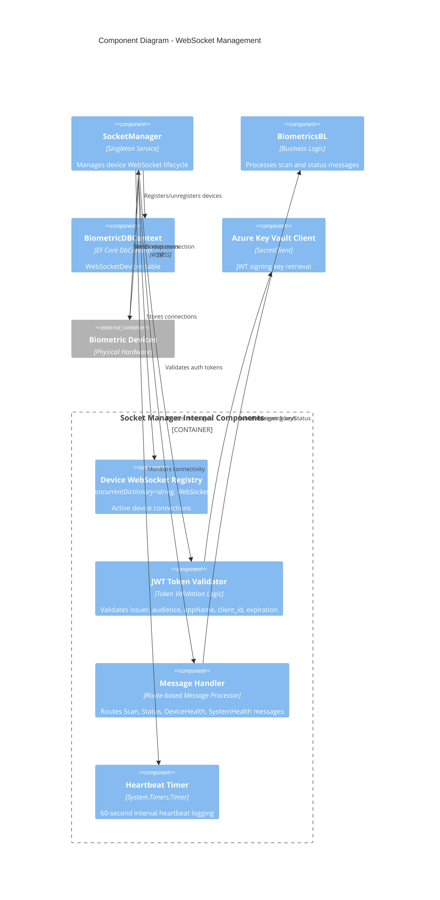

# Level 3: Component Diagram - WebSocket Management

## Overview

This diagram shows the Socket Manager's internal components and how it manages WebSocket connections with biometric devices.

## Diagram



## Socket Manager Components

### Main SocketManager Class

**Project**: `gm-web-biometrics.socketmanager`

**Lifecycle**: Singleton service registered in DI container

**Key Properties**:
```csharp
private ConcurrentDictionary<string, WebSocket> DeviceWebSockets
private IServiceBusSend _serviceBusSend
private ILogger<SocketManager> _logger
private IConfiguration _config
private IServiceScopeFactory _scopeFactory
private List<string> _clients
private string _tokenIssuer
private string _tokenAudience
private List<string> _tokenAppNames
private string _environment
private SecretClient _secretClient
private Timer _heartbeatTimer
```

**Public Methods**:
```csharp
Task<bool> ValidateToken(string authToken)
Task RegisterSocket(string deviceName, WebSocket webSocket)
Task<string> SendMessage(string deviceName, string messageToSend)
ValueTask DisposeAsync()
```

**Private Methods**:
```csharp
Task ReceiveMessage(string deviceName, WebSocket webSocket)
Task HandleMessage(string deviceName, SocketMessage message)
Task UnRegisterSocket(string deviceName)
Task<string> GetTokenFromKeyVault(string token)
string CreateFailedScanResponse(Scan scan)
void sendHeartBeat()
```

### Device WebSocket Registry

**Type**: `ConcurrentDictionary<string, WebSocket>`

**Purpose**: Thread-safe storage of active WebSocket connections

**Operations**:
- `TryAdd(deviceName, webSocket)` - Register new device
- `TryRemove(deviceName, out webSocket)` - Unregister device
- `ContainsKey(deviceName)` - Check if device is connected

**Key Features**:
- Thread-safe concurrent access
- Device name as unique identifier
- Automatic cleanup on disconnection

### JWT Token Validator

**Validation Checks**:

1. **Token Presence**: Token must not be null or empty
2. **Token Format**: Must be valid JWT format
3. **Issuer Validation**: `token.Issuer == _tokenIssuer`
4. **Expiration Check**: `token.ValidTo >= DateTime.UtcNow`
5. **Audience Validation**: `token.Audiences[0] == _tokenAudience`
6. **App Name Validation**: `token.Payload["appName"] in _tokenAppNames`
7. **Client ID Validation**: `token.Payload["client_id"] in _clients`

**Configuration Dependencies**:
```csharp
remoteManager:ValidClients       // Comma-separated client IDs
remoteManager:TokenIssuer        // Expected token issuer
remoteManager:TokenAudience      // Expected token audience
remoteManager:TokenAppName       // Comma-separated app names
```

**Validation Flow**:
```
authToken (from Authorization header)
  ?
Remove "Bearer " prefix
  ?
JwtSecurityTokenHandler.ReadJwtToken()
  ?
Validate all claims
  ?
Return true/false
```

### Message Handler

**Supported Routes** (Enum):
```csharp
public enum Routes
{
    Status,
    Scan,
    DeviceHealth,
    SystemHealth
}
```

**Message Processing**:

#### Status Message
```csharp
Route: Status
Payload: Status object
Action: BiometricsBL.SendStatusMessage(vendor, correlationId, status)
Response: None (fire and forget)
```

#### Scan Message
```csharp
Route: Scan
Payload: Scan object
Validation: 
  - CBPStatus must be "Match"
  - PassengerUID must not be null or "0"
Processing:
  - Normalize PassengerUID
  - Generate ScanID if missing
  - Call BiometricsBL.SendScanMessage()
Response: ScanResponse sent back to device via WebSocket
```

#### DeviceHealth Message
```csharp
Route: DeviceHealth
Status: Not currently in use
```

#### SystemHealth Message
```csharp
Route: SystemHealth
Status: Not currently in use
```

**Failed Scan Response**:
```csharp
{
    "StatusCode": "Failed",
    "StatusMessage": "PLEASE SEE AGENT",
    "PassengerUID": originalPassengerUID,
    "CorrelationId": originalCorrelationId
}
```

### Heartbeat Timer

**Configuration**:
- **Interval**: 60,000 ms (1 minute)
- **Event**: Logs heartbeat with UTC timestamp
- **Purpose**: Monitor Socket Manager health

**Log Message**:
```
REMOTEMANAGER_HEARTBEAT: {DateTime.UtcNow}
```

## WebSocket Connection Lifecycle

### Registration Flow

1. **Client Connects** ? RemoteManagerController.RegisterDevice(deviceName)
2. **Validate JWT Token** ? SocketManager.ValidateToken(authToken)
3. **Accept WebSocket** ? HttpContext.WebSockets.AcceptWebSocketAsync()
4. **Wait for Open State** ? while (webSocket.State != Open)
5. **Add to Registry** ? DeviceWebSockets.TryAdd(deviceName, webSocket)
6. **Store in Database** ? WebSocketDevices table insert
   ```csharp
   {
       DeviceName = deviceName,
       WebSocketRegion = _environment,
       IsActive = true,
       ConnectedDateTimeUTC = DateTime.UtcNow,
       DisconnectedDateTimeUTC = default
   }
   ```
7. **Start Receiving** ? ReceiveMessage(deviceName, webSocket)

### Message Reception Flow

1. **Create Buffer** ? ArraySegment<byte>(new Byte[1024 * 4])
2. **Receive Loop** ? while (webSocket.State == Open)
3. **Read Message** ? webSocket.ReceiveAsync(buffer, CancellationToken.None)
4. **Wait for Complete Message** ? while (!result.EndOfMessage)
5. **Deserialize** ? JsonSerializer.Deserialize<SocketMessage>()
6. **Validate Token** ? SocketManager.ValidateToken(message.Token)
7. **Handle Message** ? HandleMessage(deviceName, message)
8. **Continue Loop** ? Repeat until connection closes

### Unregistration Flow

1. **Detect Disconnect** ? webSocket.State != Open
2. **Remove from Registry** ? DeviceWebSockets.TryRemove(deviceName)
3. **Close WebSocket** ? webSocket.CloseAsync(NormalClosure)
4. **Update Database** ? WebSocketDevices record
   ```csharp
   {
       IsActive = false,
       DisconnectedDateTimeUTC = DateTime.UtcNow
   }
   ```
5. **Log Unregistration** ? "UnRegistering websocket: {deviceName}"

### Disposal Flow (Application Shutdown)

1. **Stop Heartbeat** ? _heartbeatTimer.Stop() and Dispose()
2. **Unregister All Devices** ? For each device in DeviceWebSockets
3. **Mark All Inactive** ? Update all WebSocketDevices where Region == _environment
   ```csharp
   {
       IsActive = false,
       DisconnectedDateTimeUTC = DateTime.UtcNow
   }
   ```
4. **Save Changes** ? dbContext.SaveChangesAsync()

## Security Architecture

### WebSocket Security

**Transport**: WSS (WebSocket Secure over TLS)

**Authentication**:
1. JWT token in Authorization header
2. Token validated on initial connection
3. Token validated on each message received

**Token Structure**:
```json
{
  "iss": "expected-issuer",
  "aud": "expected-audience",
  "exp": timestamp,
  "appName": "valid-app-name",
  "client_id": "valid-client-id"
}
```

### Azure Key Vault Integration

**Purpose**: Retrieve JWT signing keys

**Client Configuration**:
```csharp
SecretClientOptions options = new()
{
    Retry = {
        Delay = TimeSpan.FromSeconds(2),
        MaxDelay = TimeSpan.FromSeconds(16),
        MaxRetries = 5,
        Mode = RetryMode.Exponential
    }
};
_secretClient = new SecretClient(
    new Uri(config["biometrics:keyVaultURL"]), 
    new DefaultAzureCredential(), 
    options
);
```

**Retry Policy**: Exponential backoff with 5 retries

## Database Tracking

### WebSocketDevices Table

**Schema**:
```sql
CREATE TABLE WebSocketDevices (
    ID INT IDENTITY(1,1) PRIMARY KEY,
    DeviceName NVARCHAR(MAX),
    WebSocketRegion NVARCHAR(MAX),
    IsActive BIT,
    ConnectedDateTimeUTC DATETIME2,
    DisconnectedDateTimeUTC DATETIME2
)
```

**Usage**:
- Track active WebSocket connections
- Identify which region (East/West) hosts each device
- Monitor connection/disconnection times
- Support device region lookup for message routing

## Configuration

### Required Configuration Keys

```json
{
  "remoteManager:ValidClients": "client1,client2,client3",
  "remoteManager:TokenIssuer": "https://issuer.example.com",
  "remoteManager:TokenAudience": "biometrics-api",
  "remoteManager:TokenAppName": "BiometricsDevice,BiometricsClient",
  "biometrics:Environment": "Region East",
  "biometrics:keyVaultURL": "https://keyvault.vault.azure.net/"
}
```

## Error Handling

### Unauthorized Connections
```csharp
if (!await socketManager.ValidateToken(token))
{
    HttpContext.Response.StatusCode = StatusCodes.Status401Unauthorized;
}
```

### Invalid Scans
- PassengerUID is null or "0"
- CBPStatus is not "Match"
? Send failed scan response immediately

### WebSocket Errors
- Connection drops ? Auto-unregister device
- Message parsing fails ? Log exception, continue loop
- Token validation fails ? Send "Unauthorized" message

## Performance Considerations

### Thread Safety
- Uses `ConcurrentDictionary` for device registry
- Async/await throughout for non-blocking operations
- Scoped `DbContext` via `IServiceScopeFactory`

### Resource Management
- Implements `IAsyncDisposable` for cleanup
- Timer disposed on shutdown
- WebSocket connections properly closed
- Database connections scoped per operation

### Scalability
- Singleton service shared across requests
- Concurrent connection handling
- Efficient message buffer management (4KB buffer)

## Next Steps

- See [BiometricsBL Code Diagram](04-Code-BiometricsBL.md) for scan processing details
- See [WebSocket Scan Sequence Diagram](04-Code-Sequence-WebSocket-Scan.md) for complete flow
- See [Data Access Component Diagram](03-Component-Data-Access.md) for database structure
