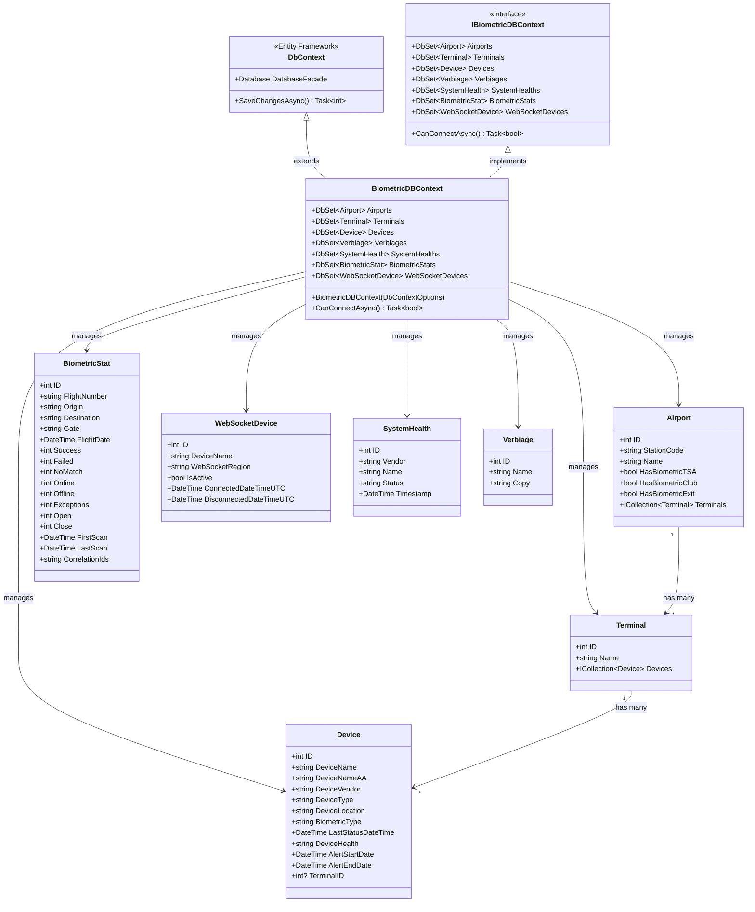

# Level 4: Code Diagram - BiometricDBContext and Entities

## Overview

This diagram shows the detailed structure of the database context and entity models.

## Class Diagram



## Entity Details

### Airport Entity

**Purpose**: Airport configuration with biometric capabilities

**Properties**:
```csharp
[Key]
public int ID { get; set; }

[MaxLength(3)]
public string StationCode { get; set; }  // IATA code: "DFW", "LAX", "PHX"

public string Name { get; set; }  // Full airport name

public bool HasBiometricTSA { get; set; }    // TSA PreCheck biometrics enabled
public bool HasBiometricClub { get; set; }   // Admirals Club biometrics enabled
public bool HasBiometricExit { get; set; }   // Exit gate biometrics enabled

public virtual ICollection<Terminal> Terminals { get; set; }
```

**Relationships**:
- One-to-Many: Airport ? Terminals

**Database Table**: `Airports`

**Sample Data**:
```json
{
  "ID": 1,
  "StationCode": "DFW",
  "Name": "Dallas Fort Worth International",
  "HasBiometricTSA": true,
  "HasBiometricClub": true,
  "HasBiometricExit": false,
  "Terminals": [...]
}
```

### Terminal Entity

**Purpose**: Physical terminals within an airport

**Properties**:
```csharp
[Key]
public int ID { get; set; }

public string Name { get; set; }  // "Terminal A", "Terminal B", "Terminal C"

public virtual ICollection<Device> Devices { get; set; }
```

**Relationships**:
- Many-to-One: Terminal ? Airport (implicit via FK)
- One-to-Many: Terminal ? Devices

**Database Table**: `Terminal`

**Note**: Originally had a Gate entity between Terminal and Device, removed in migration `20230518163849_RemoveGate`.

### Device Entity

**Purpose**: Individual biometric scanning devices at gates

**Properties**:
```csharp
[Key]
public int ID { get; set; }

public string DeviceName { get; set; }      // Internal identifier
public string DeviceNameAA { get; set; }    // American Airlines identifier
public string DeviceVendor { get; set; }    // "VeriScan", "CDA", "NEC", "SITA"
public string DeviceType { get; set; }      // "SurfaceBook", "iPad", etc.
public string DeviceLocation { get; set; }  // Gate: "A5", "B12", "C23"
public string BiometricType { get; set; }   // "CLUB", "TSA", "EXIT"
public DateTime LastStatusDateTime { get; set; }
public string DeviceHealth { get; set; }    // "Online", "Offline", "Error"
public DateTime AlertStartDate { get; set; }
public DateTime AlertEndDate { get; set; }

public int? TerminalID { get; set; }  // Foreign key to Terminal
```

**Relationships**:
- Many-to-One: Device ? Terminal

**Database Table**: `Devices`

**Business Rules**:
- Devices with "-DSH-" in name are dashboards (excluded from boarding)
- DeviceLocation is used for gate-based device filtering

**Sample Data**:
```json
{
  "ID": 101,
  "DeviceName": "DFWCLUBA",
  "DeviceNameAA": "DFWCLUBA",
  "DeviceVendor": "VeriScan",
  "DeviceType": "SurfaceBook",
  "DeviceLocation": "A5",
  "BiometricType": "CLUB",
  "LastStatusDateTime": "2024-01-15T10:30:00Z",
  "DeviceHealth": "Online",
  "TerminalID": 1
}
```

### BiometricStat Entity

**Purpose**: Flight-level boarding statistics and metrics

**Properties**:
```csharp
[Key]
public int ID { get; set; }

public string FlightNumber { get; set; }
public string Origin { get; set; }       // Departure airport code
public string Destination { get; set; }  // Arrival airport code
public string Gate { get; set; }
public DateTime FlightDate { get; set; }

// Counters
public int Success { get; set; }      // Successful scans
public int Failed { get; set; }       // Failed scans
public int NoMatch { get; set; }      // No biometric match
public int Online { get; set; }       // Online status count
public int Offline { get; set; }      // Offline status count
public int Exceptions { get; set; }   // Exception count
public int Open { get; set; }         // Open hardware count
public int Close { get; set; }        // Close hardware count

public DateTime FirstScan { get; set; }
public DateTime LastScan { get; set; }
public string CorrelationIds { get; set; }  // CSV of correlation IDs
```

**Database Table**: `BiometricStats`

**Query Patterns**:
```csharp
// By date range with minimum success count
biometricStats.Where(stat => 
    stat.FlightDate >= startDate && 
    stat.FlightDate <= endDate && 
    stat.Success > minCount)

// By origin and destination
biometricStats.Where(stat => 
    stat.Origin == "DFW" && 
    stat.Destination == "LAX")
```

**Sample Data**:
```json
{
  "ID": 1001,
  "FlightNumber": "AA123",
  "Origin": "DFW",
  "Destination": "LAX",
  "Gate": "A5",
  "FlightDate": "2024-01-15T14:30:00Z",
  "Success": 145,
  "Failed": 2,
  "NoMatch": 3,
  "FirstScan": "2024-01-15T13:00:00Z",
  "LastScan": "2024-01-15T14:25:00Z",
  "CorrelationIds": "DFWA5AA12320240115ACE,..."
}
```

### WebSocketDevice Entity

**Purpose**: Track active WebSocket connections and regions

**Properties**:
```csharp
[Key]
public int ID { get; set; }

public string DeviceName { get; set; }
public string WebSocketRegion { get; set; }  // "East", "West"
public bool IsActive { get; set; }
public DateTime ConnectedDateTimeUTC { get; set; }
public DateTime DisconnectedDateTimeUTC { get; set; }
```

**Database Table**: `WebSocketDevices`

**Usage**:
- Track which region hosts each device connection
- Support multi-region deployment
- Monitor connection/disconnection times
- Device region lookup for message routing

**Query Patterns**:
```csharp
// Get active device in specific region
WebSocketDevices.Where(dev => 
    dev.DeviceName == deviceName && 
    dev.IsActive == true)

// Get all active devices in region
WebSocketDevices.Where(dev => 
    dev.WebSocketRegion == region && 
    dev.IsActive == true)
```

**Sample Data**:
```json
{
  "ID": 501,
  "DeviceName": "DFWCLUBA",
  "WebSocketRegion": "East",
  "IsActive": true,
  "ConnectedDateTimeUTC": "2024-01-15T10:30:00Z",
  "DisconnectedDateTimeUTC": null
}
```

### SystemHealth Entity

**Purpose**: Track system and vendor health over time

**Properties**:
```csharp
[Key]
public int ID { get; set; }

public string Vendor { get; set; }   // "VeriScan", "CDA", "NEC", "SITA", "Club"
public string Name { get; set; }     // System/service name
public string Status { get; set; }   // "Online", "Offline", "Degraded"
public DateTime Timestamp { get; set; }
```

**Database Table**: `SystemHealths`

**Usage**:
- Monitor vendor system availability
- Track service health over time
- Historical analysis and reporting

### Verbiage Entity

**Purpose**: Configurable UI text/messages

**Properties**:
```csharp
[Key]
public int ID { get; set; }

public string Name { get; set; }  // Verbiage identifier
public string Copy { get; set; }  // The actual text content
```

**Database Table**: `Verbiages`

**Usage**:
- Configurable passenger-facing messages
- Support for different boarding types (TSA, Club, Exit)
- Localization support (potential)

## BiometricDBContext Implementation

**Project**: `gm-web-biometrics.data`

**DbSets**:
```csharp
public DbSet<Airport> Airports { get; set; }
public DbSet<Terminal> Terminals { get; set; }
public DbSet<Device> Devices { get; set; }
public DbSet<Verbiage> Verbiages { get; set; }
public DbSet<SystemHealth> SystemHealths { get; set; }
public DbSet<BiometricStat> BiometricStats { get; set; }
public DbSet<WebSocketDevice> WebSocketDevices { get; set; }
```

**Constructor**:
```csharp
public BiometricDBContext(DbContextOptions<BiometricDBContext> options) 
    : base(options)
{
}
```

**Custom Methods**:
```csharp
public async Task<bool> CanConnectAsync() => await Database.CanConnectAsync();
```

## IBiometricDBContext Interface

**Purpose**: Testable abstraction for dependency injection

```csharp
public interface IBiometricDBContext
{
    DbSet<Airport> Airports { get; set; }
    DbSet<Terminal> Terminals { get; set; }
    DbSet<Device> Devices { get; set; }
    DbSet<Verbiage> Verbiages { get; set; }
    DbSet<SystemHealth> SystemHealths { get; set; }
    DbSet<BiometricStat> BiometricStats { get; set; }
    DbSet<WebSocketDevice> WebSocketDevices { get; set; }
    Task<bool> CanConnectAsync();
}
```

**Registration** (Program.cs):
```csharp
builder.Services.AddDbContext<BiometricDBContext>(options =>
{
    options.UseSqlServer(builder.Configuration.GetConnectionString("BiometricsDatabase"));
});

builder.Services.AddScoped<IBiometricDBContext>(provider =>
    provider.GetRequiredService<BiometricDBContext>());
```

## Common Query Patterns

### Load Airport with Terminals and Devices
```csharp
var airport = await context.Airports
    .Where(a => a.StationCode == stationCode)
    .Include("Terminals.Devices")
    .FirstOrDefaultAsync();
```

### Get Devices for Gate
```csharp
var devices = airport.Terminals
    .SelectMany(t => t.Devices)
    .Where(d => d.DeviceLocation == gate && 
                !d.DeviceName.Contains("-DSH-", StringComparison.OrdinalIgnoreCase))
    .ToList();
```

### Get Statistics with Filter
```csharp
var stats = await context.BiometricStats
    .Where(s => s.FlightDate >= startDate &&
                s.FlightDate <= endDate &&
                s.Success > minCount)
    .AsNoTracking()
    .ToListAsync();
```

### Get Active WebSocket Devices
```csharp
var activeDevices = await context.WebSocketDevices
    .Where(d => d.IsActive == true && d.WebSocketRegion == region)
    .ToListAsync();
```

## Entity Framework Migrations

**Key Migrations**:
- `20230517215703_AddTerminalGate` - Added Terminal/Gate hierarchy
- `20230518163849_RemoveGate` - Removed Gate, flattened to Terminal?Device
- Various migrations for additional tables

**Migration Execution**:
```csharp
app.MigrateAndSeedDB();  // Extension method in Program.cs
```

## Performance Optimizations

**AsNoTracking()**: Used for read-only queries
```csharp
.AsNoTracking().ToListAsync()
```

**Eager Loading**: Prevents N+1 queries
```csharp
.Include("Terminals.Devices")
```

**Index Recommendations**:
- `Airport.StationCode` - Frequently queried
- `Device.DeviceLocation` - Gate filtering
- `BiometricStat.FlightDate` - Date range queries
- `WebSocketDevice.DeviceName + IsActive` - Composite index

## Testing Support

**In-Memory Database** (Unit Tests):
```csharp
var options = new DbContextOptionsBuilder<BiometricDBContext>()
    .UseInMemoryDatabase("TestDatabase")
    .Options;

var context = new BiometricDBContext(options);
```

**Benefits**:
- Fast execution
- No external dependencies
- Isolated test data
- Supports navigation properties

## Connection String Configuration

```json
{
  "ConnectionStrings": {
    "BiometricsDatabase": "Server=tcp:server.database.windows.net,1433;Database=BiometricsDB;User ID=username;Password=password;Encrypt=True;TrustServerCertificate=False;"
  }
}
```

## Next Steps

- See [API Flow Sequence Diagram](04-Code-Sequence-API-Flow.md) for database interaction patterns
- See [Data Access Component Diagram](03-Component-Data-Access.md) for architecture context
- See [BiometricsAdminBL](04-Code-BiometricsBL.md) for CRUD operations
