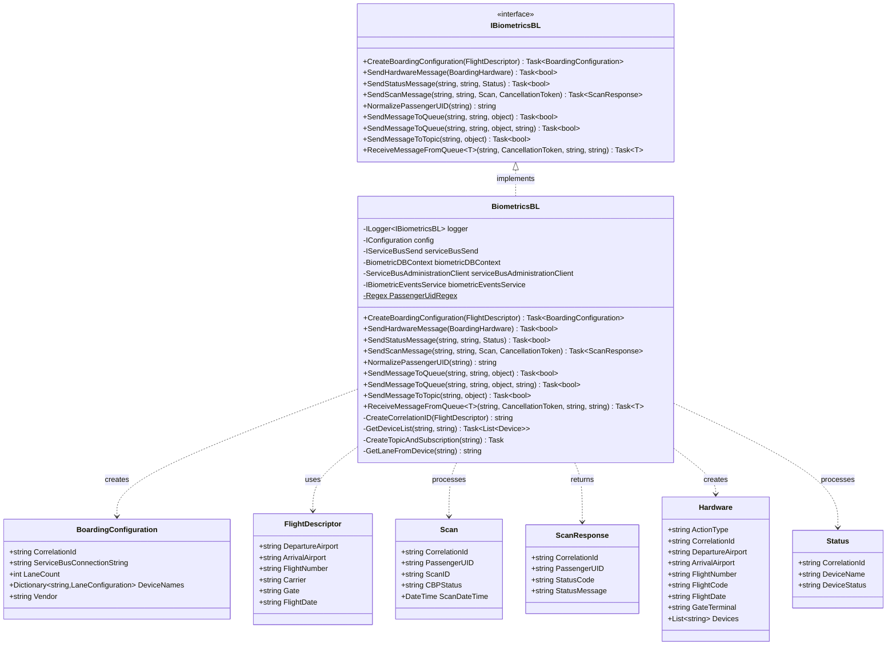

# Level 4: Code Diagram - BiometricsBL Class

## Overview

This diagram shows the detailed structure of the BiometricsBL class, the core business logic component for boarding operations.

## Class Diagram



## Implementation Details

### Constructor Injection

```csharp
public BiometricsBL(
    ILogger<IBiometricsBL> logger,
    IConfiguration config,
    IServiceBusSend serviceBusSend,
    BiometricDBContext biometricDBContext,
    ServiceBusAdministrationClient serviceBusAdministrationClient,
    IBiometricEventsService biometricEventsService)
```

**Dependencies**:
- **logger**: Structured logging with LogInfo
- **config**: Configuration access for feature flags and connection strings
- **serviceBusSend**: Service Bus messaging operations
- **biometricDBContext**: Database access for device lookup
- **serviceBusAdministrationClient**: Topic/subscription management
- **biometricEventsService**: ACE Biometric Events API integration

### CreateBoardingConfiguration

**Purpose**: Initializes boarding session for a flight

**Algorithm**:
```
1. Create correlation ID: 
   {DepartureAirport}{Gate}{FlightNumber}{FlightDate}ACE
   
2. Retrieve Service Bus connection string from config

3. Query devices from database:
   - Find airport by station code
   - Filter devices by gate
   - Exclude dashboard devices (-DSH-)
   
4. Build lane configuration:
   - Extract lane identifier from DeviceNameAA (last character)
   - Create LaneConfiguration for each unique lane
   
5. Create Service Bus topic and subscription:
   - Topic: biometrics-topic
   - Subscription: {correlationId}
   - Filter: CorrelationRuleFilter(correlationId)
   
6. Return BoardingConfiguration
```

**Correlation ID Format**:
```
DFW + A5 + AA123 + 20240115120000 + ACE
= DFWA5AA12320240115120000ACE
```

**Exception Handling**:
- "Airport does not exist" - Invalid station code
- "Airport does not have any Terminals configured" - Missing terminal setup
- "No devices configured for gate" - No devices at specified gate

### SendHardwareMessage

**Purpose**: Sends hardware control commands (OPEN/CLOSE) to devices

**Flow**:
```
1. Create Hardware message:
   - ActionType: Enum name of action (OPEN/CLOSE)
   - CorrelationId: From request
   - Flight details: From FlightDescriptor
   - Devices: Lane identifiers
   
2. Send to vendor queue via ServiceBusSend
   - Includes departureAirport for routing
   
3. Return success/failure
```

**Hardware Actions**:
- OPEN: Activate boarding devices
- CLOSE: Deactivate boarding devices

### SendStatusMessage

**Purpose**: Routes device status updates to appropriate endpoint

**Decision Logic**:
```csharp
bool seEnabled = config["biometrics:ACEServiceEndpointEnabled"] == "true";
bool isAceScan = correlationId.EndsWith("ACE");

if (seEnabled && isAceScan)
{
    // Route to ACE Biometric Events Service
    return await biometricEventsService.SendStatus(status);
}
else
{
    // Route to Service Bus queue
    return await SendMessageToQueue(vendor, correlationId, status);
}
```

**Status Message Properties**:
- DeviceName: Physical device identifier
- DeviceStatus: "Online", "Offline", "Error"
- CorrelationId: Session identifier

### SendScanMessage

**Purpose**: Processes biometric scan and returns verification result

**Flow**:
```
1. Check feature flag and correlation ID suffix
   
2. If ACE Service Endpoint enabled and correlationId ends with "ACE":
   a. Call biometricEventsService.SendScan()
   b. POST to ACE API /biometric-verification
   c. Return ExtendedScanResponse
   
3. Else (Legacy Service Bus flow):
   a. SendMessageToTopic(correlationId, scan)
      - Publish to biometrics-topic
      - Subscription filter routes to correct queue
   b. ReceiveMessageFromQueue<ExtendedScanResponse>()
      - Poll vendor response queue (8s timeout)
      - Batch receive 100 messages
      - Filter by correlationId + passengerUID
      - Complete matching message, abandon others
   c. Return ScanResponse
   
4. Log performance metrics (Stopwatch)
```

**Performance Monitoring**:
```csharp
var topicStopwatch = Stopwatch.StartNew();
// ... SendMessageToTopic
topicStopwatch.Stop();
logger.LogInformation($"SendMessageToTopic in {topicStopwatch.ElapsedMilliseconds} ms");

var queueStopwatch = Stopwatch.StartNew();
// ... ReceiveMessageFromQueue
queueStopwatch.Stop();
logger.LogInformation($"Queue receive completed in {queueStopwatch.ElapsedMilliseconds} ms");
```

### NormalizePassengerUID

**Purpose**: Standardizes passenger unique identifiers

**Regex Pattern**:
```csharp
@"^0$|^.+(?<pnr>[A-Z0-9]{6})(?<position>\d{3})(?<inf>[A-Z]+)?$"
```

**Examples**:
```
Input:  ABCDEF001
Output: ABCDEF001

Input:  PREFIX-ABCDEF001INF
Output: ABCDEF001INF

Input:  0
Output: 0 (no match case)

Input:  XYZ-ABC123456-SOMETHING
Output: ABC123456 (extracts PNR + position)
```

**Components**:
- **PNR**: 6-character alphanumeric record locator
- **Position**: 3-digit passenger position
- **INF**: Optional infant indicator

### CreateTopicAndSubscription (Private)

**Purpose**: Ensures Service Bus topic and correlation-filtered subscription exist

**Algorithm**:
```
1. Check if topic exists
   - If not, create with:
     * Auto-delete on idle: 8 hours
     * Message TTL: 4 hours
     * Partitioning enabled
     * No ordering support
     
2. Check if subscription exists for correlationId
   - If not, create with:
     * Auto-delete on idle: 10 minutes
     * Message TTL: 1 minute
     * Correlation filter rule
     * Dead-letter on filter exceptions
```

**Topic Options**:
```csharp
new CreateTopicOptions(topicName)
{
    SupportOrdering = false,
    AutoDeleteOnIdle = TimeSpan.FromHours(8),
    DefaultMessageTimeToLive = new TimeSpan(0, 4, 0, 0),
    EnablePartitioning = true
}
```

**Subscription Options**:
```csharp
new CreateSubscriptionOptions(topicName, subscriptionName)
{
    DefaultMessageTimeToLive = new TimeSpan(0, 0, 1, 0),  // 1 minute
    EnableDeadLetteringOnFilterEvaluationExceptions = true,
    EnableBatchedOperations = true,
    AutoDeleteOnIdle = TimeSpan.FromMinutes(10)
}
```

**Correlation Filter**:
```csharp
new CreateRuleOptions("CorrelationFilter", new CorrelationRuleFilter(correlationId))
```

### GetDeviceList (Private)

**Purpose**: Retrieves devices for a specific gate at an airport

**Query**:
```csharp
Airport airport = await biometricDBContext.Airports
    .Where(airport => airport.StationCode == departureAirport)
    .Include("Terminals.Devices")
    .FirstOrDefaultAsync();

// Extract devices for gate
airport.Terminals.ForEach(term =>
{
    if (term.Devices != null && term.Devices.Count > 0)
        deviceList.AddRange(
            term.Devices.Where(device => 
                device.DeviceLocation == gate && 
                !device.DeviceName.Contains("-DSH-", StringComparison.OrdinalIgnoreCase)
            ).ToList()
        );
});
```

**Filters**:
- Device location matches gate
- Excludes dashboard devices (containing "-DSH-")

### GetLaneFromDevice (Private)

**Purpose**: Extracts lane identifier from device name

**Logic**:
```csharp
private string GetLaneFromDevice(string device)
{
    char lane = device.Last();
    return string.Concat("LANE", lane);
}
```

**Example**:
```
DeviceNameAA: DFWCLUBA
Lane: LANEA

DeviceNameAA: PHXEXITB
Lane: LANEB
```

## Configuration Dependencies

```json
{
  "biometrics:ACEServiceEndpointEnabled": "true",
  "biometrics:ServiceBusConnectionString": "Endpoint=sb://...",
  "biometrics:TopicName": "biometrics-topic"
}
```

## Logging Strategy

**Structured Logging** with LogInfo:
```csharp
logger.LogInformation(new LogInfo(
    message: "SendMessageToTopic in 45 ms",
    correlationId: correlationId,
    scanID: scan.ScanID
));
```

**Key Log Points**:
1. ACE feature flag check
2. Topic publish timing
3. Queue receive timing
4. Subscription not found errors

## Error Scenarios

### Configuration Errors
- Missing airport: "Airport does not exist"
- Missing terminals: "Airport does not have any Terminals configured"
- Missing devices: "No devices configured for gate"

### Subscription Errors
- "Subscription {correlationId} not found"
- Thrown when SendMessageToTopic fails

### ACE Service Errors
- Handled within BiometricEventsService
- Returns null ScanResponse on failure

## Performance Characteristics

**CreateBoardingConfiguration**:
- Database query with eager loading
- Service Bus topic/subscription creation (if needed)
- Expected: < 500ms

**SendScanMessage**:
- Topic publish: < 50ms
- Queue receive: 1-8 seconds (with timeout)
- Expected total: 1-8.5 seconds

**SendStatusMessage**:
- Queue send: < 50ms
- ACE API call: 100-500ms

## Next Steps

- See [ServiceBusSend Code Diagram](04-Code-ServiceBusSend.md) for messaging implementation
- See [WebSocket Scan Sequence](04-Code-Sequence-WebSocket-Scan.md) for complete scan flow
- See [Business Logic Component Diagram](03-Component-Business-Logic.md) for context
