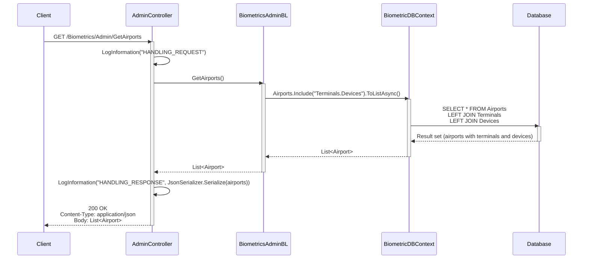
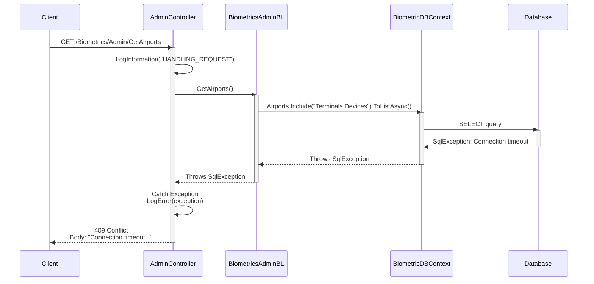
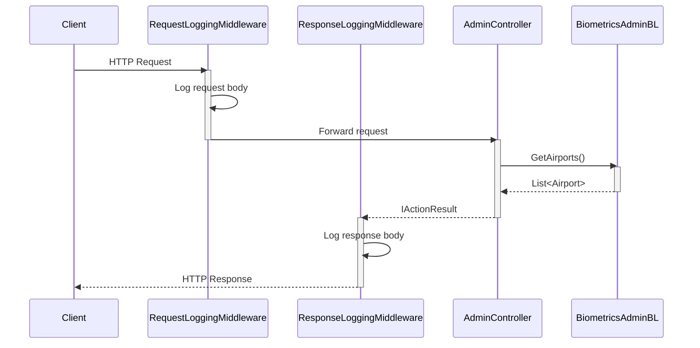
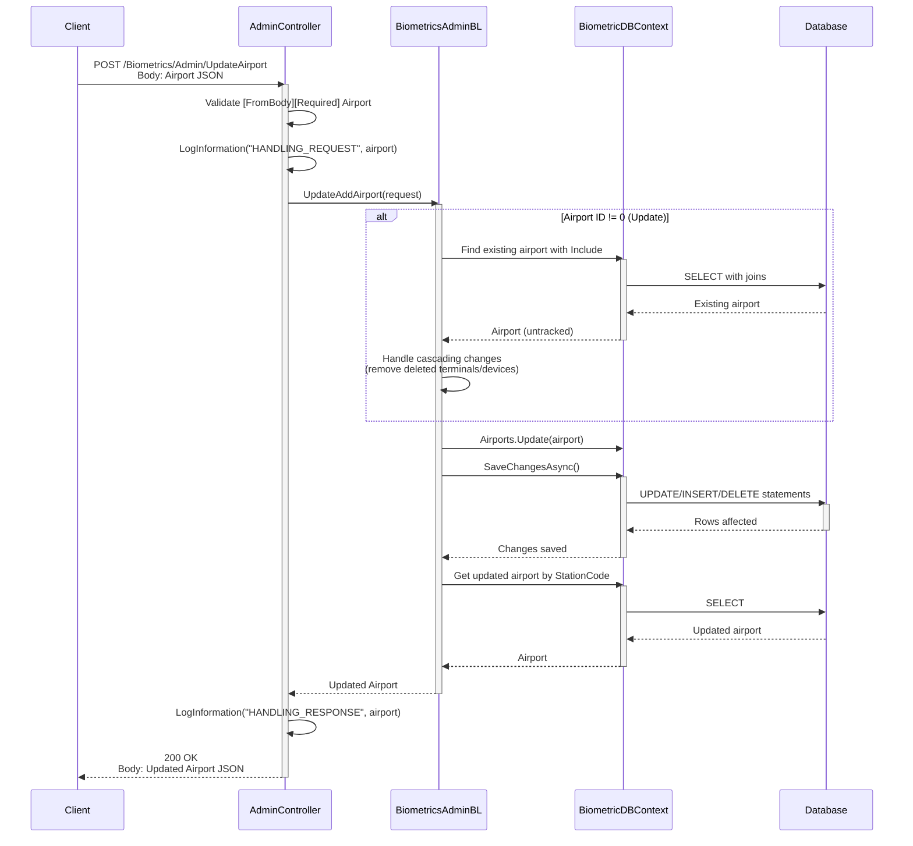
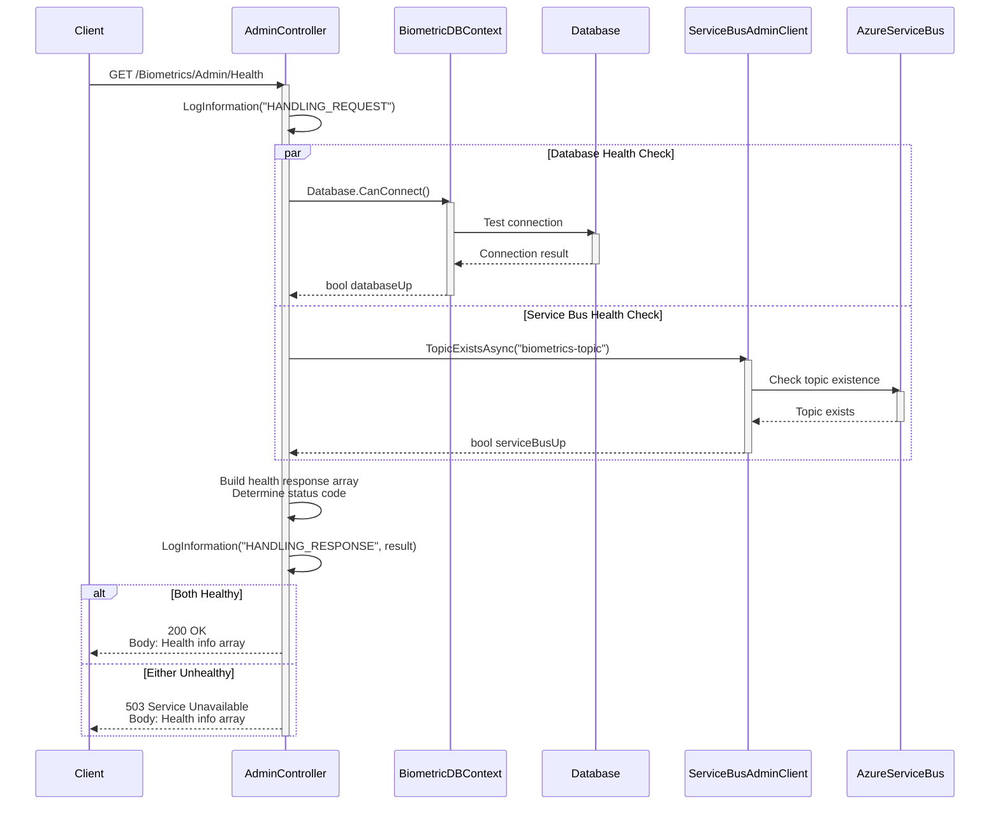

# Level 4: Sequence Diagram - API Request/Response Flow

## Overview

This sequence diagram shows the complete flow of an API request through the system, from controller to database and back.

## Diagram



## Request Flow Details

### 1. Client Request
**HTTP Request**:
```http
GET /Biometrics/Admin/GetAirports HTTP/1.1
Host: biometrics-api.example.com
Accept: application/json
```

**API Versioning Support**:
- Default route: `/Biometrics/Admin/GetAirports`
- Versioned route: `/Biometrics/Admin/v1.0/GetAirports`

### 2. Controller Entry Point

**AdminController.GetAirports()**:
```csharp
[Route("GetAirports")]
[HttpGet]
[ProducesResponseType(typeof(List<Airport>), StatusCodes.Status200OK)]
public async Task<IActionResult> GetAirports()
{
    try
    {
        logger.LogInformation(new LogInfo(message: Consts.HANDLING_REQUEST));
        List<Airport> airports = await biometricsAdminBL.GetAirports();
        logger.LogInformation(new LogInfo(message: Consts.HANDLING_RESPONSE, eventData: JsonSerializer.Serialize(airports)));
        return Ok(airports);
    }
    catch (Exception ex)
    {
        logger.LogError(new LogInfo(message: Consts.EXCEPTION, exception: ex));
        return Conflict(ex.Message);
    }
}
```

**Logging**:
- **Request Log**: Captures incoming request
- **Response Log**: Captures serialized response data
- **Error Log**: Captures exceptions with stack trace

### 3. Business Logic Layer

**BiometricsAdminBL.GetAirports()**:
```csharp
public async Task<List<Airport>> GetAirports()
{
    return await biometricDBContext.Airports
        .Include("Terminals.Devices")
        .ToListAsync();
}
```

**Eager Loading**:
- Loads Airports
- Includes Terminals navigation property
- Includes Devices navigation property (nested)
- Prevents N+1 query problem

### 4. Data Access Layer

**BiometricDBContext Query**:
```csharp
biometricDBContext.Airports.Include("Terminals.Devices").ToListAsync()
```

**Entity Framework Translation**:
```sql
SELECT 
    a.ID, a.StationCode, a.Name, a.HasBiometricTSA, a.HasBiometricClub, a.HasBiometricExit,
    t.ID, t.Name, t.AirportID,
    d.ID, d.DeviceName, d.DeviceNameAA, d.DeviceVendor, d.DeviceType, 
    d.DeviceLocation, d.BiometricType, d.LastStatusDateTime, d.DeviceHealth, d.TerminalID
FROM Airports a
LEFT JOIN Terminal t ON a.ID = t.AirportID
LEFT JOIN Devices d ON t.ID = d.TerminalID
ORDER BY a.ID, t.ID, d.ID
```

**Query Optimization**:
- Single database round-trip
- LEFT JOINs to include airports without terminals/devices
- EF Core handles object graph construction

### 5. Response Construction

**HTTP Response**:
```http
HTTP/1.1 200 OK
Content-Type: application/json; charset=utf-8
Content-Length: 2543

[
  {
    "id": 1,
    "stationCode": "DFW",
    "name": "Dallas Fort Worth International",
    "hasBiometricTSA": true,
    "hasBiometricClub": true,
    "hasBiometricExit": false,
    "terminals": [
      {
        "id": 1,
        "name": "Terminal A",
        "devices": [
          {
            "id": 101,
            "deviceName": "DFWCLUBA",
            "deviceVendor": "VeriScan",
            "deviceLocation": "A5",
            ...
          }
        ]
      }
    ]
  }
]
```

**JSON Serialization**:
- ASP.NET Core uses System.Text.Json by default
- Camel case property names
- Navigation properties serialized as nested objects

## Error Handling Flow



**Error Response**:
```http
HTTP/1.1 409 Conflict
Content-Type: text/plain

Connection timeout to SQL Server
```

**Error Logging**:
```csharp
logger.LogError(new LogInfo(
    message: Consts.EXCEPTION, 
    exception: ex  // Full stack trace and inner exceptions
));
```

## Middleware Processing



**Middleware Configuration** (Program.cs):
```csharp
app.UseRequestBodyLogging();   // Logs incoming request bodies
app.UseResponseBodyLogging();  // Logs outgoing response bodies
```

## Update Operation Flow



## Health Check Flow



**Health Response Format**:
```json
[
  "gm-web-biometrics.boarding.api",
  "1.0.0.0",
  "Admin Service",
  "2024-01-15 10:30:00.123456",
  "Region East",
  "Database: Healthy",
  "ServiceBus: Healthy"
]
```

## Performance Characteristics

**Typical Response Times**:
- **GetAirports**: 50-200ms (depends on data size)
- **UpdateAirport**: 100-500ms (includes multiple DB operations)
- **Health Check**: 50-150ms (parallel checks)

**Optimization Techniques**:
- Eager loading to prevent N+1 queries
- AsNoTracking() for read-only queries
- Parallel health checks
- Efficient JSON serialization

## Next Steps

- See [WebSocket Scan Sequence Diagram](04-Code-Sequence-WebSocket-Scan.md) for real-time message flow
- See [API Controllers Component Diagram](03-Component-API-Controllers.md) for controller architecture
- See [BiometricDBContext Code Diagram](04-Code-BiometricDBContext.md) for database details
