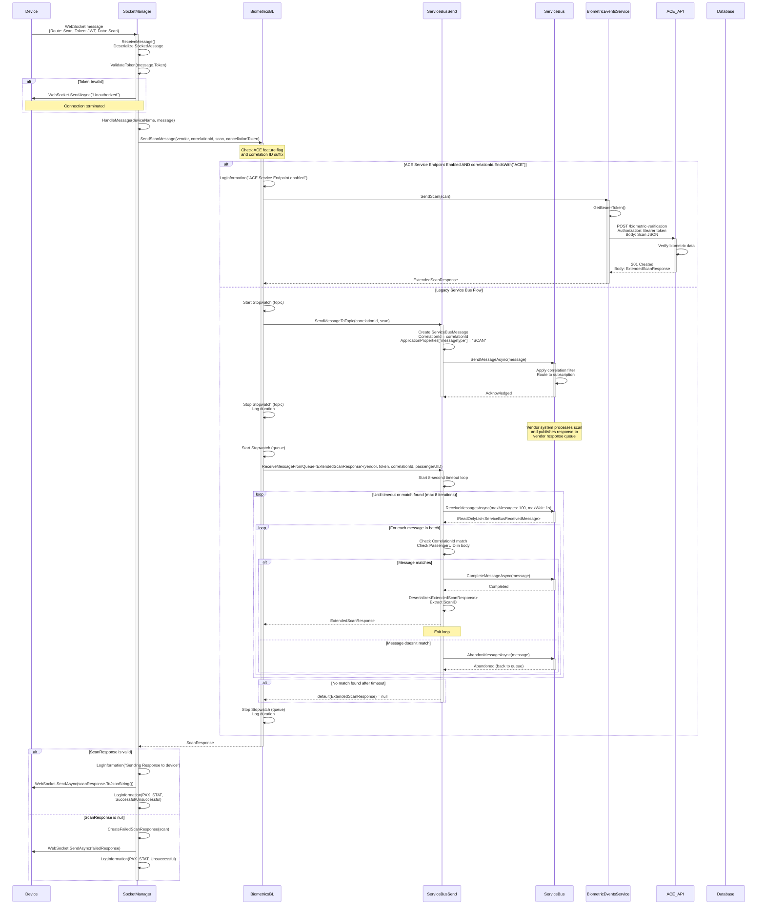
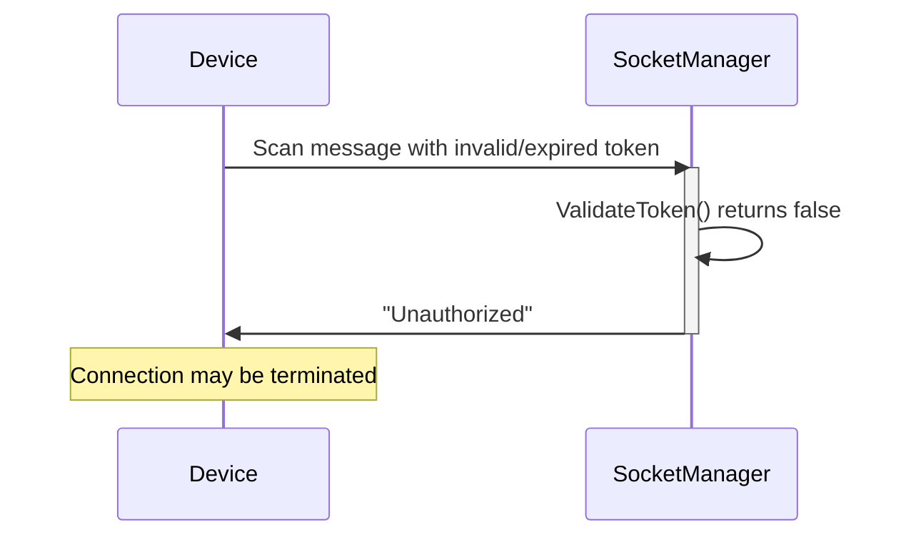
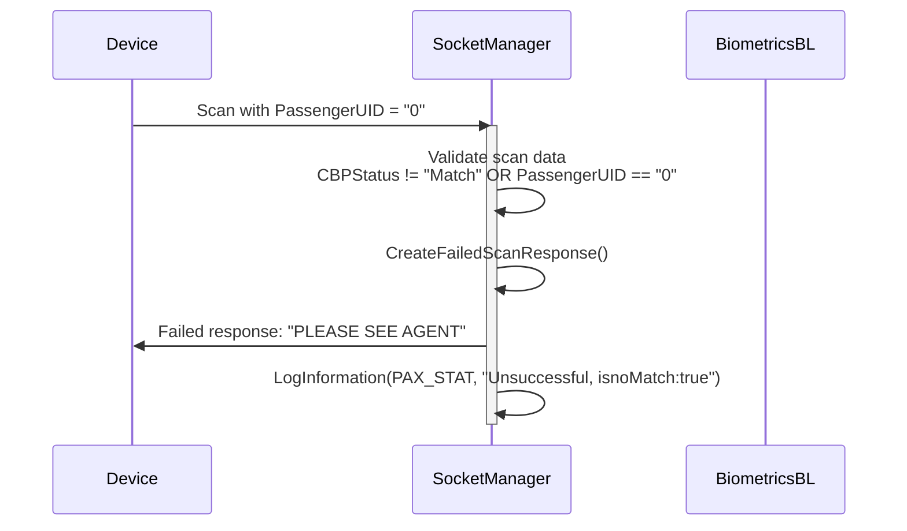
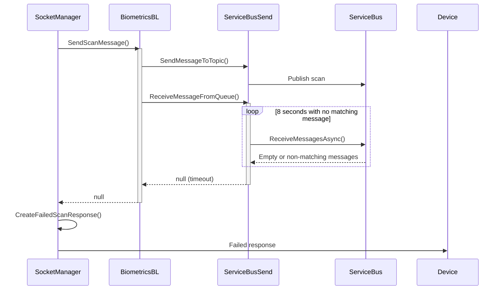
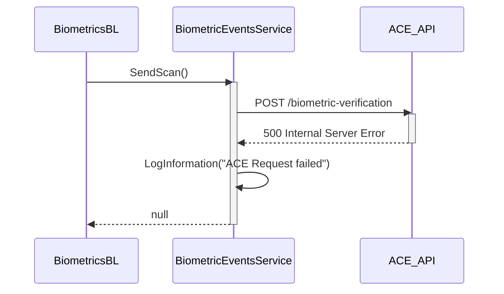

# Level 4: Sequence Diagram - WebSocket Scan Processing Flow

## Overview

This sequence diagram shows the complete flow of a biometric scan message from a device through WebSocket, Service Bus, and back to the device.

## Complete Scan Flow



## Detailed Flow Breakdown

### 1. Device Sends Scan

**WebSocket Message Format**:
```json
{
  "Token": "eyJhbGciOiJSUzI1NiIsInR5cCI6IkpXVCJ9...",
  "Vendor": "VeriScan",
  "Route": "Scan",
  "Data": {
    "CorrelationId": "DFWA5AA12320240115ACE",
    "PassengerUID": "ABC123001",
    "ScanID": "SCAN-12345",
    "CBPStatus": "Match",
    "ScanDateTime": "2024-01-15T10:30:00Z"
  }
}
```

### 2. SocketManager Receives and Validates

**ReceiveMessage Flow**:
```csharp
// 1. Receive from WebSocket (4KB buffer)
var result = await webSocket.ReceiveAsync(buffer, CancellationToken.None);

// 2. Handle multi-frame messages
while (!result.EndOfMessage) { ... }

// 3. Deserialize
SocketMessage message = JsonSerializer.Deserialize<SocketMessage>(messageBytes);

// 4. Validate JWT token
if (!await ValidateToken(message.Token))
{
    await SendMessage(deviceName, "Unauthorized");
    return;
}

// 5. Route to handler
await HandleMessage(deviceName, message);
```

**Token Validation Checks**:
1. Token not null/empty
2. Valid JWT format
3. Issuer matches configuration
4. Not expired
5. Audience matches
6. App name in valid list
7. Client ID in valid list

### 3. HandleMessage Processes Scan

**Scan Validation**:
```csharp
// Normalize PassengerUID (extract PNR + position)
scan.PassengerUID = biometricsBL.NormalizePassengerUID(scan.PassengerUID);

// Generate ScanID if missing
if (string.IsNullOrEmpty(scan.ScanID))
    scan.ScanID = Scan.GenerateScanID();

// Validate scan data
if (scan.CBPStatus != "Match" || 
    scan.PassengerUID == null || 
    scan.PassengerUID == "0")
{
    // Invalid scan - immediate failure response
    await SendMessage(deviceName, CreateFailedScanResponse(scan));
    return;
}
```

**Failed Scan Response**:
```json
{
  "StatusCode": "Failed",
  "StatusMessage": "PLEASE SEE AGENT",
  "PassengerUID": "ABC123001",
  "CorrelationId": "DFWA5AA12320240115ACE"
}
```

### 4. ACE Service Endpoint Flow (New)

**Feature Flag Check**:
```csharp
bool seEnabled = config["biometrics:ACEServiceEndpointEnabled"] == "true";
bool isAceScan = correlationId.EndsWith("ACE");

if (seEnabled && isAceScan)
{
    // Use ACE Biometric Events Service
    return await biometricEventsService.SendScan(scan);
}
```

**BiometricEventsService.SendScan()**:
```csharp
// 1. Get OAuth bearer token (cached)
string token = await bearerTokenService.GenerateToken(...);

// 2. Prepare HTTP request
var requestBody = new StringContent(scan.ToJsonString(), Encoding.UTF8, "application/json");
httpClient.DefaultRequestHeaders.Add("Authorization", $"Bearer {token}");

// 3. POST to ACE API
var response = await httpClient.PostAsync("/biometric-verification", requestBody);

// 4. Parse response
var content = await response.Content.ReadAsStringAsync();
ExtendedScanResponse scanResponse = JsonSerializer.Deserialize<ExtendedScanResponse>(content);

return scanResponse;
```

**ACE API Response**:
```json
{
  "PassengerUID": "ABC123001",
  "CorrelationId": "DFWA5AA12320240115ACE",
  "ScanID": "SCAN-12345",
  "StatusCode": "Successful",
  "StatusMessage": "Boarding Approved",
  "BoardingStatus": "Approved",
  "SeatNumber": "12A"
}
```

### 5. Legacy Service Bus Flow

**Topic Publish**:
```csharp
// 1. Create Service Bus message
var message = new ServiceBusMessage(JsonSerializer.Serialize(scan))
{
    CorrelationId = correlationId,
    ApplicationProperties = { ["messagetype"] = "SCAN" }
};

// 2. Send to topic
await topicClient.SendMessageAsync(message);

// 3. Correlation filter routes to subscription
// Subscription name = correlationId
// Filter: msg.CorrelationId == subscriptionName
```

**Queue Receive Loop**:
```csharp
DateTime timeout = DateTime.Now.AddSeconds(8);
int loopcount = 1;

while (!cancellationToken.IsCancellationRequested && DateTime.Now < timeout)
{
    // Receive batch of up to 100 messages with 1s wait
    var messages = await receiver.ReceiveMessagesAsync(
        maxMessages: 100, 
        maxWaitTime: TimeSpan.FromSeconds(1), 
        cancellationToken
    );

    foreach (var msg in messages)
    {
        var body = Encoding.UTF8.GetString(msg.Body);
        
        // Check for match
        if (msg.CorrelationId == correlationId && body.Contains(passengerUID))
        {
            await receiver.CompleteMessageAsync(msg);
            return JsonSerializer.Deserialize<ExtendedScanResponse>(body);
        }
        else
        {
            await receiver.AbandonMessageAsync(msg);
        }
    }
    
    loopcount++;
}

return default;  // Timeout - no matching message found
```

**Performance Metrics**:
- **Topic Publish**: 20-50ms
- **Queue Receive**: 50ms - 8000ms (depends on vendor response time)
- **Total**: 70ms - 8050ms

### 6. Response Back to Device

**Successful Scan Response**:
```json
{
  "StatusCode": "Successful",
  "StatusMessage": "Boarding Approved",
  "PassengerUID": "ABC123001",
  "CorrelationId": "DFWA5AA12320240115ACE",
  "SeatNumber": "12A",
  "BoardingGroup": "2"
}
```

**Failed Scan Response**:
```json
{
  "StatusCode": "Failed",
  "StatusMessage": "PLEASE SEE AGENT",
  "PassengerUID": "ABC123001",
  "CorrelationId": "DFWA5AA12320240115ACE"
}
```

**WebSocket Send**:
```csharp
byte[] responseBytes = Encoding.UTF8.GetBytes(scanResponse.ToJsonString());

await webSocket.SendAsync(
    new ArraySegment<byte>(responseBytes),
    WebSocketMessageType.Text,
    endOfMessage: true,
    CancellationToken.None
);
```

## Error Scenarios

### Scenario 1: Invalid Token



### Scenario 2: No Match (Invalid PassengerUID)



### Scenario 3: Timeout Waiting for Response



### Scenario 4: ACE API Failure



## Logging and Observability

**Key Log Points**:

1. **WebSocket Receive**: Log incoming scan message
2. **Token Validation**: Log validation failures
3. **Scan Validation**: Log invalid scans (noMatch)
4. **ACE Feature Flag**: Log when ACE endpoint is used
5. **Topic Publish**: Log publish duration
6. **Queue Receive**: Log loop iterations and duration
7. **Response Send**: Log response to device
8. **Passenger Stat**: Log final outcome (Successful/Unsuccessful)

**Passenger Stat Log Format**:
```csharp
logger.LogInformation(new LogInfo(
    message: Consts.PAX_STAT,
    eventData: "Successful, isnoMatch:false",
    correlationId: "DFWA5AA12320240115ACE",
    scanID: "SCAN-12345"
));
```

## Performance Optimization

**Strategies**:
1. **Batch Message Receiving**: Up to 100 messages per receive call
2. **1-Second Wait Time**: Balance between responsiveness and efficiency
3. **Message Abandonment**: Non-matching messages returned to queue quickly
4. **Parallel Processing**: Multiple scan requests can be processed concurrently
5. **Connection Pooling**: Reuse WebSocket connections
6. **Bearer Token Caching**: Reduce authentication overhead

**Typical Performance**:
- **ACE Flow**: 100-500ms end-to-end
- **Service Bus Flow**: 1-8 seconds (vendor-dependent)
- **WebSocket Overhead**: < 10ms

## Next Steps

- See [SocketManager Code Diagram](04-Code-SocketManager.md) for WebSocket implementation
- See [BiometricsBL Code Diagram](04-Code-BiometricsBL.md) for business logic
- See [ServiceBusSend Code Diagram](04-Code-ServiceBusSend.md) for messaging details
- See [Socket Manager Component Diagram](03-Component-Socket-Manager.md) for architecture
