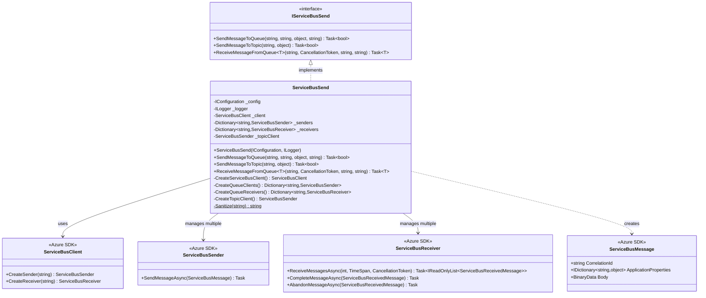

# Level 4: Code Diagram - ServiceBusSend Class

## Overview

This diagram shows the detailed structure of the ServiceBusSend class, which handles all Azure Service Bus messaging operations.

## Class Diagram



## Implementation Details

### Constructor and Initialization

```csharp
public ServiceBusSend(IConfiguration config, ILogger<IServiceBusSend> logger)
{
    _config = config;
    _logger = logger;

    _client = CreateServiceBusClient();
    _senders = CreateQueueClients();
    _receivers = CreateQueueReceivers();
    _topicClient = CreateTopicClient();

    _logger.LogInformation(new LogInfo(message: Consts.SERVICEBUS_SENDER_STARTED));
}
```

**Initialization Order**:
1. Create ServiceBusClient with retry configuration
2. Create queue senders for each vendor
3. Create queue receivers for each vendor
4. Create topic sender for broadcast messaging
5. Log startup confirmation

**Lifecycle**: Registered as Singleton in DI container

### CreateServiceBusClient

**Purpose**: Creates configured Service Bus client with retry policy

```csharp
private ServiceBusClient CreateServiceBusClient() =>
    new ServiceBusClient(
        _config["biometrics:ServiceBusConnectionString"] ?? _config["ServiceBusConnectionString"],
        new ServiceBusClientOptions
        {
            RetryOptions = new ServiceBusRetryOptions
            {
                TryTimeout = TimeSpan.FromSeconds(8),
                MaxRetries = 3
            },
            TransportType = ServiceBusTransportType.AmqpWebSockets
        }
    );
```

**Configuration**:
- **TryTimeout**: 8 seconds per attempt
- **MaxRetries**: 3 retry attempts
- **TransportType**: AMQP over WebSockets (firewall-friendly)

**Retry Behavior**:
- Total possible time per operation: 8s × 3 = 24 seconds
- Exponential backoff between retries

### CreateQueueClients

**Purpose**: Creates sender clients for vendor-specific request queues

```csharp
private Dictionary<string, ServiceBusSender> CreateQueueClients() =>
    new(StringComparer.OrdinalIgnoreCase)
    {
        ["VERISCAN"] = _client.CreateSender(_config["veriScan:QueueName"] ?? _config["VeriScanQueueName"]),
        ["CDA"] = _client.CreateSender(_config["cda:QueueName"] ?? _config["cdaQueueName"]),
        ["NEC"] = _client.CreateSender(_config["nec:QueueName"] ?? _config["necQueueName"]),
        ["SITA"] = _client.CreateSender(_config["sita:QueueName"] ?? _config["sitaQueueName"])
    };
```

**Vendor Queue Mapping**:
| Vendor | Config Key | Example Queue Name |
|--------|-----------|-------------------|
| VeriScan | veriScan:QueueName | veriscan-request-queue |
| CDA | cda:QueueName | cda-request-queue |
| NEC | nec:QueueName | nec-request-queue |
| SITA | sita:QueueName | sita-request-queue |

**Case-Insensitive Lookup**: Uses `StringComparer.OrdinalIgnoreCase`

### CreateQueueReceivers

**Purpose**: Creates receiver clients for vendor-specific response queues

```csharp
private Dictionary<string, ServiceBusReceiver> CreateQueueReceivers()
{
    var map = new Dictionary<string, string>(StringComparer.OrdinalIgnoreCase)
    {
        ["VERISCAN"] = _config["veriScan:ResponseQueueName"] ?? _config["VeriScanResponseQueueName"],
        ["CDA"] = _config["cda:ResponseQueueName"] ?? _config["cdaResponseQueueName"],
        ["NEC"] = _config["nec:ResponseQueueName"] ?? _config["necResponseQueueName"],
        ["SITA"] = _config["sita:ResponseQueueName"] ?? _config["sitaResponseQueueName"]
    };

    var receivers = new Dictionary<string, ServiceBusReceiver>(StringComparer.OrdinalIgnoreCase);
    foreach (var kvp in map)
    {
        var vendor = kvp.Key;
        var queueName = kvp.Value;
        if (string.IsNullOrWhiteSpace(queueName))
        {
            _logger.LogWarning("No queue name configured for vendor {Vendor}", vendor);
            continue;
        }

        _logger.LogInformation($"Creating ServiceBusReceiver for vendor {vendor} on queue {queueName}");
        receivers[vendor] = _client.CreateReceiver(queueName);
    }

    return receivers;
}
```

**Response Queue Mapping**:
| Vendor | Config Key | Example Queue Name |
|--------|-----------|-------------------|
| VeriScan | veriScan:ResponseQueueName | veriscan-response-queue |
| CDA | cda:ResponseQueueName | cda-response-queue |
| NEC | nec:ResponseQueueName | nec-response-queue |
| SITA | sita:ResponseQueueName | sita-response-queue |

**Error Handling**: Skips vendors with missing queue configuration

### CreateTopicClient

**Purpose**: Creates sender for broadcasting messages to topic

```csharp
private ServiceBusSender CreateTopicClient() =>
    _client.CreateSender(_config["biometrics:TopicName"] ?? _config["TopicName"]);
```

**Topic Name**: `biometrics-topic`

**Usage**: Broadcast scan messages to correlation-filtered subscriptions

### SendMessageToQueue

**Purpose**: Sends vendor-specific messages to request queue

```csharp
public async Task<bool> SendMessageToQueue(string vendor, string correlationId, object payload, string departureAirport = null)
{
    _logger.LogInformation(new LogInfo(
        message: $"SendMessageToQueue method: {Sanitize(vendor)}", 
        eventData: JsonSerializer.Serialize(payload), 
        correlationId: correlationId
    ));
    
    try
    {
        var message = new ServiceBusMessage(JsonSerializer.Serialize(payload))
        {
            CorrelationId = correlationId
        };

        message.ApplicationProperties["messagetype"] = payload.GetType().Name.ToUpper();
        if (!string.IsNullOrEmpty(departureAirport))
        {
            message.ApplicationProperties["departureairport"] = departureAirport;
        }
        
        if (_senders.TryGetValue(vendor.ToUpper(), out var sender))
        {
            await sender.SendMessageAsync(message);
            return true;
        }
    }
    catch (Exception ex)
    {
        _logger.LogInformation(new LogInfo(
            message: Consts.EXCEPTION, 
            eventData: JsonSerializer.Serialize(new { vendor, departureAirport, payload }), 
            exception: ex, 
            correlationId: correlationId
        ));
        throw;
    }
    return false;
}
```

**Message Properties**:
- **CorrelationId**: Session identifier for message correlation
- **messagetype**: Payload type name (e.g., "HARDWARE", "STATUS", "SCAN")
- **departureairport**: Optional routing hint for multi-airport deployments

**Return Values**:
- `true`: Message sent successfully
- `false`: Vendor not found in senders dictionary
- Throws exception on send failure

### SendMessageToTopic

**Purpose**: Broadcasts messages to topic for subscription-based routing

```csharp
public async Task<bool> SendMessageToTopic(string correlationId, object payload)
{
    var scanId = payload?.GetType().GetProperty("ScanID")?.GetValue(payload)?.ToString();

    _logger.LogInformation(new LogInfo(
        message: "SendMessageToTopic Method", 
        eventData: JsonSerializer.Serialize(payload), 
        correlationId: correlationId, 
        scanID: scanId
    ));
    
    try
    {
        var message = new ServiceBusMessage(JsonSerializer.Serialize(payload))
        {
            CorrelationId = correlationId
        };

        message.ApplicationProperties["messagetype"] = payload.GetType().Name.ToUpper();

        await _topicClient.SendMessageAsync(message);
        return true;
    }
    catch (Exception ex)
    {
        _logger.LogInformation(new LogInfo(
            message: Consts.EXCEPTION, 
            eventData: JsonSerializer.Serialize(payload), 
            exception: ex, 
            correlationId: correlationId,
            scanID: scanId
        ));
        throw;
    }
}
```

**Correlation Filter**:
Subscription is created with `CorrelationRuleFilter(correlationId)`, so only messages with matching correlation ID are delivered to that subscription.

**Use Case**: Scan messages are published to topic, subscription filters route to appropriate consumer

### ReceiveMessageFromQueue

**Purpose**: Receives and filters messages from vendor response queue

```csharp
public async Task<T> ReceiveMessageFromQueue<T>(
    string vendor, 
    CancellationToken cancellationToken, 
    string correlationId, 
    string passengerUID)
{
    _logger.LogInformation(new LogInfo(
        message: "ReceiveMessageFromQueue method", 
        vendor: Sanitize(vendor), 
        correlationId: Sanitize(correlationId), 
        eventData: Sanitize(passengerUID)
    ));
    
    if (!_receivers.TryGetValue(vendor.ToUpper(), out var receiver)) 
        return default;

    var stopwatch = Stopwatch.StartNew();

    try
    {
        _logger.LogInformation(new LogInfo(message: "ReceiveMessagesAsync..."));

        DateTime timeout = DateTime.Now.AddSeconds(8);
        int loopcount = 1;
        
        while (!cancellationToken.IsCancellationRequested && (DateTime.Now < timeout))
        {
            _logger.LogInformation(new LogInfo(message: $"ReceiveMessageFromQueue Loop Count: {loopcount}"));
            
            var messages = await receiver.ReceiveMessagesAsync(
                maxMessages: 100, 
                maxWaitTime: TimeSpan.FromSeconds(1), 
                cancellationToken
            );

            foreach (var msg in messages)
            {
                _logger.LogInformation(new LogInfo(message: $"ReceiveMessageFromQueue Message: {msg}"));
                
                var body = Encoding.UTF8.GetString(msg.Body);
                
                if (msg.CorrelationId == correlationId && body.Contains($"{passengerUID}"))
                {
                    await receiver.CompleteMessageAsync(msg);

                    stopwatch.Stop();
                    var message = JsonSerializer.Deserialize<T>(Encoding.UTF8.GetString(msg.Body));
                    var scanId = typeof(T).GetProperty("ScanID")?.GetValue(message)?.ToString();

                    _logger.LogInformation(new LogInfo(
                        message: $"ReceiveMessageFromQueue duration: {stopwatch.ElapsedMilliseconds}ms", 
                        scanID: scanId
                    ));
                    return message;
                }
                else
                {
                    _logger.LogInformation(new LogInfo(message: $"ReceiveMessageFromQueue Message, Abandoning: {msg}"));
                    await receiver.AbandonMessageAsync(msg);
                }
            }
            loopcount++;
        }
    }
    catch (Exception ex)
    {
        stopwatch.Stop();
        _logger.LogError(ex, "Error receiving message from queue for vendor {Vendor}. Duration: {Duration}ms", 
            vendor, stopwatch.ElapsedMilliseconds);
        throw;
    }

    stopwatch.Stop();
    _logger.LogInformation(new LogInfo(message: $"ReceiveMessageFromQueue duration (no match): {stopwatch.ElapsedMilliseconds}ms"));
    return default;
}
```

**Algorithm**:
1. **Validate Receiver**: Check if vendor has configured receiver
2. **Loop Until Timeout**: 8-second timeout with 1-second receive intervals
3. **Batch Receive**: Up to 100 messages per receive call
4. **Filter Messages**:
   - Match `CorrelationId`
   - Match `PassengerUID` in message body
5. **Process Match**:
   - Complete message (remove from queue)
   - Deserialize to type T
   - Return result
6. **Process Non-Match**:
   - Abandon message (return to queue for redelivery)
7. **Timeout**: Return `default(T)` if no match found

**Performance Characteristics**:
- **Batch Size**: 100 messages
- **Max Wait per Receive**: 1 second
- **Total Timeout**: 8 seconds
- **Loop Iterations**: Up to 8 iterations
- **Typical Duration**: 50ms - 8 seconds

**Message Acknowledgment**:
- **Complete**: Removes message from queue permanently
- **Abandon**: Returns message to queue with increased delivery count

### Sanitize (Private Static)

**Purpose**: Removes newline characters from log data

```csharp
private static string Sanitize(string input) => 
    input?.Replace("\r", "").Replace("\n", "").Trim();
```

**Use Case**: Prevent log injection attacks and ensure clean log formatting

## Configuration Dependencies

```json
{
  "biometrics:ServiceBusConnectionString": "Endpoint=sb://namespace.servicebus.windows.net/;SharedAccessKeyName=...;SharedAccessKey=...",
  "biometrics:TopicName": "biometrics-topic",
  
  "veriScan:QueueName": "veriscan-request-queue",
  "veriScan:ResponseQueueName": "veriscan-response-queue",
  
  "cda:QueueName": "cda-request-queue",
  "cda:ResponseQueueName": "cda-response-queue",
  
  "nec:QueueName": "nec-request-queue",
  "nec:ResponseQueueName": "nec-response-queue",
  
  "sita:QueueName": "sita-request-queue",
  "sita:ResponseQueueName": "sita-response-queue"
}
```

## Message Flow Patterns

### Queue Send Pattern
```
Application ? SendMessageToQueue()
  ?
ServiceBusSender ? Vendor Request Queue
  ?
Vendor System
```

### Topic Publish Pattern
```
Application ? SendMessageToTopic()
  ?
ServiceBusSender ? Topic
  ?
Correlation Filter ? Subscription
  ?
Consumer
```

### Queue Receive Pattern
```
Application ? ReceiveMessageFromQueue()
  ?
ServiceBusReceiver ? Batch Receive (100 msgs, 1s wait)
  ?
Filter by CorrelationId + PassengerUID
  ?
Match Found ? Complete Message ? Return
No Match ? Abandon Message ? Continue Loop
Timeout ? Return default
```

## Error Handling

**Send Failures**:
- Log exception with full context
- Rethrow exception to caller
- Caller determines retry strategy

**Receive Failures**:
- Log exception with duration
- Rethrow exception to caller
- Messages remain in queue for retry

**Missing Vendor Configuration**:
- SendMessageToQueue returns `false`
- ReceiveMessageFromQueue returns `default(T)`
- Warning logged during initialization

## Performance Optimizations

**Batch Receiving**:
- Receives up to 100 messages per call
- Reduces network round-trips
- Improves throughput for high-volume scenarios

**AMQP over WebSockets**:
- Better firewall traversal than AMQP/TCP
- Reuses HTTP/HTTPS ports
- Suitable for restricted network environments

**Retry Configuration**:
- 8-second timeout per attempt
- 3 retry attempts
- Exponential backoff

**Message Abandonment**:
- Non-matching messages returned to queue
- Allows other consumers to process
- Preserves message ordering guarantees

## Logging Strategy

**Key Log Points**:
1. Service initialization
2. Queue receiver creation per vendor
3. Message send operations
4. Message receive loops
5. Message matching/abandoning
6. Performance metrics (duration)
7. Exceptions with full context

**Structured Logging**:
```csharp
logger.LogInformation(new LogInfo(
    message: "ReceiveMessageFromQueue duration: 245ms",
    scanID: "ABC123",
    correlationId: "DFWA5AA12320240115ACE"
));
```

## Thread Safety

- **Dictionary Access**: Read-only after initialization (thread-safe)
- **ServiceBusClient**: Thread-safe per Azure SDK documentation
- **Concurrent Operations**: Multiple threads can call send/receive simultaneously

## Next Steps

- See [BiometricsBL Code Diagram](04-Code-BiometricsBL.md) for business logic usage
- See [WebSocket Scan Sequence](04-Code-Sequence-WebSocket-Scan.md) for messaging flow
- See [Business Logic Component Diagram](03-Component-Business-Logic.md) for architecture context
