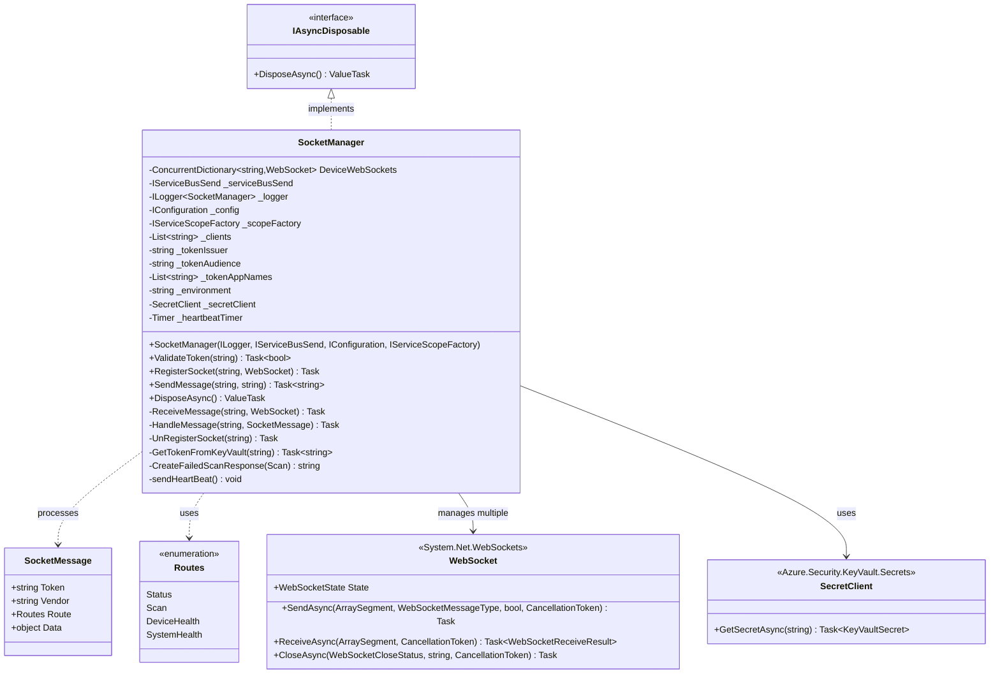

# Level 4: Code Diagram - SocketManager Class

## Overview

This diagram shows the detailed structure of the SocketManager class, which manages WebSocket connections with biometric devices.

## Class Diagram



## Implementation Details

### Constructor and Initialization

```csharp
public SocketManager(
    ILogger<SocketManager> logger,
    IServiceBusSend serviceBusSend,
    IConfiguration config,
    IServiceScopeFactory scopeFactory)
{
    _logger = logger;
    _serviceBusSend = serviceBusSend;
    _config = config;
    _scopeFactory = scopeFactory;
    
    _clients = config["remoteManager:ValidClients"].Split(',').ToList();
    _tokenIssuer = _config["remoteManager:TokenIssuer"];
    _tokenAudience = _config["remoteManager:TokenAudience"];
    _tokenAppNames = _config["remoteManager:TokenAppName"].Split(',').ToList();
    _environment = _config["biometrics:Environment"].Split(" ")[1];  // "Region East" ? "East"
    
    _heartbeatTimer = new System.Timers.Timer();
    _heartbeatTimer.Interval = 60000;  // 60 seconds
    _heartbeatTimer.Elapsed += (sender, e) => sendHeartBeat();
    _heartbeatTimer.Start();

    SecretClientOptions options = new()
    {
        Retry = {
            Delay = TimeSpan.FromSeconds(2),
            MaxDelay = TimeSpan.FromSeconds(16),
            MaxRetries = 5,
            Mode = RetryMode.Exponential
        }
    };
    _secretClient = new SecretClient(
        new Uri(_config["biometrics:keyVaultURL"]), 
        new DefaultAzureCredential(), 
        options
    );
}
```

**Initialization Steps**:
1. Store dependencies (logger, Service Bus, config, scope factory)
2. Parse valid client IDs from configuration
3. Configure JWT token validation parameters
4. Extract environment region (East/West)
5. Start heartbeat timer (60-second interval)
6. Initialize Azure Key Vault client with retry policy

**Lifecycle**: Registered as Singleton

### ValidateToken

**Purpose**: Validates JWT token from WebSocket clients

```csharp
public async Task<bool> ValidateToken(string authToken)
{
    try
    {
        if (string.IsNullOrEmpty(authToken))
        {
            _logger.LogInformation(new LogInfo(message: "Auth Token is null"));
            return false;
        }

        authToken = authToken.Replace("Bearer ", string.Empty);
        var tokenHandler = new JwtSecurityTokenHandler();
        tokenHandler.MapInboundClaims = true;

        SecurityToken validatedToken = tokenHandler.ReadJwtToken(authToken);
        
        if (validatedToken == null || validatedToken == default(SecurityToken))
        {
            _logger.LogInformation(new LogInfo(message: "SecurityToken is null."));
            return false;
        }
        
        if (validatedToken.Issuer != _tokenIssuer)
        {
            _logger.LogInformation(new LogInfo(message: "Token issuer is invalid."));
            return false;
        }
        
        if (validatedToken.ValidTo < DateTime.UtcNow)
        {
            _logger.LogInformation(new LogInfo(message: "Token ValidTo is invalid."));
            return false;
        }
        
        if (new List<string>(((JwtSecurityToken)validatedToken).Audiences)[0] != _tokenAudience)
        {
            _logger.LogInformation(new LogInfo(message: "Token Audience is invalid."));
            return false;
        }
        
        if (!_tokenAppNames.Contains(((JwtSecurityToken)validatedToken).Payload["appName"].ToString()))
        {
            _logger.LogInformation(new LogInfo(message: "Token App Name is invalid."));
            return false;
        }
        
        if (!_clients.Contains(((JwtSecurityToken)validatedToken).Payload["client_id"].ToString()))
        {
            _logger.LogInformation(new LogInfo(message: "Token Client Id is invalid."));
            return false;
        }
        
        return true;
    }
    catch (Exception ex)
    {
        _logger.LogInformation(new LogInfo(message: Consts.EXCEPTION, exception: ex));
        return false;
    }
}
```

**Validation Checks** (in order):
1. **Token Presence**: Not null or empty
2. **Bearer Prefix Removal**: Clean token string
3. **JWT Parsing**: Valid JWT format
4. **Token Non-Null**: Successfully parsed
5. **Issuer**: Matches configured issuer
6. **Expiration**: Not expired (ValidTo >= UtcNow)
7. **Audience**: Matches configured audience
8. **App Name**: In list of valid app names
9. **Client ID**: In list of valid client IDs

**Token Claims Structure**:
```json
{
  "iss": "https://expected-issuer.com",
  "aud": "biometrics-api",
  "exp": 1234567890,
  "appName": "BiometricsDevice",
  "client_id": "device-client-001"
}
```

### RegisterSocket

**Purpose**: Registers new WebSocket connection and tracks in database

```csharp
public async Task RegisterSocket(string deviceName, WebSocket webSocket)
{
    using (var scope = _scopeFactory.CreateScope())
    {
        var _biometricDBContext = scope.ServiceProvider.GetRequiredService<BiometricDBContext>();

        if (string.IsNullOrEmpty(deviceName) || webSocket == null) return;

        WebSocketDevice webSocketDevice = await _biometricDBContext.WebSocketDevices
            .Where(dev => dev.DeviceName == deviceName && dev.IsActive == true)
            .FirstOrDefaultAsync();

        if (DeviceWebSockets.ContainsKey(deviceName) || webSocketDevice != default(WebSocketDevice))
            await UnRegisterSocket(deviceName);

        _logger.LogInformation(new LogInfo(message: "Registering websocket", eventData: deviceName));
        
        DeviceWebSockets.TryAdd(deviceName, webSocket);
        
        await _biometricDBContext.WebSocketDevices.AddAsync(new WebSocketDevice()
        {
            DeviceName = deviceName,
            WebSocketRegion = _environment,
            IsActive = true,
            ConnectedDateTimeUTC = DateTime.UtcNow,
            DisconnectedDateTimeUTC = default(DateTime)
        });
        await _biometricDBContext.SaveChangesAsync();
    }
    
    await ReceiveMessage(deviceName, webSocket);
}
```

**Flow**:
1. **Create Scoped DbContext**: Get fresh context from scope factory
2. **Validation**: Check device name and WebSocket not null
3. **Check Existing**: Query for active WebSocketDevice record
4. **Cleanup Existing**: Unregister if already registered
5. **Add to Registry**: `DeviceWebSockets.TryAdd()`
6. **Database Insert**: Create WebSocketDevice record
7. **Start Receiving**: Call `ReceiveMessage()` (blocking)

**Database Record**:
```csharp
{
    DeviceName = "DFWCLUBA",
    WebSocketRegion = "East",
    IsActive = true,
    ConnectedDateTimeUTC = 2024-01-15T10:30:00Z,
    DisconnectedDateTimeUTC = null
}
```

### ReceiveMessage (Private)

**Purpose**: Continuously receives messages from WebSocket

```csharp
private async Task ReceiveMessage(string deviceName, WebSocket webSocket)
{
    var buffer = new ArraySegment<byte>(new Byte[1024 * 4]);  // 4KB buffer
    WebSocketReceiveResult result = null;

    while (webSocket.State == WebSocketState.Open)
    {
        do
        {
            result = await webSocket.ReceiveAsync(buffer, CancellationToken.None);

            if (result.MessageType == WebSocketMessageType.Close)
            {
                if (webSocket.State == WebSocketState.CloseReceived)
                    await webSocket.CloseOutputAsync(WebSocketCloseStatus.NormalClosure, "", CancellationToken.None);
            }
        } while (!result.EndOfMessage);

        if (result.Count > 0)
        {
            try
            {
                var newBuffer = new byte[result.Count];
                Array.Copy(buffer.Array, newBuffer, result.Count);
                
                SocketMessage message = System.Text.Json.JsonSerializer.Deserialize<SocketMessage>(
                    System.Text.Encoding.UTF8.GetString(newBuffer, 0, newBuffer.Length)
                        .Replace("correlationId", "CorrelationId")
                );

                _logger.LogInformation(new LogInfo(
                    message: $"Received message from {deviceName}", 
                    eventData: message.ToJsonString()
                ));

                if (!await ValidateToken(message.Token))
                    await SendMessage(deviceName, "Unauthorized");
                else
                    await HandleMessage(deviceName, message);
            }
            catch (Exception ex)
            {
                _logger.LogError(new LogInfo(
                    message: $"Exception receiving message from {deviceName}", 
                    exception: ex
                ));
            }
        }
    }

    await UnRegisterSocket(deviceName);
}
```

**Algorithm**:
1. **Create Buffer**: 4KB receive buffer
2. **Loop While Open**: Continue until WebSocket closes
3. **Receive Fragments**: Handle multi-frame messages
4. **Check for Close**: Respond to close message
5. **Process Complete Message**:
   - Copy data from buffer
   - Deserialize to SocketMessage
   - Normalize property names (correlationId ? CorrelationId)
   - Validate token
   - Route to HandleMessage or send "Unauthorized"
6. **Error Handling**: Log and continue on exceptions
7. **Cleanup**: Unregister on disconnect

**Buffer Size**: 4KB (4096 bytes) - adequate for typical JSON messages

### HandleMessage (Private)

**Purpose**: Routes messages based on route type

```csharp
private async Task HandleMessage(string deviceName, SocketMessage message)
{
    try
    {
        using (var scope = _scopeFactory.CreateScope())
        {
            var _biometricBL = scope.ServiceProvider.GetRequiredService<IBiometricsBL>();
            
            switch (message.Route)
            {
                case Routes.Status:
                    Status status = JsonSerializer.Deserialize<Status>(message.Data.ToString());
                    await _biometricBL.SendStatusMessage(message.Vendor, status.CorrelationId, status);
                    break;
                    
                case Routes.Scan:
                    Scan scan = JsonSerializer.Deserialize<Scan>(message.Data.ToString());
                    scan.PassengerUID = _biometricBL.NormalizePassengerUID(scan.PassengerUID);
                    
                    if (string.IsNullOrEmpty(scan.ScanID))
                        scan.ScanID = models.Scan.GenerateScanID();

                    if (scan == null || scan == default(Scan) || 
                        scan.CBPStatus != "Match" || 
                        scan.PassengerUID == null || scan.PassengerUID == "0")
                    {
                        _logger.LogInformation(new LogInfo(
                            message: $"Sending Response for upid 0 to {deviceName}.", 
                            eventData: scan.ToJsonString()
                        ));
                        await SendMessage(deviceName, CreateFailedScanResponse(scan));
                        _logger.LogInformation(new LogInfo(
                            message: Consts.PAX_STAT,
                            eventData: "Unsuccessful, isnoMatch:true",
                            correlationId: scan.CorrelationId,
                            scanID: scan.ScanID
                        ));
                    }
                    else
                    {
                        CancellationTokenSource cancelTokenSource = new CancellationTokenSource();
                        CancellationToken token = cancelTokenSource.Token;
                        ScanResponse scanResponse = await _biometricBL.SendScanMessage(
                            message.Vendor, scan.CorrelationId, scan, token
                        );
                        
                        if (scanResponse != null)
                        {
                            _logger.LogInformation(new LogInfo(
                                message: $"Sending Response to {deviceName}", 
                                eventData: scanResponse.ToJsonString()
                            ));
                            await SendMessage(deviceName, scanResponse.ToJsonString());
                            _logger.LogInformation(new LogInfo(
                                message: Consts.PAX_STAT,
                                eventData: $"{(scanResponse.StatusCode == "Successful" ? "Successful" : "Unsuccessful")}, isnoMatch:false",
                                correlationId: scan.CorrelationId,
                                scanID: scan.ScanID
                            ));
                        }
                        else
                        {
                            _logger.LogInformation(new LogInfo(
                                message: $"Unable to find scan response for {deviceName}", 
                                eventData: scan.ToJsonString()
                            ));
                            await SendMessage(deviceName, CreateFailedScanResponse(scan));
                            _logger.LogInformation(new LogInfo(
                                message: Consts.PAX_STAT,
                                eventData: "Unsuccessful, isnoMatch:false",
                                correlationId: scan.CorrelationId,
                                scanID: scan.ScanID
                            ));
                        }
                    }
                    break;
                    
                case Routes.DeviceHealth:
                case Routes.SystemHealth:
                    // Not currently in use
                    break;
                    
                default:
                    _logger.LogInformation(new LogInfo(
                        message: $"Handle message: message route does not exist", 
                        eventData: message.Route.ToString()
                    ));
                    break;
            }
        }
    }
    catch (Exception ex)
    {
        _logger.LogError(new LogInfo(message: Consts.EXCEPTION, exception: ex));
    }
}
```

**Route Handling**:

**Status Route**:
1. Deserialize to Status
2. Forward to BiometricsBL.SendStatusMessage()
3. No response to device

**Scan Route**:
1. Deserialize to Scan
2. Normalize PassengerUID
3. Generate ScanID if missing
4. Validate scan data:
   - **Invalid**: CBPStatus != "Match" OR PassengerUID == null/0
     - Send failed response immediately
     - Log unsuccessful with isnoMatch:true
   - **Valid**:
     - Call BiometricsBL.SendScanMessage()
     - **Success**: Send ScanResponse to device
     - **Failure**: Send failed response
     - Log passenger stat with outcome

**DeviceHealth/SystemHealth Routes**: Not implemented

### SendMessage

**Purpose**: Sends message to device via WebSocket

```csharp
public async Task<string> SendMessage(string deviceName, string messageToSend)
{
    if (!string.IsNullOrEmpty(deviceName) && DeviceWebSockets.ContainsKey(deviceName))
    {
        byte[] returnBytes = System.Text.Encoding.UTF8.GetBytes(messageToSend);
        WebSocket webSocket = DeviceWebSockets[deviceName];
        
        if (webSocket != null && webSocket.State == WebSocketState.Open)
        {
            await webSocket.SendAsync(
                new ArraySegment<byte>(returnBytes),
                WebSocketMessageType.Text,
                true,  // End of message
                CancellationToken.None
            );
            return "Message Sent";
        }
        else
        {
            await UnRegisterSocket(deviceName);
            return "No device connected";
        }
    }
    else
    {
        return "No device connected";
    }
}
```

**Flow**:
1. Check device exists in registry
2. Get WebSocket from dictionary
3. Verify WebSocket state is Open
4. Encode message to UTF-8 bytes
5. Send via WebSocket
6. Return status message

**Error Cases**:
- Device not in registry ? "No device connected"
- WebSocket not open ? Unregister and return "No device connected"

### CreateFailedScanResponse (Private)

**Purpose**: Creates standardized failed scan response

```csharp
private string CreateFailedScanResponse(Scan scan)
{
    ScanResponse response = new ScanResponse()
    {
        StatusCode = "Failed",
        StatusMessage = "PLEASE SEE AGENT",
        PassengerUID = scan.PassengerUID,
        CorrelationId = scan.CorrelationId
    };

    return response.ToJsonString();
}
```

**Response Structure**:
```json
{
  "StatusCode": "Failed",
  "StatusMessage": "PLEASE SEE AGENT",
  "PassengerUID": "ABCDEF001",
  "CorrelationId": "DFWA5AA12320240115ACE"
}
```

### UnRegisterSocket (Private)

**Purpose**: Removes WebSocket from registry and updates database

```csharp
private async Task UnRegisterSocket(string deviceName)
{
    _logger.LogInformation(new LogInfo(
        message: $"RemoteManager - UnRegistering websocket", 
        eventData: deviceName
    ));
    
    if (DeviceWebSockets.ContainsKey(deviceName))
    {
        WebSocket websocket;
        DeviceWebSockets.TryRemove(deviceName, out websocket);
        
        if (websocket != null && 
            (websocket.State == WebSocketState.Open || websocket.State == WebSocketState.CloseReceived))
        {
            await websocket.CloseAsync(WebSocketCloseStatus.NormalClosure, "", CancellationToken.None);
        }
    }

    using (var scope = _scopeFactory.CreateScope())
    {
        var _biometricDBContext = scope.ServiceProvider.GetRequiredService<BiometricDBContext>();

        WebSocketDevice webSocketDevice = await _biometricDBContext.WebSocketDevices
            .Where(dev => dev.DeviceName == deviceName && dev.IsActive == true)
            .FirstOrDefaultAsync();
            
        if (webSocketDevice != default(WebSocketDevice))
        {
            webSocketDevice.IsActive = false;
            webSocketDevice.DisconnectedDateTimeUTC = DateTime.UtcNow;
            _biometricDBContext.WebSocketDevices.Update(webSocketDevice);
            await _biometricDBContext.SaveChangesAsync();
        }
    }
}
```

**Steps**:
1. Remove from `DeviceWebSockets` dictionary
2. Close WebSocket if still open
3. Create scoped DbContext
4. Find active WebSocketDevice record
5. Mark as inactive with disconnect timestamp
6. Save changes

### DisposeAsync

**Purpose**: Cleanup on application shutdown

```csharp
public async ValueTask DisposeAsync()
{
    _logger.LogInformation(new LogInfo(
        message: $"SocketManager Dispose called.", 
        eventData: _environment
    ));

    _heartbeatTimer.Stop();
    _heartbeatTimer.Dispose();

    DeviceWebSockets.ToList().ForEach(async device =>
    {
        await UnRegisterSocket(device.Key);
    });

    using (var scope = _scopeFactory.CreateScope())
    {
        var _biometricDBContext = scope.ServiceProvider.GetRequiredService<BiometricDBContext>();

        List<WebSocketDevice> webSocketDevices = await _biometricDBContext.WebSocketDevices
            .Where(dev => dev.WebSocketRegion == _environment && dev.IsActive == true)
            .ToListAsync();
            
        webSocketDevices.ForEach(webSocketDevice =>
        {
            webSocketDevice.IsActive = false;
            webSocketDevice.DisconnectedDateTimeUTC = DateTime.UtcNow;
            _biometricDBContext.WebSocketDevices.Update(webSocketDevice);
        });
        await _biometricDBContext.SaveChangesAsync();
    }

    return;
}
```

**Cleanup Steps**:
1. Stop and dispose heartbeat timer
2. Unregister all active WebSocket connections
3. Mark all active devices in current region as inactive
4. Save database changes

## Configuration Dependencies

```json
{
  "remoteManager:ValidClients": "client1,client2,client3",
  "remoteManager:TokenIssuer": "https://issuer.example.com",
  "remoteManager:TokenAudience": "biometrics-api",
  "remoteManager:TokenAppName": "BiometricsDevice,BiometricsClient",
  "biometrics:Environment": "Region East",
  "biometrics:keyVaultURL": "https://keyvault.vault.azure.net/"
}
```

## Next Steps

- See [WebSocket Scan Sequence Diagram](04-Code-Sequence-WebSocket-Scan.md) for complete message flow
- See [BiometricsBL Code Diagram](04-Code-BiometricsBL.md) for scan processing
- See [Socket Manager Component Diagram](03-Component-Socket-Manager.md) for architecture overview
