# End-to-End Sequence Diagram - Ace Application Integration

## Overview

This is the **parent sequence diagram** showing the high-level flow of how the Ace application (frontend) interacts with the GM Biometrics Boarding API service and its backend dependencies. 

**Complex conditional flows are broken out into separate sub-diagrams** referenced below for detailed implementation.

## Main Boarding Flow Sequence

```mermaid
sequenceDiagram
    participant Ace as Ace Application
    participant API as Boarding API<br/>(Controllers)
    participant BL as Business Logic<br/>(BiometricsBL)
    participant Socket as Socket Manager<br/>(WebSocket)
    participant DB as SQL Server<br/>Database
    participant SB as Azure<br/>Service Bus
    participant ACE_SVC as ACE Service
    participant Loyalty as Loyalty<br/>Service
    participant Device as Biometric<br/>Device
    participant AppIns as Application<br/>Insights

    Note over Ace,AppIns: === PHASE 1: Boarding Configuration Setup ===
    
    Ace->>+API: POST /Biometrics/Boarding/BoardingConfiguration<br/>{FlightNumber, Origin, Destination, Date, Terminal, Gate}
    API->>AppIns: Log Request
    
    API->>+BL: CreateBoardingConfiguration(flightDescriptor)
    
    BL->>+DB: Query Airports, Terminals, Devices<br/>SELECT * FROM Airports WHERE StationCode = ?<br/>JOIN Terminals ON Airports.ID = Terminals.AirportID<br/>JOIN Devices ON Terminals.ID = Devices.TerminalID
    DB-->>-BL: Airport/Terminal/Device Configuration
    
    BL->>BL: Generate CorrelationId<br/>(e.g., "DFWA5AA12320240315ACE")
    
    BL->>+SB: CreateOrUpdateSubscription<br/>(topicName, correlationId, correlationFilter)
    SB-->>-BL: Subscription Created
    
    BL->>BL: Build BoardingConfiguration Object<br/>(Devices, Verbiages, Settings)
    
    BL-->>-API: BoardingConfiguration{CorrelationId, Devices[], Verbiages}
    
    API->>AppIns: Log Response (CorrelationId)
    API-->>-Ace: 200 OK<br/>BoardingConfiguration JSON
    
    Note over Ace,AppIns: === PHASE 2: Device WebSocket Connection ===
    
    Device->>+Socket: WebSocket Connect + Auth Message<br/>{Token: JWT, Route: "Register", DeviceName}
    
    rect rgb(200, 220, 240)
        Note over Device,DB: ⚙️ SUBFLOW: Device Authentication<br/>See Subflow-01-Device-Authentication.md<br/><br/>• JWT signature validation (6 checks)<br/>• Token expiration verification<br/>• AppName and ClientID authorization<br/>• Database device registration<br/>• Connection tracking
    end
    
    Socket-->>-Device: WebSocket Acknowledged (Connected)
    
    Note over Ace,AppIns: === PHASE 3: Hardware Control Command ===
    
    Ace->>+API: POST /Biometrics/Boarding/Hardware<br/>{CorrelationId, DeviceName, Command: "StartScan"}
    API->>AppIns: Log Hardware Request
    
    API->>+BL: SendHardwareMessage(boardingHardware)
    
    BL->>BL: Determine Vendor from DeviceName<br/>(VeriScan, CDA, NEC, SITA)
    
    BL->>+SB: PublishMessage to Topic<br/>(correlationId, messageType: "HARDWARE")<br/>with correlation filter
    SB->>SB: Route to Vendor Subscription
    SB-->>-BL: Message Published
    
    BL-->>-API: Success = true
    API->>AppIns: Log Hardware Command Sent
    API-->>-Ace: 200 OK
    
    Note over SB,Device: External vendor system processes<br/>hardware message and sends<br/>command to physical device
    
    Note over Ace,AppIns: === PHASE 4: Biometric Scan Processing ===
    
    Device->>+Socket: WebSocket Scan Message<br/>{Token: JWT, Route: "Scan", Vendor, Data: ScanData}
    Socket->>AppIns: Log Scan Received
    
    Socket->>Socket: ValidateToken(JWT) + Deserialize
    
    Socket->>+BL: SendScanMessage(vendor, correlationId, scan)
    BL->>AppIns: Log Scan Processing Start
    
    BL->>BL: Check Feature Flags:<br/>IsACEServiceEnabled?<br/>CorrelationId.EndsWith("ACE")?
    
    alt ACE Service Flow (Modern)
        rect rgb(220, 240, 220)
            Note over BL,ACE_SVC: ⚙️ SUBFLOW: Bearer Token Acquisition<br/>See Subflow-02-Bearer-Token-Acquisition.md<br/><br/>• Check token cache (1-hour TTL)<br/>• OAuth client credentials flow if expired<br/>• Token caching and error handling
        end
        
        rect rgb(240, 220, 220)
            Note over BL,ACE_SVC: ⚙️ SUBFLOW: ACE Scan Processing<br/>See Subflow-03-Scan-Processing-ACE.md<br/><br/>• POST to ACE biometric verification API<br/>• Handle Match/NoMatch/Error responses<br/>• Retry logic and timeout handling<br/>• Statistics recording
        end
        
        BL-->>BL: ExtendedScanResponse (from ACE)
        
    else Legacy Service Bus Flow
        rect rgb(240, 240, 220)
            Note over BL,SB: ⚙️ SUBFLOW: Service Bus Scan Processing<br/>See Subflow-04-Scan-Processing-ServiceBus.md<br/><br/>PHASE 1: Publish scan to topic<br/>• Create ServiceBusMessage with correlation filter<br/>• Route to vendor-specific subscription<br/><br/>PHASE 2: Receive response from queue<br/>• 8-second polling loop (8 iterations × 1s)<br/>• Batch receive (up to 100 messages)<br/>• Message matching and completion
        end
        
        rect rgb(220, 230, 240)
            Note over BL,SB: ⚙️ SUBFLOW: Message Matching Loop<br/>See Subflow-05-Service-Bus-Message-Matching.md<br/><br/>• CorrelationId matching (Level 1)<br/>• PassengerUID matching (Level 2)<br/>• Complete matched, abandon unmatched<br/>• Timeout handling after 8 seconds
        end
        
        BL-->>BL: ExtendedScanResponse or null
    end
    
    alt Loyalty Feature Enabled (Optional)
        BL->>+Loyalty: POST /loyalty/profile<br/>{PassengerUID}
        Loyalty-->>-BL: Loyalty Profile
    end
    
    BL->>+DB: INSERT INTO BiometricStats<br/>(ScanID, CorrelationId, Status, Duration)
    DB-->>-BL: Statistics Recorded
    
    BL-->>-Socket: ScanResponse
    
    Socket->>Device: WebSocket.SendAsync(ScanResponse)
    Socket->>AppIns: Log PAX_STAT
    Socket-->>-Device: Scan Result
    
    Note over Ace,AppIns: === PHASE 5: Device Status Update ===
    
    Device->>+Socket: WebSocket Status Message<br/>{Token: JWT, Route: "Status", Data: DeviceStatus}
    Socket->>AppIns: Log Status Received
    
    Socket->>Socket: ValidateToken(JWT)
    
    Socket->>+BL: SendStatusMessage(vendor, correlationId, status)
    
    BL->>+SB: PublishMessage to Topic<br/>(correlationId, messageType: "STATUS")
    SB-->>-BL: Published
    
    BL->>+DB: UPDATE Devices SET<br/>LastStatusDateTime = ?,<br/>DeviceHealth = ?<br/>WHERE DeviceName = ?
    DB-->>-BL: Updated
    
    BL-->>-Socket: Status Processed
    Socket->>AppIns: Log Status Processed
    Socket-->>-Device: Acknowledgment
    
    Note over Ace,AppIns: === PHASE 6: Telemetry & Monitoring ===
    
    Ace->>+API: GET /Biometrics/Telemetry/Statistics<br/>?airport=DFW&startDate=2024-01-01
    API->>AppIns: Log Telemetry Request
    
    API->>+BL: GetStatistics(airport, dateRange)
    
    BL->>+DB: SELECT * FROM BiometricStats<br/>WHERE Airport = ? AND Timestamp BETWEEN ? AND ?<br/>GROUP BY Date, Status<br/>ORDER BY Timestamp DESC
    DB-->>-BL: Aggregated Statistics
    
    BL-->>-API: Statistics{TotalScans, SuccessRate, ByVendor, ByHour}
    
    API->>AppIns: Log Telemetry Response
    API-->>-Ace: 200 OK<br/>Statistics JSON
    
    Note over Ace,AppIns: === PHASE 7: Admin Configuration ===
    
    Ace->>+API: GET /Biometrics/Admin/GetAirports
    API->>AppIns: Log Admin Request
    
    API->>+BL: GetAirports()
    
    BL->>+DB: SELECT * FROM Airports<br/>LEFT JOIN Terminals ON Airports.ID = Terminals.AirportID<br/>LEFT JOIN Devices ON Terminals.ID = Devices.TerminalID
    DB-->>-BL: Airports with Terminals and Devices
    
    BL-->>-API: List<Airport>
    
    API->>AppIns: Log Admin Response
    API-->>-Ace: 200 OK<br/>Airports JSON
    
    Note over Ace,AppIns: === PHASE 8: Health Check ===
    
    Ace->>+API: GET /Biometrics/Boarding/Health
    API->>AppIns: Log Health Check
    
    API->>+DB: CanConnect()
    DB-->>-API: Connection Status
    
    API->>+SB: TopicExistsAsync(topicName)
    SB-->>-API: Topic Status
    
    API->>API: Build Health Response<br/>{Version, ServiceName, Timestamp, Database, ServiceBus}
    
    API->>AppIns: Log Health Status
    
    alt All Dependencies Healthy
        API-->>-Ace: 200 OK<br/>{Database: Healthy, ServiceBus: Healthy}
    else One or More Down
        API-->>Ace: 503 Service Unavailable<br/>{Database: Un-Healthy, ServiceBus: Healthy}
    end
    
    Note over Ace,AppIns: === PHASE 9: Device Disconnect ===
    
    Device->>+Socket: WebSocket Close / Connection Lost
    
    rect rgb(240, 220, 240)
        Note over Socket,DB: ⚙️ SUBFLOW: Device Disconnect<br/>See Subflow-06-Device-Disconnect.md<br/><br/>• Graceful vs abnormal disconnect handling<br/>• Database cleanup (update disconnect time, reason)<br/>• Remove from active connections<br/>• Resource disposal and logging<br/><br/>Disconnect Reasons:<br/>• Normal (graceful)<br/>• NetworkError (connection lost)<br/>• AuthFailure (token invalid)<br/>• IdleTimeout (no activity)<br/>• ServerShutdown (maintenance)
    end
    
    Socket-->>-Device: Connection Closed
```

## Sub-Diagram Reference Guide

This parent diagram references the following detailed sub-flows:

| Sub-Flow | File | Description | Complexity |
|----------|------|-------------|------------|
| **Device Authentication** | [Subflow-01](Subflow-01-Device-Authentication.md) | JWT validation (6 checks), database registration, connection tracking | High |
| **Bearer Token Acquisition** | [Subflow-02](Subflow-02-Bearer-Token-Acquisition.md) | OAuth client credentials flow, token caching, retry logic | Medium |
| **ACE Scan Processing** | [Subflow-03](Subflow-03-Scan-Processing-ACE.md) | ACE API integration, Match/NoMatch handling, error scenarios | High |
| **Service Bus Scan Processing** | [Subflow-04](Subflow-04-Scan-Processing-ServiceBus.md) | Topic publish, queue receive, vendor routing, timing analysis | High |
| **Message Matching Loop** | [Subflow-05](Subflow-05-Service-Bus-Message-Matching.md) | 2-level matching (CorrelationId + PassengerUID), batch processing, timeout | Very High |
| **Device Disconnect** | [Subflow-06](Subflow-06-Device-Disconnect.md) | Disconnect types, cleanup process, reconnection strategies | Medium |

**How to Use**:
- Start with this **parent diagram** for the overall flow
- Dive into **sub-diagrams** for detailed conditional logic and error handling
- Each sub-diagram is self-contained with detailed documentation

## Key Integration Points

### 1. Ace Application → Boarding API (Frontend Integration)

The Ace application interacts with the Boarding API through the following REST endpoints:

| Endpoint | Method | Purpose | Request | Response |
|----------|--------|---------|---------|----------|
| `/Biometrics/Boarding/BoardingConfiguration` | POST | Initialize boarding session | FlightDescriptor | BoardingConfiguration with CorrelationId |
| `/Biometrics/Boarding/Hardware` | POST | Send hardware commands to devices | BoardingHardware | Success/Failure |
| `/Biometrics/Admin/GetAirports` | GET | Retrieve airport configurations | - | List of Airports with Terminals and Devices |
| `/Biometrics/Telemetry/Statistics` | GET | Get boarding statistics | Airport, DateRange | Aggregated Statistics |
| `/Biometrics/Boarding/Health` | GET | Check service health | - | Health Status |

### 2. Boarding API → Backend Dependencies

The Boarding API orchestrates multiple backend systems:

#### A. Azure Service Bus
- **Purpose**: Asynchronous messaging for vendor-specific device communication
- **Operations**:
  - Publish scan messages to topic with correlation filters
  - Publish hardware commands to topic
  - Receive scan responses from vendor queues
  - Create/update subscriptions with correlation filters
- **Protocol**: AMQP over WebSockets
- **Message Types**: SCAN, STATUS, HARDWARE

#### B. SQL Server Database
- **Purpose**: Persistent storage for configuration and operational data
- **Operations**:
  - Query airports, terminals, devices
  - Store biometric statistics
  - Track device health and status
  - Manage WebSocket device connections
- **Tables**: Airports, Terminals, Devices, BiometricStats, SystemHealth, WebSocketDevices

#### C. ACE Biometric Events Service
- **Purpose**: CBP (Customs and Border Protection) biometric verification
- **Operations**:
  - OAuth authentication (Bearer Token Service)
  - Submit biometric scan for verification
  - Receive match/no-match response
- **Protocol**: HTTPS/REST with OAuth 2.0
- **Endpoint**: POST /biometric-verification

#### D. Loyalty Service
- **Purpose**: Retrieve passenger loyalty profile information
- **Operations**:
  - Query loyalty status by PassengerUID
- **Protocol**: HTTPS/REST
- **Optional**: Feature-flagged integration

#### E. Azure Key Vault
- **Purpose**: Secure credential and key storage
- **Operations**:
  - Retrieve JWT signing keys for WebSocket authentication
  - Retrieve service credentials
  - Retrieve connection strings
- **Protocol**: HTTPS/REST

#### F. Application Insights
- **Purpose**: Telemetry, logging, and monitoring
- **Operations**:
  - Log all API requests/responses
  - Log device connections/disconnections
  - Log scan processing metrics (duration, success/failure)
  - Track performance counters
- **Protocol**: HTTPS

#### G. Biometric Devices
- **Purpose**: Physical hardware scanners at airport gates
- **Operations**:
  - Establish WebSocket connection
  - Authenticate with JWT token
  - Send scan data
  - Send status updates
  - Receive hardware commands
- **Protocol**: WebSocket (WSS)
- **Vendors**: VeriScan, CDA, NEC, SITA

## Data Flow Patterns

### 1. Synchronous Request-Response
- **Ace → API → Database**: Admin queries, configuration retrieval
- **Ace → API → ACE Service**: Real-time biometric verification
- **Duration**: < 1 second

### 2. Asynchronous Pub/Sub
- **API → Service Bus → Vendor Systems**: Scan messages, hardware commands
- **Vendor Systems → Service Bus → API**: Scan responses, status updates
- **Duration**: 1-8 seconds (with timeout handling)

### 3. WebSocket Bidirectional
- **Devices ↔ Socket Manager**: Real-time device communication
- **Persistent**: Long-lived connections with heartbeat/keepalive

### 4. Correlation-Based Message Routing
- **Correlation ID Format**: `{Airport}{Terminal}{FlightNumber}{Date}{Suffix}`
  - Example: `DFWA5AA12320240315ACE`
- **Service Bus Uses**: Correlation filters to route messages to specific subscriptions
- **Message Matching**: 8-second polling loop matches CorrelationId and PassengerUID

## Error Handling & Resilience

### 1. Service Bus Timeout Handling
- **Timeout**: 8 seconds for scan response
- **Polling**: 1-second intervals, up to 100 messages per batch
- **Fallback**: Return null response, create failed scan response

### 2. Token Caching
- **Bearer Token Service**: Caches OAuth tokens for 1 hour
- **Reduces**: External authentication calls

### 3. Health Checks
- **Database**: CanConnect() test
- **Service Bus**: TopicExistsAsync() verification
- **Response**: 200 OK (healthy) or 503 Service Unavailable (degraded)

### 4. WebSocket Validation
- **JWT Validation**: Signature, issuer, audience, expiry, claims
- **Result**: Authorized connection or immediate disconnect

### 5. Application Insights Logging
- **All Operations**: Logged with correlation IDs
- **Tracing**: End-to-end request flow tracking
- **Monitoring**: Performance metrics and error rates

## Message Processing Metrics

Based on the sequence diagram, typical processing times:

| Operation | Average Duration | Notes |
|-----------|------------------|-------|
| Boarding Configuration | 200-500 ms | Database query + Service Bus subscription creation |
| WebSocket Authentication | 50-150 ms | Key Vault retrieval + JWT validation |
| Hardware Command | 100-300 ms | Service Bus publish |
| Scan Processing (ACE) | 500-2000 ms | External API call with OAuth |
| Scan Processing (Service Bus) | 1000-8000 ms | Pub/sub with polling and timeout |
| Telemetry Query | 100-500 ms | Database aggregation query |
| Health Check | 50-200 ms | Lightweight connection tests |

## Security Considerations

### 1. Authentication
- **JWT Tokens**: WebSocket device authentication
- **OAuth 2.0**: External service authentication (ACE, Loyalty)

### 2. Authorization
- **Azure Key Vault**: Centralized secret management
- **Managed Identity**: Service-to-service authentication

### 3. Data Protection
- **HTTPS**: All REST API traffic
- **WSS**: All WebSocket traffic (encrypted)
- **TLS**: Database connections

### 4. Logging & Auditing
- **Application Insights**: All operations logged with correlation IDs
- **PII Handling**: Careful logging of passenger data

## Scalability & Performance

### 1. Singleton Services
- **Socket Manager**: Single instance manages all WebSocket connections
- **Service Bus Client**: Reused for all messaging operations

### 2. Connection Pooling
- **Database**: EF Core connection pooling
- **HTTP Clients**: Handler lifetime management (5 minutes)

### 3. Asynchronous Processing
- **Service Bus**: Decouples API from vendor processing
- **Parallel Operations**: Multiple scans processed concurrently

### 4. Message Batching
- **Service Bus Receive**: Up to 100 messages per poll
- **Efficiency**: Reduces round-trips to Service Bus

## Diagram Hierarchy

### Top-Level Architecture Diagrams
- [System Context Diagram](01-System-Context.md) - High-level system overview
- [Container Diagram](02-Container-Diagram.md) - Technical component structure

### Sequence Diagrams
- **[End-to-End Sequence](End-to-End-Sequence-Diagram.md)** ← **YOU ARE HERE (Parent Diagram)**
  - [Subflow-01: Device Authentication](Subflow-01-Device-Authentication.md)
  - [Subflow-02: Bearer Token Acquisition](Subflow-02-Bearer-Token-Acquisition.md)
  - [Subflow-03: ACE Scan Processing](Subflow-03-Scan-Processing-ACE.md)
  - [Subflow-04: Service Bus Scan Processing](Subflow-04-Scan-Processing-ServiceBus.md)
  - [Subflow-05: Message Matching Loop](Subflow-05-Service-Bus-Message-Matching.md)
  - [Subflow-06: Device Disconnect](Subflow-06-Device-Disconnect.md)
- [API Flow Sequence](04-Code-Sequence-API-Flow.md) - Detailed API request flow
- [WebSocket Scan Flow](04-Code-Sequence-WebSocket-Scan.md) - Original WebSocket scan flow (legacy)

### Component Diagrams
- [API Controllers Component](03-Component-API-Controllers.md)
- [Business Logic Component](03-Component-Business-Logic.md)
- [Socket Manager Component](03-Component-Socket-Manager.md)
- [Data Access Component](03-Component-Data-Access.md)

## Version Information

- **API Version**: 1.0
- **.NET Version**: .NET 8
- **Entity Framework Core**: 8.x
- **Azure SDK**: Latest stable
- **Last Updated**: March 6, 2026
