# Sub-Flow: Scan Processing via ACE Service

## Overview

This diagram shows the biometric scan processing flow when using the ACE (CBP) Biometric Events Service for real-time verification.

## Diagram

```mermaid
sequenceDiagram
    participant BL as Business Logic<br/>(BiometricsBL)
    participant Bearer as Bearer Token<br/>Service
    participant ACE_SVC as ACE Biometric<br/>Events Service
    participant AppIns as Application<br/>Insights
    participant DB as SQL Server<br/>Database

    Note over BL: Feature Flag Check:<br/>IsACEServiceEnabled = true<br/>CorrelationId.EndsWith("ACE") = true
    
    BL->>AppIns: Log "ACE Service Endpoint Enabled"<br/>{CorrelationId, PassengerUID, Vendor}
    
    BL->>BL: Start Stopwatch<br/>(ACE Service Call Timing)
    
    BL->>+Bearer: GetBearerToken()
    Note right of Bearer: See Subflow-02-Bearer-Token-Acquisition
    Bearer-->>-BL: Bearer Token (OAuth Access Token)
    
    BL->>BL: Build ACE Request Payload<br/>{<br/>  PassengerUID,<br/>  BiometricData,<br/>  CorrelationId,<br/>  ScanDateTime,<br/>  DeviceInfo,<br/>  FlightInfo<br/>}
    
    BL->>BL: Serialize Payload to JSON
    
    BL->>AppIns: Log "Sending to ACE Service"<br/>{CorrelationId, PayloadSize}
    
    BL->>+ACE_SVC: POST /biometric-verification<br/>Authorization: Bearer {token}<br/>Content-Type: application/json<br/>Body: {BiometricVerificationRequest}
    
    Note over ACE_SVC: ACE Service Processing<br/>- Validates bearer token<br/>- Extracts biometric data<br/>- Queries CBP database<br/>- Performs face matching

    alt ACE Success - Match Found
        ACE_SVC->>ACE_SVC: Biometric Verification: MATCH<br/>Confidence Score >= Threshold
        
        ACE_SVC-->>-BL: 201 Created<br/>{<br/>  "scanId": "ACE-SCAN-789012",<br/>  "cbpStatus": "Match",<br/>  "passengerUID": "ABC123001",<br/>  "verificationDateTime": "2026-03-06T14:30:00Z",<br/>  "confidenceScore": 0.98,<br/>  "verificationMethod": "FacialRecognition",<br/>  "message": "Biometric verified successfully"<br/>}
        
        BL->>BL: Stop Stopwatch<br/>Log ACE Duration
        
        BL->>AppIns: Log "ACE Match"<br/>{ScanId, ConfidenceScore, Duration}
        
        BL->>BL: Map to ExtendedScanResponse<br/>{<br/>  ScanID: "ACE-SCAN-789012",<br/>  CBPStatus: "Match",<br/>  PassengerUID,<br/>  Timestamp,<br/>  AdditionalData<br/>}
        
        BL->>+DB: INSERT INTO BiometricStats<br/>(ScanID, CorrelationId, Status: 'Success',<br/> ProcessingTime, Vendor, Method: 'ACE')<br/>VALUES (?, ?, 'Success', ?, ?, 'ACE')
        DB-->>-BL: Stats Recorded
        
        BL-->>BL: Return ExtendedScanResponse
        
    else ACE Success - No Match
        ACE_SVC->>ACE_SVC: Biometric Verification: NO MATCH<br/>Confidence Score < Threshold
        
        ACE_SVC-->>BL: 200 OK<br/>{<br/>  "scanId": "ACE-SCAN-789013",<br/>  "cbpStatus": "NoMatch",<br/>  "passengerUID": "ABC123001",<br/>  "verificationDateTime": "2026-03-06T14:30:00Z",<br/>  "confidenceScore": 0.45,<br/>  "verificationMethod": "FacialRecognition",<br/>  "message": "Biometric verification failed"<br/>}
        
        BL->>BL: Stop Stopwatch<br/>Log ACE Duration
        
        BL->>AppIns: Log "ACE No Match"<br/>{ScanId, ConfidenceScore, Duration}
        
        BL->>BL: Map to ExtendedScanResponse<br/>{<br/>  ScanID: "ACE-SCAN-789013",<br/>  CBPStatus: "NoMatch",<br/>  PassengerUID,<br/>  Timestamp<br/>}
        
        BL->>+DB: INSERT INTO BiometricStats<br/>(ScanID, CorrelationId, Status: 'NoMatch',<br/> ProcessingTime, Vendor, Method: 'ACE')
        DB-->>-BL: Stats Recorded
        
        BL-->>BL: Return ExtendedScanResponse
        
    else ACE Client Error - Bad Request
        ACE_SVC-->>BL: 400 Bad Request<br/>{<br/>  "error": "InvalidRequest",<br/>  "message": "Missing required field: PassengerUID",<br/>  "correlationId": "DFWA5AA12320240315ACE"<br/>}
        
        BL->>BL: Stop Stopwatch
        
        BL->>AppIns: Log Error "ACE Bad Request"<br/>{Error, Message, CorrelationId, Duration}
        
        BL->>+DB: INSERT INTO BiometricStats<br/>(ScanID: null, CorrelationId, Status: 'Error',<br/> ErrorMessage, Method: 'ACE')
        DB-->>-BL: Stats Recorded
        
        BL->>BL: Create Error Response<br/>{<br/>  ScanID: null,<br/>  CBPStatus: "Error",<br/>  Message: "Invalid request to ACE service"<br/>}
        
        BL-->>BL: Return Error Response
        
    else ACE Auth Error - Unauthorized
        ACE_SVC-->>BL: 401 Unauthorized<br/>{<br/>  "error": "InvalidToken",<br/>  "message": "Bearer token is expired or invalid"<br/>}
        
        BL->>BL: Stop Stopwatch
        
        BL->>AppIns: Log Error "ACE Auth Failed"<br/>{Error: "Unauthorized", Duration}
        
        BL->>+Bearer: ClearTokenCache()<br/>(Force token refresh on next call)
        Bearer-->>-BL: Cache Cleared
        
        BL->>+DB: INSERT INTO BiometricStats<br/>(Status: 'AuthError', Method: 'ACE')
        DB-->>-BL: Stats Recorded
        
        BL->>BL: Create Error Response<br/>{<br/>  CBPStatus: "Error",<br/>  Message: "Authentication failed"<br/>}
        
        BL-->>BL: Return Error Response
        
    else ACE Server Error
        ACE_SVC-->>BL: 500 Internal Server Error<br/>{<br/>  "error": "InternalError",<br/>  "message": "Temporary processing error",<br/>  "transactionId": "TXN-XYZ-456"<br/>}
        
        BL->>BL: Stop Stopwatch
        
        BL->>AppIns: Log Error "ACE Server Error"<br/>{StatusCode: 500, TransactionId, Duration}
        
        BL->>BL: Retry Once After 500ms
        
        alt Retry Successful
            BL->>ACE_SVC: POST /biometric-verification (Retry)
            ACE_SVC-->>BL: 201 Created (Success Response)
            
            BL->>AppIns: Log "ACE Success on Retry"<br/>{Attempt: 2}
            
            BL->>DB: INSERT INTO BiometricStats<br/>(Status: 'Success', RetryCount: 1)
            
            BL-->>BL: Return ExtendedScanResponse
            
        else Retry Failed
            BL->>AppIns: Log Error "ACE Retry Failed"<br/>{Attempts: 2}
            
            BL->>+DB: INSERT INTO BiometricStats<br/>(Status: 'Error', RetryCount: 1,<br/> ErrorMessage: 'ACE server error')
            DB-->>-BL: Stats Recorded
            
            BL->>BL: Create Error Response<br/>{CBPStatus: "Error"}
            
            BL-->>BL: Return Error Response
        end
        
    else Network Timeout
        Note over ACE_SVC: Request Timeout (30 seconds)
        
        BL->>BL: Stop Stopwatch
        
        BL->>AppIns: Log Error "ACE Timeout"<br/>{Duration: 30000ms, TimeoutThreshold: 30s}
        
        BL->>+DB: INSERT INTO BiometricStats<br/>(Status: 'Timeout', ProcessingTime: 30000,<br/> Method: 'ACE')
        DB-->>-BL: Stats Recorded
        
        BL->>BL: Create Timeout Response<br/>{<br/>  CBPStatus: "Error",<br/>  Message: "ACE service timeout"<br/>}
        
        BL-->>BL: Return Timeout Response
    end
```



## ACE Service Integration Details

### Request Payload Structure
```json
{
  "correlationId": "DFWA5AA12320240315ACE",
  "passengerUID": "ABC123001",
  "scanDateTime": "2026-03-06T14:30:00Z",
  "biometricData": {
    "type": "FacialImage",
    "format": "JPEG",
    "data": "base64EncodedImageData...",
    "quality": "High"
  },
  "deviceInfo": {
    "deviceName": "VERISCAN-DFW-A5-001",
    "vendor": "VeriScan",
    "location": "DFW Terminal A Gate 5"
  },
  "flightInfo": {
    "flightNumber": "AA123",
    "origin": "DFW",
    "destination": "LHR",
    "departureDate": "2026-03-06"
  }
}
```

### Response Payload Structure (Success - Match)
```json
{
  "scanId": "ACE-SCAN-789012",
  "cbpStatus": "Match",
  "passengerUID": "ABC123001",
  "verificationDateTime": "2026-03-06T14:30:00Z",
  "confidenceScore": 0.98,
  "verificationMethod": "FacialRecognition",
  "matchDetails": {
    "algorithm": "CBP-FR-v3.2",
    "threshold": 0.85,
    "actualScore": 0.98
  },
  "message": "Biometric verified successfully"
}
```

### Response Payload Structure (Success - No Match)
```json
{
  "scanId": "ACE-SCAN-789013",
  "cbpStatus": "NoMatch",
  "passengerUID": "ABC123001",
  "verificationDateTime": "2026-03-06T14:30:00Z",
  "confidenceScore": 0.45,
  "verificationMethod": "FacialRecognition",
  "matchDetails": {
    "algorithm": "CBP-FR-v3.2",
    "threshold": 0.85,
    "actualScore": 0.45
  },
  "message": "Biometric verification failed - confidence below threshold"
}
```

## Feature Flags

### ACE Service Enablement
```json
{
  "FeatureFlags": {
    "ACEServiceEnabled": true,
    "ACEServiceEndpoint": "https://api.ace.cbp.gov",
    "ACEServiceTimeout": 30000
  }
}
```

### Correlation ID Suffix Check
- **Pattern**: `{Airport}{Terminal}{FlightNumber}{Date}ACE`
- **Example**: `DFWA5AA12320240315ACE`
- **Purpose**: Route specific flights to ACE vs legacy Service Bus

## Performance Metrics

### Typical Response Times
| Scenario | Average | P95 | P99 |
|----------|---------|-----|-----|
| **Match** | 800ms | 1500ms | 2500ms |
| **No Match** | 750ms | 1400ms | 2300ms |
| **Error** | 100ms | 200ms | 500ms |
| **Timeout** | 30000ms | 30000ms | 30000ms |

### Timeout Configuration
- **HTTP Timeout**: 30 seconds
- **Retry Delay**: 500ms
- **Max Retries**: 1

## Error Handling Strategy

### Error Categories
1. **Client Errors** (4xx): Log and return error to device
2. **Server Errors** (5xx): Retry once, then return error
3. **Network Errors**: Log and return timeout error
4. **Auth Errors** (401): Clear token cache, return error

### Fallback Behavior
- **ACE Unavailable**: Can fallback to Service Bus flow if configured
- **Configuration**: `FallbackToServiceBus: true/false`

## Monitoring & Alerting

### Key Metrics
- **ACE Success Rate**: Target > 95%
- **Average Latency**: Target < 1000ms
- **Timeout Rate**: Target < 1%
- **Match Rate**: Monitor for anomalies

### Application Insights Logs
```csharp
logger.LogInformation("ACE_SERVICE_CALL", new {
    CorrelationId,
    PassengerUID,
    Duration,
    Status,
    ConfidenceScore
});
```

### Alerts
- **High Error Rate**: > 5% failures
- **High Latency**: P95 > 3000ms
- **Auth Failures**: Any 401 response
- **Timeout Spike**: > 2% timeout rate

## Security Considerations

### Bearer Token
- **Cached**: For 1 hour with 5-minute buffer
- **OAuth 2.0**: Client credentials flow
- **Rotation**: Automatic on expiration

### Data Protection
- **HTTPS Only**: All communication over TLS 1.2+
- **PII Handling**: Passenger data encrypted in transit
- **Audit Trail**: All verifications logged

### Authorization
- **Service Account**: Dedicated ACE service account
- **Least Privilege**: Only biometric verification scope
- **IP Whitelisting**: ACE may whitelist API IPs

## Database Tracking

### BiometricStats Table Insert
```sql
INSERT INTO BiometricStats (
    ScanID, CorrelationId, PassengerUID, 
    Status, ProcessingTime, Vendor, 
    Method, ConfidenceScore, Timestamp
) VALUES (
    'ACE-SCAN-789012', 'DFWA5AA12320240315ACE', 'ABC123001',
    'Success', 850, 'VeriScan',
    'ACE', 0.98, GETDATE()
)
```

## Related Flows
- **Parent Flow**: [End-to-End Sequence Diagram](End-to-End-Sequence-Diagram.md)
- **Bearer Token Flow**: [Subflow-02-Bearer-Token-Acquisition](Subflow-02-Bearer-Token-Acquisition.md)
- **Alternative Flow**: [Service Bus Scan Processing](Subflow-04-Scan-Processing-ServiceBus.md)

## Version Information
- **Last Updated**: March 6, 2026
- **ACE API Version**: v2.1
- **.NET Version**: .NET 8
- **Integration Type**: Synchronous REST API
