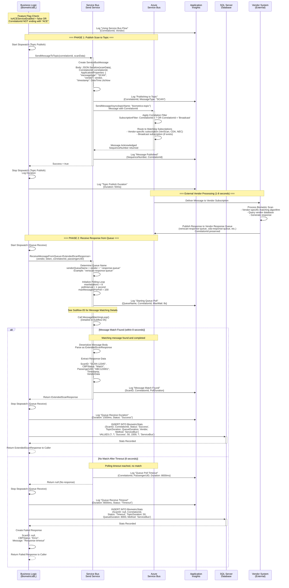

# Sub-Flow: Scan Processing via Service Bus (Legacy)

## Overview

This diagram shows the biometric scan processing flow using Azure Service Bus for asynchronous vendor-specific processing.

## Diagram



## Service Bus Architecture

### Topic Structure
```
biometrics-topic
├── Subscription: veriscan-subscription
│   └── Filter: CorrelationId LIKE '%' OR Vendor = 'VeriScan'
├── Subscription: cda-subscription
│   └── Filter: CorrelationId LIKE '%' OR Vendor = 'CDA'
├── Subscription: nec-subscription
│   └── Filter: CorrelationId LIKE '%' OR Vendor = 'NEC'
└── Subscription: sita-subscription
    └── Filter: CorrelationId LIKE '%' OR Vendor = 'SITA'
```

### Queue Structure
```
veriscan-response-queue (Vendor responses to VeriScan scans)
cda-response-queue (Vendor responses to CDA scans)
nec-response-queue (Vendor responses to NEC scans)
sita-response-queue (Vendor responses to SITA scans)
```

### Correlation Filter Details
```csharp
// Subscription created with correlation filter
var filter = new CorrelationRuleFilter();
filter.CorrelationId = "DFWA5AA12320240315" // OR
filter.Properties["vendor"] = "VeriScan";

await subscriptionClient.CreateOrUpdateRuleAsync(
    "CorrelationRule", filter);
```

## Message Format

### Scan Message (Topic)
```json
{
  "correlationId": "DFWA5AA12320240315",
  "passengerUID": "ABC123001",
  "scanDateTime": "2026-03-06T14:30:00Z",
  "deviceName": "VERISCAN-DFW-A5-001",
  "vendor": "VeriScan",
  "biometricType": "FacialRecognition",
  "scanData": {
    "imageData": "base64EncodedData...",
    "quality": 0.95
  },
  "applicationProperties": {
    "messagetype": "SCAN",
    "vendor": "VeriScan",
    "timestamp": "2026-03-06T14:30:00Z"
  }
}
```

### Response Message (Queue)
```json
{
  "scanId": "SCAN-12345",
  "correlationId": "DFWA5AA12320240315",
  "passengerUID": "ABC123001",
  "cbpStatus": "Match",
  "verificationDateTime": "2026-03-06T14:30:02Z",
  "vendorData": {
    "vendor": "VeriScan",
    "matchScore": 0.96,
    "processingTime": 1200
  }
}
```

## Timing Analysis

### Phase 1: Topic Publish
- **Average Duration**: 30-50ms
- **P95**: 100ms
- **P99**: 200ms
- **Network Hops**: 1 (to Service Bus)

### Vendor Processing (External)
- **Average Duration**: 1000-3000ms
- **Range**: 500ms - 8000ms
- **Factors**: Vendor algorithm, database query, load

### Phase 2: Queue Receive
- **Polling Strategy**: 1-second intervals, up to 8 iterations
- **Best Case**: 1000ms (first poll finds message)
- **Average Case**: 1500-3000ms
- **Worst Case**: 8000ms (timeout)

### Total End-to-End
- **Best Case**: ~1.5 seconds
- **Average**: ~3 seconds
- **Timeout**: 8 seconds

## Polling Configuration

### ReceiveMessageFromQueue Settings
```csharp
// Configuration
const int MaxIterations = 8;
const int PollIntervalMs = 1000;
const int MaxMessagesPerBatch = 100;
const int MaxWaitTimePerReceive = 1; // seconds

// Total timeout = MaxIterations * PollIntervalMs = 8 seconds
```

### Why 8 Seconds?
- **Vendor SLA**: Most vendors respond within 3-5 seconds
- **Buffer**: 8 seconds provides cushion for slow responses
- **User Experience**: Longer timeout impacts boarding flow
- **Tradeoff**: Balance between waiting and responsiveness

## Error Scenarios

### Timeout Handling
```csharp
if (elapsedTime > TimeSpan.FromSeconds(8))
{
    logger.LogWarning("Queue receive timeout", new {
        CorrelationId,
        PassengerUID,
        ElapsedMs = elapsedTime.TotalMilliseconds
    });
    
    // Return null, caller handles timeout
    return default(ExtendedScanResponse);
}
```

### Message Abandonment
- **Unmatched Messages**: Returned to queue via AbandonAsync
- **Retry**: Available for other consumers
- **Dead Letter**: After max delivery count (10)

### Service Bus Failures
| Failure Type | Handling | Recovery |
|--------------|----------|----------|
| Connection Loss | Auto-reconnect | Retry with backoff |
| Throttling | Exponential backoff | Wait and retry |
| Topic Not Found | Log error, return null | Manual intervention |
| Queue Not Found | Log error, return null | Manual intervention |

## Performance Optimization

### Batch Receiving
- **Why**: Reduce round-trips to Service Bus
- **Size**: Up to 100 messages per receive call
- **Tradeoff**: More messages to filter, but fewer network calls

### Message Prefetch
```csharp
var receiverOptions = new ServiceBusReceiverOptions
{
    PrefetchCount = 50 // Prefetch messages for faster access
};
```

### Parallel Processing
- **Multiple Scans**: Can poll different queues in parallel
- **Thread Safety**: Each scan gets its own receiver
- **Scaling**: Multiple API instances can process concurrently

## Monitoring

### Key Metrics
- **Topic Publish Duration**: Monitor for Service Bus performance
- **Queue Poll Duration**: Track actual wait time for responses
- **Timeout Rate**: % of scans that timeout
- **Message Abandonment Rate**: Unmatched messages returned to queue

### Application Insights Queries
```kusto
// Find timeout patterns
customEvents
| where name == "QUEUE_POLL_TIMEOUT"
| extend CorrelationId = tostring(customDimensions.CorrelationId)
| summarize TimeoutCount = count() by Vendor = tostring(customDimensions.Vendor)
| order by TimeoutCount desc
```

### Alerts
- **High Timeout Rate**: > 5% of scans timeout
- **Slow Topic Publish**: P95 > 500ms
- **Queue Depth Growing**: Indicates vendor processing issues

## Comparison: Service Bus vs ACE

| Aspect | Service Bus Flow | ACE Flow |
|--------|------------------|----------|
| **Latency** | 1.5-8 seconds | 0.5-2 seconds |
| **Consistency** | Variable (vendor-dependent) | Consistent |
| **Timeout** | 8 seconds | 30 seconds |
| **Retry** | Message abandonment | HTTP retry |
| **Vendor Control** | External vendor systems | Centralized ACE |
| **Monitoring** | Service Bus metrics | HTTP metrics |
| **Fallback** | No fallback | Can fallback to Service Bus |

## When to Use Service Bus Flow

### Use Cases
1. **Vendor-Specific Requirements**: Vendor has custom matching algorithm
2. **Offline Processing**: Vendor needs to process asynchronously
3. **Legacy Integration**: Existing vendor system uses Service Bus
4. **ACE Unavailable**: Fallback when ACE service is down

### Configuration
```json
{
  "FeatureFlags": {
    "ACEServiceEnabled": false, // Forces Service Bus flow
    "ServiceBusTimeout": 8000,
    "FallbackToServiceBus": true // ACE failure fallback
  }
}
```

## Database Tracking

### BiometricStats Insert (Service Bus)
```sql
INSERT INTO BiometricStats (
    ScanID, CorrelationId, PassengerUID,
    Status, TopicDuration, QueueDuration,
    TotalDuration, Vendor, Method
) VALUES (
    'SCAN-12345', 'DFWA5AA12320240315', 'ABC123001',
    'Success', 50, 1500,
    1550, 'VeriScan', 'ServiceBus'
)
```

### Performance Tracking
- **TopicDuration**: Time to publish to topic
- **QueueDuration**: Time to receive from queue
- **TotalDuration**: End-to-end (Topic + Queue)

## Related Flows
- **Parent Flow**: [End-to-End Sequence Diagram](End-to-End-Sequence-Diagram.md)
- **Message Matching**: [Subflow-05-Service-Bus-Message-Matching](Subflow-05-Service-Bus-Message-Matching.md)
- **Alternative Flow**: [ACE Scan Processing](Subflow-03-Scan-Processing-ACE.md)

## Version Information
- **Last Updated**: March 6, 2026
- **Service Bus Client**: Azure.Messaging.ServiceBus 7.x
- **.NET Version**: .NET 8
- **Integration Type**: Asynchronous Pub/Sub
