# Sub-Flow: Service Bus Message Matching Loop

## Overview

This diagram details the message matching algorithm used to find the correct scan response from the Service Bus queue when multiple messages may be present.

## Diagram

```mermaid
sequenceDiagram
    participant SBSend as Service Bus<br/>Send Service
    participant SB as Azure Service Bus<br/>(Response Queue)
    participant AppIns as Application<br/>Insights

    Note over SBSend: Input Parameters:<br/>- vendor: "VeriScan"<br/>- correlationId: "DFWA5AA12320240315"<br/>- passengerUID: "ABC123001"<br/>- token: CancellationToken
    
    SBSend->>SBSend: Initialize Loop Variables<br/>iteration = 0<br/>maxIterations = 8<br/>matchFound = false<br/>startTime = DateTime.UtcNow
    
    SBSend->>SBSend: Determine Queue Name<br/>queueName = vendor + "-response-queue"<br/>Example: "veriscan-response-queue"
    
    SBSend->>SBSend: Create ServiceBusReceiver<br/>receiver = client.CreateReceiver(queueName)
    
    loop For each iteration (max 8 iterations)
        SBSend->>SBSend: Check Loop Conditions<br/>iteration < 8 AND<br/>!matchFound AND<br/>!token.IsCancellationRequested
        
        alt Loop Conditions Met
            SBSend->>SBSend: Increment iteration<br/>iteration++
            
            SBSend->>AppIns: Log "Polling Queue"<br/>{Iteration, QueueName, CorrelationId}
            
            SBSend->>+SB: ReceiveMessagesAsync<br/>(maxMessages: 100, maxWaitTime: 1 second)
            
            alt Messages Received
                SB-->>-SBSend: IReadOnlyList<ServiceBusReceivedMessage><br/>(e.g., 42 messages)
                
                SBSend->>AppIns: Log "Messages Received"<br/>{MessageCount: 42, Iteration}
                
                SBSend->>SBSend: Start message filtering loop<br/>foreach (var message in messages)
                
                loop For each message in batch
                    SBSend->>SBSend: Extract Message Properties<br/>- messageCorrelationId = message.CorrelationId<br/>- messageBody = message.Body.ToString()
                    
                    SBSend->>SBSend: Check Correlation ID Match<br/>Does messageCorrelationId == correlationId?
                    
                    alt Correlation ID Matches
                        SBSend->>AppIns: Log "Correlation ID Match"<br/>{MessageId, CorrelationId}
                        
                        SBSend->>SBSend: Deserialize Message Body<br/>response = JsonSerializer.Deserialize<ExtendedScanResponse>(messageBody)
                        
                        SBSend->>SBSend: Check PassengerUID in Body<br/>Does response.PassengerUID == passengerUID?
                        
                        alt PassengerUID Matches
                            Note over SBSend: ✓ MATCH FOUND!<br/>Both CorrelationId AND PassengerUID match
                            
                            SBSend->>AppIns: Log "Message Match Found"<br/>{MessageId, CorrelationId, PassengerUID,<br/> ScanID, Iteration, ElapsedMs}
                            
                            SBSend->>+SB: CompleteMessageAsync(message)<br/>(Remove from queue)
                            SB-->>-SBSend: Message Completed
                            
                            SBSend->>AppIns: Log "Message Completed"<br/>{MessageId, ScanID}
                            
                            SBSend->>SBSend: Set matchFound = true<br/>Break inner loop
                            
                            Note over SBSend: Exit both loops and return response
                            
                        else PassengerUID Mismatch
                            SBSend->>AppIns: Log "PassengerUID Mismatch"<br/>{MessageId, Expected: passengerUID,<br/> Actual: response.PassengerUID}
                            
                            SBSend->>+SB: AbandonMessageAsync(message)<br/>(Return to queue for other consumers)
                            SB-->>-SBSend: Message Abandoned
                            
                            SBSend->>AppIns: Log "Message Abandoned"<br/>{MessageId, Reason: "PassengerUID mismatch"}
                            
                            Note over SBSend: Continue to next message
                        end
                        
                    else Correlation ID Mismatch
                        SBSend->>AppIns: Log "Correlation ID Mismatch"<br/>{MessageId, Expected: correlationId,<br/> Actual: messageCorrelationId}
                        
                        SBSend->>+SB: AbandonMessageAsync(message)<br/>(Return to queue)
                        SB-->>-SBSend: Message Abandoned
                        
                        SBSend->>AppIns: Log "Message Abandoned"<br/>{MessageId, Reason: "CorrelationId mismatch"}
                        
                        Note over SBSend: Continue to next message
                    end
                end
                
                Note over SBSend: All messages in batch processed
                
                alt Match Found in This Batch
                    SBSend->>SBSend: Break main loop<br/>Return matched response
                else No Match in This Batch
                    SBSend->>AppIns: Log "No Match in Batch"<br/>{Iteration, MessagesProcessed: 42}
                    
                    SBSend->>SBSend: Wait 1 second before next iteration<br/>await Task.Delay(1000, token)
                    
                    Note over SBSend: Continue to next iteration
                end
                
            else No Messages Received (Empty Queue)
                SB-->>SBSend: Empty list (0 messages)
                
                SBSend->>AppIns: Log "Queue Empty"<br/>{Iteration, QueueName}
                
                SBSend->>SBSend: Wait 1 second before retry<br/>await Task.Delay(1000, token)
                
                Note over SBSend: Continue to next iteration
            end
            
        else Loop Exit Condition
            Note over SBSend: Exit loop - one of:<br/>- Max iterations reached (8)<br/>- Match found<br/>- Cancellation requested
        end
    end
    
    SBSend->>SBSend: Calculate Total Duration<br/>duration = DateTime.UtcNow - startTime
    
    alt Match Found
        SBSend->>AppIns: Log "Match Found Successfully"<br/>{ScanID, CorrelationId, PassengerUID,<br/> TotalDuration, Iterations}
        
        SBSend->>SBSend: Return ExtendedScanResponse<br/>{ScanID, CBPStatus, PassengerUID, ...}
        
    else No Match After All Iterations (Timeout)
        SBSend->>AppIns: Log "Queue Poll Timeout"<br/>{CorrelationId, PassengerUID,<br/> TotalDuration: 8000ms, Iterations: 8}
        
        SBSend->>SBSend: Return default(ExtendedScanResponse)<br/>(null)
    end
    
    SBSend->>SBSend: Dispose ServiceBusReceiver<br/>await receiver.DisposeAsync()
```



## Matching Algorithm

### Two-Level Matching Strategy

#### Level 1: CorrelationId Match
```csharp
// Quick filter on message property
if (message.CorrelationId == expectedCorrelationId)
{
    // Proceed to Level 2
}
else
{
    // Abandon and continue
    await receiver.AbandonMessageAsync(message);
}
```

**Why**: CorrelationId is a message property, fast to check without deserializing

#### Level 2: PassengerUID Match
```csharp
// Deserialize and check body
var response = JsonSerializer.Deserialize<ExtendedScanResponse>(message.Body);
if (response.PassengerUID == expectedPassengerUID)
{
    // MATCH! Complete message
    await receiver.CompleteMessageAsync(message);
    return response;
}
else
{
    // Abandon for other consumers
    await receiver.AbandonMessageAsync(message);
}
```

**Why**: Multiple passengers may have same CorrelationId (same flight), need PassengerUID to distinguish

### Why Two Criteria?

**Scenario**: Flight AA123 has 200 passengers boarding simultaneously
- **CorrelationId**: Same for all (`DFWA5AA123...`)
- **PassengerUID**: Unique per passenger (`ABC123001`, `ABC123002`, etc.)
- **Without PassengerUID**: Would match wrong passenger's response
- **With PassengerUID**: Ensures correct passenger match

## Loop Configuration

### Iteration Settings
```csharp
const int MaxIterations = 8;              // Maximum polling attempts
const int PollIntervalMs = 1000;          // 1 second between polls
const int MaxMessagesPerBatch = 100;       // Messages per receive call
const int MaxWaitTimePerReceive = 1;       // Seconds to wait for messages
```

### Total Timeout Calculation
```
Maximum Timeout = MaxIterations × PollIntervalMs
                = 8 × 1000ms
                = 8 seconds
```

### Early Exit Conditions
1. **Match Found**: Return immediately when both criteria match
2. **Cancellation Requested**: Graceful shutdown via cancellation token
3. **Max Iterations**: Safety timeout to prevent infinite waiting

## Message Lifecycle

### States in Service Bus Queue
```
1. Active: Message available for receive
2. Locked: Message received, not yet completed/abandoned
3. Completed: Message removed from queue permanently
4. Abandoned: Message returned to Active state
5. Dead-Lettered: Message failed max delivery attempts (10)
```

### Our Usage
- **CompleteMessageAsync**: Remove matched message from queue
- **AbandonMessageAsync**: Return unmatched message for other receivers
- **Lock Duration**: 60 seconds (Azure default)

## Performance Characteristics

### Best Case (Message in First Batch)
```
Iteration 1:
  - Receive: 50ms
  - Filter 100 messages: 10ms
  - Match on message #3
  - Complete: 30ms
Total: ~100ms
```

### Average Case (Message in 2nd-3rd Iteration)
```
Iteration 1:
  - Receive: 50ms, no match, wait 1000ms
Iteration 2:
  - Receive: 50ms, no match, wait 1000ms
Iteration 3:
  - Receive: 50ms, match found, complete: 30ms
Total: ~2180ms
```

### Worst Case (Timeout)
```
8 iterations × (50ms receive + 10ms filter + 1000ms wait)
Total: ~8480ms (actual timeout set at 8000ms)
```

## Batch Processing Efficiency

### Why Batch Size of 100?
- **Tradeoff**: Larger batches = fewer Service Bus calls, more filtering
- **Service Bus Limit**: Maximum 100 messages per receive
- **Memory**: 100 messages typically < 1MB total
- **Processing Time**: Filtering 100 messages takes ~10ms

### Filtering Speed
```csharp
// O(n) complexity for batch
foreach (var message in messages) // n ≤ 100
{
    if (message.CorrelationId == expectedId) // O(1)
    {
        var response = Deserialize(message.Body); // O(message size)
        if (response.PassengerUID == expectedUID) // O(1)
        {
            return response; // Early exit on first match
        }
    }
}
```

**Average**: 50 comparisons if match in middle of batch

## Abandoned Message Handling

### Why Abandon Instead of Complete?
**Scenario**: Multiple API instances polling same queue
- **Message A**: CorrelationId matches, PassengerUID doesn't
- **Action**: Abandon message
- **Reason**: Another API instance might be waiting for this message
- **Result**: Message remains available for correct consumer

### Abandon Example
```
Queue has messages:
1. {CorrelationId: "AA123", PassengerUID: "PAX001"} ← We want this
2. {CorrelationId: "AA123", PassengerUID: "PAX002"} ← Abandon
3. {CorrelationId: "AA456", PassengerUID: "PAX003"} ← Abandon
4. {CorrelationId: "AA123", PassengerUID: "PAX001"} ← Match!

Message #2: Abandoned for another consumer waiting for PAX002
Message #3: Abandoned for consumer waiting for AA456
```

## Error Handling

### Service Bus Exceptions

| Exception | Cause | Handling |
|-----------|-------|----------|
| **ServiceBusException** (Communication) | Network issue | Log, continue to next iteration |
| **ServiceBusException** (Timeout) | Queue receive timeout | Normal, continue polling |
| **ServiceBusException** (EntityNotFound) | Queue doesn't exist | Log error, return null |
| **OperationCanceledException** | Cancellation token triggered | Log, return null gracefully |
| **JsonException** | Malformed message body | Log, abandon message, continue |

### Message Deserialization Errors
```csharp
try
{
    var response = JsonSerializer.Deserialize<ExtendedScanResponse>(message.Body);
}
catch (JsonException ex)
{
    logger.LogError("Malformed message", new { MessageId = message.MessageId, ex });
    await receiver.AbandonMessageAsync(message);
    continue; // Try next message
}
```

## Monitoring & Diagnostics

### Key Metrics to Track
1. **Average Iterations to Match**: Lower is better (target: 1-2)
2. **Timeout Rate**: % of calls that hit 8 iterations (target: < 5%)
3. **Messages Abandoned per Call**: High = poor correlation or queue backlog
4. **Queue Depth**: Growing queue indicates vendor processing issues

### Application Insights Logging
```csharp
logger.LogInformation("MESSAGE_MATCHING_LOOP", new {
    CorrelationId,
    PassengerUID,
    Iteration,
    MessagesInBatch,
    MatchesFound,
    Abandonments,
    ElapsedMs
});
```

### Diagnostic Queries
```kusto
customEvents
| where name == "MESSAGE_MATCHING_LOOP"
| extend Iteration = toint(customDimensions.Iteration)
| summarize avg(Iteration), max(Iteration) by Vendor = tostring(customDimensions.Vendor)
```

## Optimization Opportunities

### Current Implementation
- **Serial Processing**: Check messages one by one
- **No Caching**: Each iteration receives fresh batch
- **Fixed Interval**: Always wait 1 second between iterations

### Potential Improvements
1. **Adaptive Polling**: Increase interval after first few iterations
2. **Prefetching**: Prefetch messages to reduce Service Bus calls
3. **Parallel Filtering**: Check multiple messages concurrently
4. **Peek-Lock Optimization**: Peek before receive to check correlation IDs

## Related Flows
- **Parent Flow**: [Service Bus Scan Processing](Subflow-04-Scan-Processing-ServiceBus.md)
- **Called By**: BiometricsBL.SendScanMessage (Service Bus path)
- **Alternative**: [ACE Scan Processing](Subflow-03-Scan-Processing-ACE.md) (no message matching needed)

## Version Information
- **Last Updated**: March 6, 2026
- **Service Bus Client**: Azure.Messaging.ServiceBus 7.x
- **.NET Version**: .NET 8
- **Algorithm Complexity**: O(n × m) where n = iterations, m = messages per batch
