# Sub-Flow: Device Disconnect and Cleanup

## Overview

This diagram details the WebSocket disconnect process when a biometric device closes its connection, either gracefully or due to an error.

## Diagram

```mermaid
sequenceDiagram
    participant Device as Biometric<br/>Device
    participant Socket as Socket Manager
    participant DB as SQL Server<br/>Database
    participant AppIns as Application<br/>Insights

    Note over Device,Socket: === Graceful Disconnect ===
    
    alt Graceful Disconnect (Device Initiated)
        Device->>+Socket: WebSocket Close Frame<br/>CloseStatus: NormalClosure<br/>Description: "Device shutting down"
        
        Socket->>AppIns: Log "Graceful Disconnect Received"<br/>{DeviceName, CloseStatus, Description}
        
        Socket->>Socket: Extract Device Information<br/>- DeviceName from connection context<br/>- DisconnectTime = DateTime.UtcNow<br/>- CloseReason = "Normal"
        
        Socket->>+DB: UPDATE WebSocketDevices SET<br/>  DisconnectTime = GETDATE(),<br/>  Status = 'Disconnected',<br/>  DisconnectReason = 'Normal',<br/>  ConnectionDuration = DATEDIFF(SECOND, ConnectionTime, GETDATE())<br/>WHERE DeviceName = ?
        DB-->>-Socket: 1 row updated
        
        Socket->>Socket: Remove from Active Connections<br/>activeConnections.Remove(deviceName)
        
        Socket->>AppIns: Log "Device Disconnected"<br/>{DeviceName, ConnectionDuration,<br/> DisconnectReason: "Normal"}
        
        Socket->>Device: WebSocket Close Acknowledgment<br/>CloseStatus: NormalClosure
        
        Socket->>Socket: Dispose WebSocket Resources<br/>await webSocket.CloseAsync()<br/>webSocket.Dispose()
        
        Socket-->>-Device: Connection Closed
        
    else Network Error / Abnormal Disconnect
        Note over Device,Socket: Connection Lost<br/>(Network timeout, device crash, etc.)
        
        Socket->>Socket: Detect Connection Loss<br/>- ReceiveAsync throws exception<br/>- OR KeepAlive timeout<br/>- OR Socket state = Aborted
        
        Socket->>AppIns: Log "Abnormal Disconnect Detected"<br/>{DeviceName, Exception, SocketState}
        
        Socket->>Socket: Extract Device Information<br/>- DeviceName<br/>- DisconnectTime = DateTime.UtcNow<br/>- CloseReason = "NetworkError"
        
        Socket->>+DB: UPDATE WebSocketDevices SET<br/>  DisconnectTime = GETDATE(),<br/>  Status = 'Disconnected',<br/>  DisconnectReason = 'NetworkError',<br/>  ConnectionDuration = DATEDIFF(SECOND, ConnectionTime, GETDATE())<br/>WHERE DeviceName = ?
        DB-->>-Socket: 1 row updated
        
        Socket->>Socket: Remove from Active Connections<br/>activeConnections.Remove(deviceName)
        
        Socket->>AppIns: Log "Device Connection Lost"<br/>{DeviceName, ConnectionDuration,<br/> DisconnectReason: "NetworkError"}
        
        Socket->>Socket: Attempt to Close WebSocket<br/>(May already be closed)
        
        Socket->>Socket: Dispose WebSocket Resources<br/>webSocket.Dispose()
        
    else Authentication Failure During Active Connection
        Note over Socket: Token validation fails on a message<br/>after initial connection
        
        Socket->>AppIns: Log "Auth Failure - Disconnecting"<br/>{DeviceName, Reason: "Invalid token during message"}
        
        Socket->>+DB: UPDATE WebSocketDevices SET<br/>  DisconnectTime = GETDATE(),<br/>  Status = 'Disconnected',<br/>  DisconnectReason = 'AuthFailure',<br/>  ConnectionDuration = DATEDIFF(SECOND, ConnectionTime, GETDATE())<br/>WHERE DeviceName = ?
        DB-->>-Socket: 1 row updated
        
        Socket->>Socket: Remove from Active Connections<br/>activeConnections.Remove(deviceName)
        
        Socket->>Device: WebSocket Close<br/>CloseStatus: PolicyViolation<br/>Description: "Authentication failed"
        
        Socket->>AppIns: Log "Device Forcibly Disconnected"<br/>{DeviceName, Reason: "AuthFailure"}
        
        Socket->>Socket: Dispose WebSocket Resources
        
    else Idle Timeout
        Note over Socket: No messages received within timeout period<br/>(e.g., 30 minutes)
        
        Socket->>Socket: Idle Timer Expires<br/>lastMessageTime + timeout < DateTime.UtcNow
        
        Socket->>AppIns: Log "Idle Timeout - Disconnecting"<br/>{DeviceName, IdleDuration, TimeoutThreshold}
        
        Socket->>+DB: UPDATE WebSocketDevices SET<br/>  DisconnectTime = GETDATE(),<br/>  Status = 'Disconnected',<br/>  DisconnectReason = 'IdleTimeout',<br/>  ConnectionDuration = DATEDIFF(SECOND, ConnectionTime, GETDATE())<br/>WHERE DeviceName = ?
        DB-->>-Socket: 1 row updated
        
        Socket->>Socket: Remove from Active Connections<br/>activeConnections.Remove(deviceName)
        
        Socket->>Device: WebSocket Close<br/>CloseStatus: NormalClosure<br/>Description: "Idle timeout"
        
        Socket->>AppIns: Log "Device Disconnected - Idle"<br/>{DeviceName, IdleDuration}
        
        Socket->>Socket: Dispose WebSocket Resources
        
    else Server Shutdown
        Note over Socket: Application is shutting down<br/>(Deployment, restart, etc.)
        
        Socket->>AppIns: Log "Server Shutdown - Closing All Connections"<br/>{ActiveConnectionCount}
        
        Socket->>Socket: Iterate All Active Connections<br/>foreach (var connection in activeConnections)
        
        loop For each active connection
            Socket->>+DB: UPDATE WebSocketDevices SET<br/>  DisconnectTime = GETDATE(),<br/>  Status = 'Disconnected',<br/>  DisconnectReason = 'ServerShutdown'<br/>WHERE DeviceName = ?
            DB-->>-Socket: Updated
            
            Socket->>Device: WebSocket Close<br/>CloseStatus: NormalClosure<br/>Description: "Server shutting down"
            
            Socket->>AppIns: Log "Device Disconnected - Shutdown"<br/>{DeviceName}
        end
        
        Socket->>Socket: Clear Active Connections Dictionary<br/>activeConnections.Clear()
        
        Socket->>AppIns: Log "All Connections Closed"<br/>{DisconnectedCount}
    end
```



## Disconnect Reasons

### Categorization

| Reason | Type | Initiated By | Reconnect Expected? |
|--------|------|--------------|---------------------|
| **Normal** | Graceful | Device | No (intentional shutdown) |
| **NetworkError** | Error | Network | Yes (automatic retry) |
| **AuthFailure** | Security | Server | No (requires investigation) |
| **IdleTimeout** | Policy | Server | Yes (device should reconnect) |
| **ServerShutdown** | Maintenance | Server | Yes (after server restart) |

## Database Updates

### WebSocketDevices Table Schema
```sql
CREATE TABLE WebSocketDevices (
    ID INT IDENTITY(1,1) PRIMARY KEY,
    DeviceName NVARCHAR(255) NOT NULL,
    ConnectionTime DATETIME2 NOT NULL,
    DisconnectTime DATETIME2 NULL,
    Status NVARCHAR(50) NOT NULL, -- 'Connected', 'Disconnected'
    DisconnectReason NVARCHAR(100) NULL,
    ConnectionDuration INT NULL, -- Seconds
    IPAddress NVARCHAR(50) NULL,
    Region NVARCHAR(50) NULL,
    LastMessageTime DATETIME2 NULL
)
```

### Disconnect Update Query
```sql
UPDATE WebSocketDevices 
SET 
    DisconnectTime = GETDATE(),
    Status = 'Disconnected',
    DisconnectReason = @Reason,
    ConnectionDuration = DATEDIFF(SECOND, ConnectionTime, GETDATE())
WHERE 
    DeviceName = @DeviceName
    AND Status = 'Connected'
```

## Active Connections Management

### In-Memory Dictionary
```csharp
// Singleton SocketManager maintains this
private static ConcurrentDictionary<string, WebSocketConnection> activeConnections = new();

// Connection object
public class WebSocketConnection
{
    public WebSocket Socket { get; set; }
    public string DeviceName { get; set; }
    public DateTime ConnectedAt { get; set; }
    public DateTime LastMessageAt { get; set; }
    public string IPAddress { get; set; }
}
```

### Add on Connect
```csharp
activeConnections.TryAdd(deviceName, new WebSocketConnection
{
    Socket = webSocket,
    DeviceName = deviceName,
    ConnectedAt = DateTime.UtcNow,
    LastMessageAt = DateTime.UtcNow,
    IPAddress = httpContext.Connection.RemoteIpAddress?.ToString()
});
```

### Remove on Disconnect
```csharp
if (activeConnections.TryRemove(deviceName, out var connection))
{
    await connection.Socket.CloseAsync(
        WebSocketCloseStatus.NormalClosure, 
        "Disconnecting", 
        CancellationToken.None);
    
    connection.Socket.Dispose();
}
```

## WebSocket Close Statuses

### Standard Close Status Codes

| Code | Status | Usage in System |
|------|--------|-----------------|
| **1000** | NormalClosure | Graceful disconnect, idle timeout, server shutdown |
| **1001** | EndpointUnavailable | Server going away |
| **1002** | ProtocolError | Invalid message format |
| **1003** | InvalidMessageType | Unsupported data type |
| **1007** | InvalidPayloadData | Malformed JSON |
| **1008** | PolicyViolation | Authentication failure |
| **1011** | InternalServerError | Unexpected error |

### Our Usage
```csharp
// Graceful disconnect
await webSocket.CloseAsync(
    WebSocketCloseStatus.NormalClosure, 
    "Device shutting down", 
    CancellationToken.None);

// Auth failure
await webSocket.CloseAsync(
    WebSocketCloseStatus.PolicyViolation, 
    "Authentication failed", 
    CancellationToken.None);

// Server error
await webSocket.CloseAsync(
    WebSocketCloseStatus.InternalServerError, 
    "Unexpected server error", 
    CancellationToken.None);
```

## Cleanup Process

### Resource Disposal Order
1. **Database Update**: Mark device as disconnected
2. **Remove from Dictionary**: Remove from active connections
3. **Log Event**: Record disconnect in Application Insights
4. **Close WebSocket**: Send close frame (if possible)
5. **Dispose WebSocket**: Free system resources

### Error Handling During Cleanup
```csharp
try
{
    // Update database
    await UpdateDatabaseAsync(deviceName, disconnectReason);
}
catch (Exception ex)
{
    logger.LogError("Database update failed during disconnect", ex);
    // Continue cleanup anyway
}

try
{
    // Close WebSocket
    if (webSocket.State == WebSocketState.Open)
    {
        await webSocket.CloseAsync(closeStatus, reason, CancellationToken.None);
    }
}
catch (Exception ex)
{
    logger.LogWarning("WebSocket close failed", ex);
    // May already be closed
}
finally
{
    // Always dispose
    webSocket.Dispose();
}
```

## Idle Timeout Implementation

### Configuration
```json
{
  "WebSocket": {
    "IdleTimeoutMinutes": 30,
    "KeepAliveIntervalSeconds": 60
  }
}
```

### Background Timer
```csharp
// SocketManager constructor
private Timer idleCheckTimer;

public SocketManager()
{
    // Check for idle connections every 5 minutes
    idleCheckTimer = new Timer(CheckIdleConnections, null, 
        TimeSpan.FromMinutes(5), 
        TimeSpan.FromMinutes(5));
}

private void CheckIdleConnections(object state)
{
    var idleThreshold = DateTime.UtcNow.AddMinutes(-30);
    
    foreach (var connection in activeConnections.Values)
    {
        if (connection.LastMessageAt < idleThreshold)
        {
            // Disconnect idle device
            _ = DisconnectDevice(connection.DeviceName, "IdleTimeout");
        }
    }
}
```

## Server Shutdown Handling

### Graceful Shutdown Implementation
```csharp
// Program.cs - Application lifetime events
var app = builder.Build();

var lifetime = app.Services.GetRequiredService<IHostApplicationLifetime>();

lifetime.ApplicationStopping.Register(() =>
{
    // Get SocketManager from DI
    var socketManager = app.Services.GetRequiredService<SocketManager>();
    
    // Close all connections gracefully
    socketManager.DisconnectAllDevices("ServerShutdown").Wait();
});
```

### DisconnectAllDevices Method
```csharp
public async Task DisconnectAllDevices(string reason)
{
    logger.LogInformation($"Disconnecting all devices: {reason}");
    
    var disconnectTasks = activeConnections.Keys
        .Select(deviceName => DisconnectDevice(deviceName, reason))
        .ToList();
    
    await Task.WhenAll(disconnectTasks);
    
    logger.LogInformation($"All devices disconnected: {disconnectTasks.Count}");
}
```

## Monitoring & Analytics

### Application Insights Metrics

#### Disconnect Events
```csharp
telemetryClient.TrackEvent("DEVICE_DISCONNECTED", new Dictionary<string, string>
{
    { "DeviceName", deviceName },
    { "DisconnectReason", reason },
    { "ConnectionDuration", duration.TotalMinutes.ToString() },
    { "Region", region }
});
```

#### Connection Duration Metrics
```csharp
telemetryClient.TrackMetric("ConnectionDuration", duration.TotalMinutes, new Dictionary<string, string>
{
    { "DeviceName", deviceName },
    { "DisconnectReason", reason }
});
```

### KQL Queries for Analysis

#### Disconnect Reason Distribution
```kusto
customEvents
| where name == "DEVICE_DISCONNECTED"
| extend Reason = tostring(customDimensions.DisconnectReason)
| summarize Count = count() by Reason
| order by Count desc
```

#### Average Connection Duration by Reason
```kusto
customEvents
| where name == "DEVICE_DISCONNECTED"
| extend Duration = todouble(customDimensions.ConnectionDuration)
| extend Reason = tostring(customDimensions.DisconnectReason)
| summarize AvgDuration = avg(Duration) by Reason
```

#### Abnormal Disconnects Over Time
```kusto
customEvents
| where name == "DEVICE_DISCONNECTED"
| where customDimensions.DisconnectReason == "NetworkError"
| summarize Count = count() by bin(timestamp, 1h)
| render timechart
```

## Health Monitoring

### Alerts to Configure
1. **High Abnormal Disconnect Rate**: > 10% NetworkError disconnects
2. **Frequent Auth Failures**: Multiple AuthFailure per hour
3. **Short Connection Durations**: Avg duration < 5 minutes (indicates instability)
4. **No Active Connections**: activeConnections.Count == 0 during business hours

### Dashboard Metrics
- **Active Connections**: Real-time count
- **Disconnect Rate**: Disconnects per minute
- **Avg Connection Duration**: By device, region, reason
- **Disconnect Reason Breakdown**: Pie chart

## Reconnection Strategy

### Device-Side Reconnection Logic
Devices should implement exponential backoff:
```
Attempt 1: Immediate reconnect
Attempt 2: Wait 5 seconds
Attempt 3: Wait 15 seconds
Attempt 4: Wait 45 seconds
Attempt 5+: Wait 2 minutes
Max attempts: Infinite (until successful or manual stop)
```

### Server-Side Expectations
- **Normal**: No reconnect expected
- **NetworkError**: Device should reconnect within 30 seconds
- **IdleTimeout**: Device should reconnect when needed
- **ServerShutdown**: Device should reconnect after 1-2 minutes
- **AuthFailure**: No automatic reconnect (requires token refresh)

## Related Flows
- **Parent Flow**: [End-to-End Sequence Diagram](End-to-End-Sequence-Diagram.md)
- **Opposite Flow**: [Device Authentication](Subflow-01-Device-Authentication.md)
- **Connection Lifecycle**: Connect → Authenticate → Message Exchange → Disconnect

## Version Information
- **Last Updated**: March 6, 2026
- **.NET Version**: .NET 8
- **WebSocket Protocol**: RFC 6455
- **Database**: SQL Server
