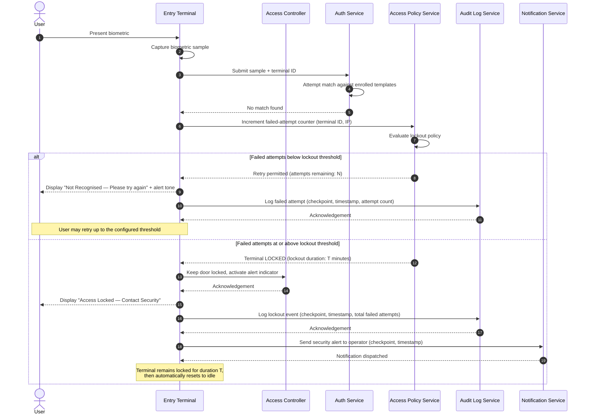

# BioEntExit — Failed Authentication Flow

This sequence diagram describes the system's response when a biometric authentication attempt fails at a checkpoint, covering retry logic, lockout behaviour, and operator notification.

## Actors & Components

| Participant | Description |
|-------------|-------------|
| User | The individual attempting to authenticate |
| Entry Terminal | The biometric scanner at the checkpoint |
| Access Controller | Embedded controller managing door/turnstile hardware |
| Auth Service | Backend service that matches biometric samples against enrolled templates |
| Access Policy Service | Service that evaluates access rules and manages lockout state |
| Audit Log Service | Service that persists access events |
| Notification Service | Service that sends real-time alerts to operators |

## Sequence Diagram

## Notes

- The failed-attempt threshold and lockout duration are configurable per deployment.
- Lockout is tracked **per terminal** to prevent spreading attempts across devices.
- All failed attempts are written to the **Audit Log** regardless of whether a lockout is triggered.
- Operators can manually clear a lockout early via the Admin Portal.
