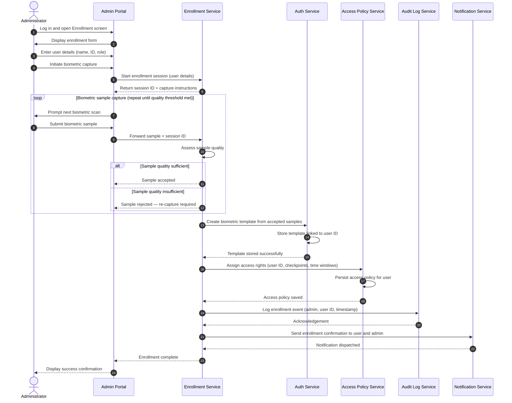

# BioEntExit — User Enrollment Flow

This sequence diagram describes the process by which an administrator enrolls a new user into the BioEntExit system, capturing their biometric data and configuring their access rights.

## Actors & Components

| Participant | Description |
|-------------|-------------|
| Administrator | Authorised staff member performing the enrollment |
| Admin Portal | Web-based management interface |
| Enrollment Service | Backend service that orchestrates enrollment and template creation |
| Auth Service | Backend service responsible for biometric template storage and matching |
| Access Policy Service | Service that stores and evaluates user access rules |
| Audit Log Service | Service that persists all administrative actions |
| Notification Service | Service that sends confirmations and alerts |

## Sequence Diagram

## Notes

- A minimum number of biometric samples (configurable) must meet the quality threshold before a template is created.
- The enrolling administrator's actions are recorded in the **Audit Log** for accountability.
- Access rights can be updated post-enrollment through the Admin Portal without repeating biometric capture.
