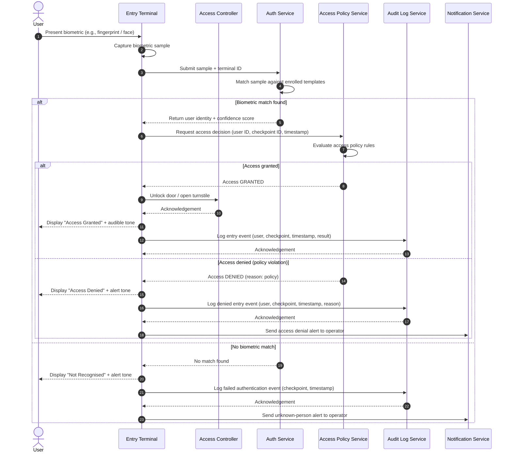

# BioEntExit — User Entry Flow

This sequence diagram describes the end-to-end flow when a registered user attempts to enter a secured facility through a BioEntExit checkpoint.

## Actors & Components

| Participant | Description |
|-------------|-------------|
| User | The individual seeking entry |
| Entry Terminal | The physical biometric scanning device at the checkpoint |
| Access Controller | Embedded controller that manages the door/turnstile hardware |
| Auth Service | Backend service that matches biometric samples against enrolled templates |
| Access Policy Service | Service that evaluates whether the authenticated user is permitted entry at this checkpoint and time |
| Audit Log Service | Service that persists access events for compliance and reporting |
| Notification Service | Service that sends real-time alerts to facility operators |

## Sequence Diagram

## Notes

- The **Entry Terminal** enforces a configurable timeout; if no valid scan is submitted within the window the terminal resets to idle.
- Confidence score thresholds for biometric acceptance are configurable per deployment environment.
- All events — including failures — are written to the **Audit Log** to support regulatory compliance.
