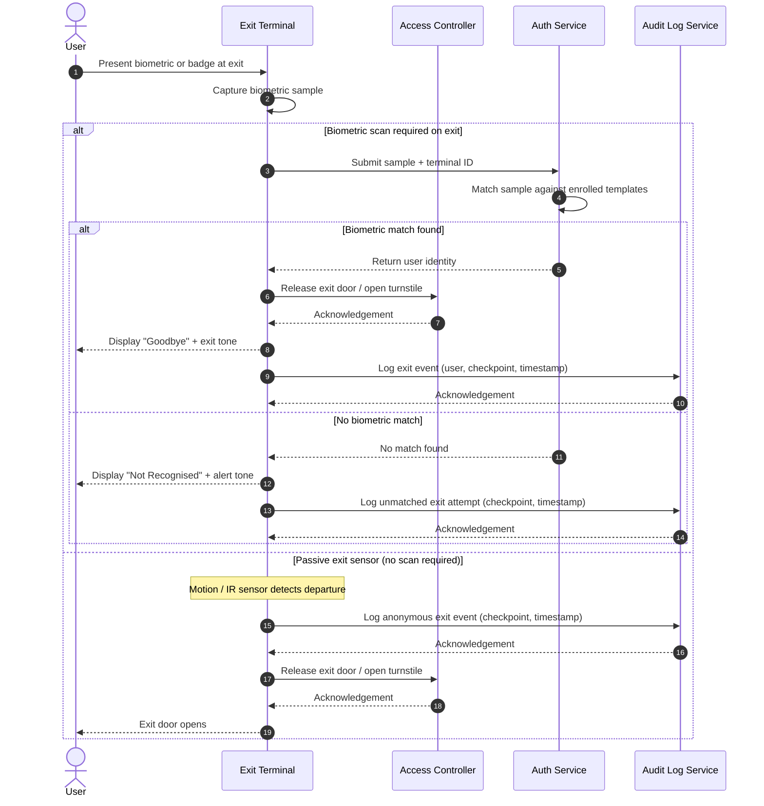

# BioEntExit — User Exit Flow

This sequence diagram describes the flow when a registered user exits a secured facility through a BioEntExit exit checkpoint.

## Actors & Components

| Participant | Description |
|-------------|-------------|
| User | The individual departing the facility |
| Exit Terminal | The biometric scanner or passive sensor at the exit point |
| Access Controller | Embedded controller that manages the exit door/turnstile hardware |
| Auth Service | Backend service that matches biometric samples against enrolled templates |
| Audit Log Service | Service that persists access events for compliance and reporting |

## Sequence Diagram

## Notes

- Some installations operate exits in **passive mode** where a motion or infrared sensor detects departure without requiring a biometric scan.
- Exit events are correlated with entry events in the **Audit Log** to calculate occupancy and dwell time.
- Anti-passback rules (preventing re-entry without a corresponding exit) are enforced by the **Access Policy Service** during the next entry attempt.
